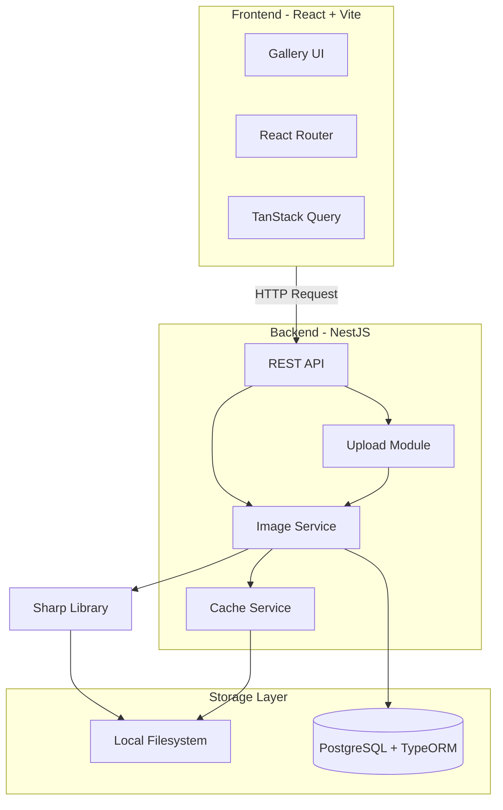

# OptiView

## Project Description

**OptiView** is a prototype web application designed to demonstrate high-performance image delivery. The system solves the problem of inefficient content loading by serving images tailored to the user's specific screen size, pixel density, and browser format support.

### Key Objective

The primary goal is to achieve an optimal balance between visual quality and loading speed while maintaining excellent Core Web Vitals. The prototype implements:

- **Performance Optimization** — Hybrid image processing with on-the-fly generation and caching
- **Adaptive Delivery** — Automatic format selection (AVIF > WebP > JPEG) based on browser capabilities
- **Visual Excellence** — Zero Cumulative Layout Shift (CLS) through aspect ratio locking and smart loading states

---

## ✨ Features from User's point of view

| Feature               | Description                                                                            |
|:----------------------|:---------------------------------------------------------------------------------------|
| **Image Gallery**     | Responsive masonry grid displaying images with rating and category tags                |
| **Filtering System**  | Filter by genre (Nature, Architecture, Portrait, etc.) and minimum rating (1-5 stars)  |
| **Sorting Mechanism** | Sort by creation date or rating in ascending/descending order                          |
| **Upload Module**     | Drag-and-drop interface with genre selection per image                                 |
| **Lightbox Modal**    | Full-screen image viewing with navigation and download options (640px, 1280px, 1920px) |
| **Rating System**     | Update image ratings directly from gallery cards or lightbox                           |
| **Smart Loading**     | Smooth loading experience with dominant color backgrounds and blurred previews         |

---

## Interesting technical moments from Developer's point of view

### Auto-Format Negotiation

The server analyzes the `Accept` header to deliver the most efficient format without client-side detection:

```
Priority: AVIF → WebP → JPEG (fallback)
```

### Hybrid Caching with Fixed Breakpoints

First-time requests trigger image generation; subsequent requests serve from cache. Width values are rounded to fixed breakpoints (320, 640, 768, 1024, 1280, 1920px) to prevent cache explosion.

### LQIP Placeholder Strategy

Low Quality Image Placeholders (~20px wide, ~200-500 bytes base64) are generated during upload, embedded inline in API responses, and displayed with CSS blur during image loading.

### Zero CLS Implementation

- Container aspect-ratio is set before image loads
- Dominant color fills the image area immediately
- LQIP appears while full-resolution image downloads
- Smooth crossfade transition on load completion

### URL as Source of Truth

All UI state (filters, sorting, pagination) is stored in URL query parameters, enabling shareable and bookmarkable URLs with natural browser navigation.

---

## System Architecture



---

## 🛠️ Technology Stack

### Backend

| Technology | Purpose |
|:-----------|:--------|
| NestJS 10.x | Backend framework |
| TypeORM 0.3.x | Database ORM |
| Sharp 0.33.x | Image processing |
| PostgreSQL 15.x | Primary data store |
| Docker Compose | Postgres containerization |

### Frontend

| Technology | Purpose |
|:-----------|:--------|
| React 19.x | UI framework |
| Vite 7.x | Build tool and dev server |
| React Router 6.x | SPA routing and URL state |
| TanStack Query 5.x | Server state management |
| TypeScript 5.x | Type safety |
| Tailwind CSS | Styling |
| Flowbite | UI component library |

---

## 📁 Project Structure

```
OptiView/
├── backend/        # NestJS API server with image processing
├── frontend/       # React + Vite web application
└── doc/            # Project documentation (PRD, ADR, UI specs)
```

---

## 🚀 Quick Start

### Prerequisites

- Node.js 18+
- PostgreSQL 15+ (via Docker)
- npm or yarn

### Run Backend & Frontend

Detailed instructions available in respective README files:

- [Backend Setup & Run](backend/README.md)
- [Frontend Setup & Run](frontend/README.md)

**Quick commands:**

```bash
# Backend (from backend/)
docker-compose up -d    # Start PostgreSQL
npm install             # Install dependencies
npm run db:seed         # Provide test data
npm run start:dev       # Start dev server on :3000

# Frontend (from frontend/)
npm install             # Install dependencies
npm run dev             # Start dev server on :5173
```

---

## 📚 Documentation

| Document                                          | Description                                        |
|:--------------------------------------------------|:---------------------------------------------------|
| [PRD (Product Requirements Document)](doc/PRD.md) | Product requirements and functional specifications |
| [ADR (Architecture Design Record)](doc/ADR.md)    | Architectural decisions and technical details      |
| [UI Specification](doc/UI.md)                     | User interface design and component specifications |
