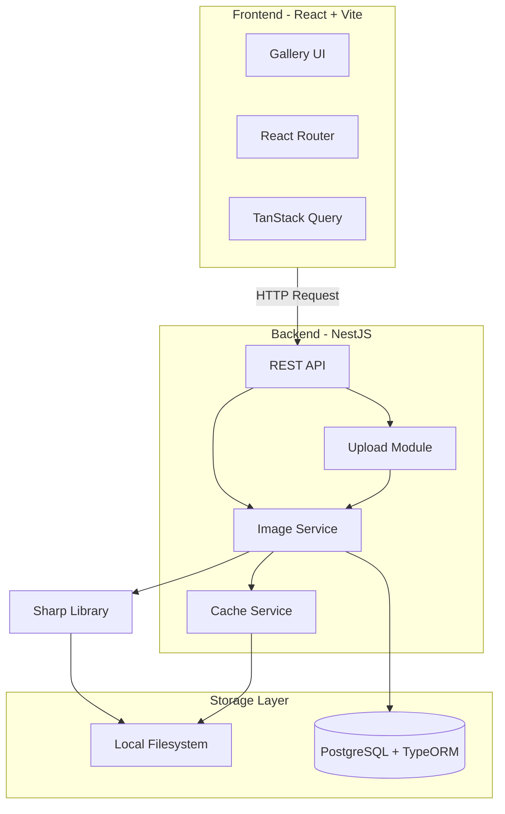
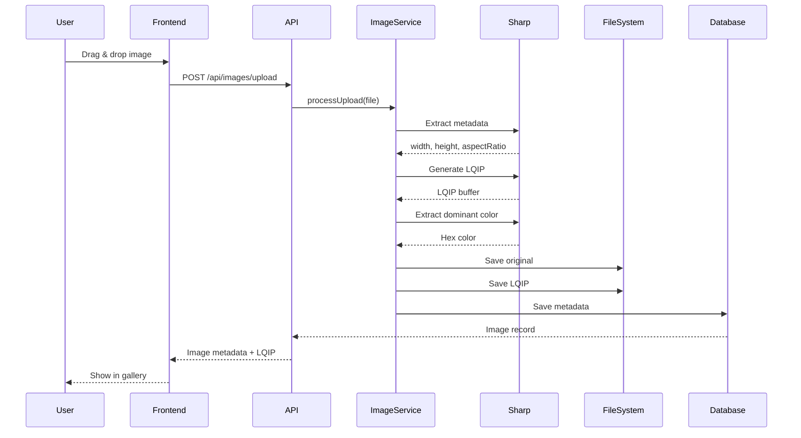
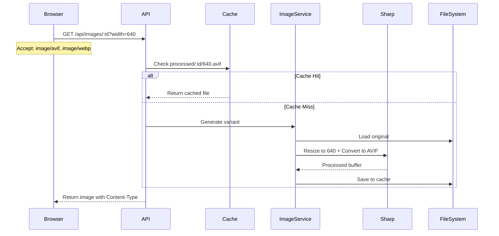
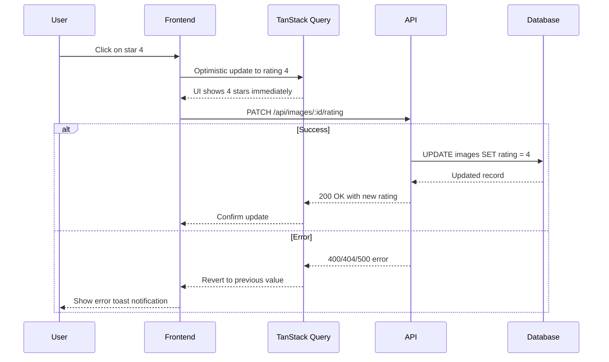

# Architecture Decision Record: OptiView

## Table of Contents

1. [Overview](#1-overview)
2. [Architecture Diagram](#2-architecture-diagram)
3. [Technology Stack](#3-technology-stack)
4. [Architecture Decisions](#4-architecture-decisions)
5. [Data Flow](#5-data-flow)
6. [Security Considerations](#6-security-considerations)
7. [Scalability Notes](#7-scalability-notes)
8. [Open Questions](#8-open-questions)

---

## 1. Overview

This ADR documents the architectural decisions for **OptiView** — a high-performance image delivery web application. The system is designed to serve images optimized for user's screen size, pixel density, and browser format support while maintaining excellent Core Web Vitals.

### Key Requirements Reference

| Requirement             | PRD Reference   |
|:------------------------|:----------------|
| Auto-format negotiation | REQ-1           |
| Dynamic resizing        | REQ-2           |
| Hybrid caching          | REQ-3           |
| Metadata extraction     | REQ-4           |
| Zero CLS                | REQ-10, REQ-11  |
| Lighthouse 90+          | Success Metrics |

---

## 2. Architecture Diagram



---

## 3. Technology Stack

### Frontend

| Technology     | Version | Purpose                              |
|:---------------|:--------|:-------------------------------------|
| React          | 19.x    | UI framework                         |
| Vite           | 7.x     | Build tool and dev server            |
| React Router   | 6.x     | SPA routing and URL state management |
| TanStack Query | 5.x     | Server state management and caching  |
| TypeScript     | 5.x     | Type safety                          |

### Backend

| Technology        | Version | Purpose            |
|:------------------|:--------|:-------------------|
| NestJS            | 10.x    | Backend framework  |
| TypeORM           | 0.3.x   | Database ORM       |
| Sharp             | 0.33.x  | Image processing   |
| class-validator   | 0.14.x  | DTO validation     |
| class-transformer | 0.2.x   | DTO transformation |

### Database

| Technology | Version | Purpose            |
|:-----------|:--------|:-------------------|
| PostgreSQL | 15.x    | Primary data store |

### Infrastructure

| Technology     | Purpose                       |
|:---------------|:------------------------------|
| Docker         | Postgres containerization     |
| Docker Compose | Multi-container orchestration |

---

## 4. Architecture Decisions

### ADR-001: Local Filesystem Storage

**Decision:** Store original and processed images on the local filesystem.

**Rationale:**

- Simplicity for initial development phase
- No additional infrastructure costs
- Direct file access for image processing with Sharp
- Easy migration path to S3-compatible storage in the future

**Storage Structure:**

```
uploads/
├── originals/           # Original uploaded images
│   └── {uuid}.{ext}
├── processed/           # Cached processed versions
│   └── {uuid}/
│       ├── 320.webp
│       ├── 320.avif
│       ├── 640.webp
│       └── ...
└── lqip/               # Low Quality Image Placeholders
    └── {uuid}.jpg
```

**Consequences:**

- ✅ Simple implementation
- ✅ Fast local file access
- ⚠️ Not horizontally scalable
- ⚠️ Requires backup strategy

---

### ADR-002: REST API with Query Parameters and Accept Header Negotiation

**Decision:** Use REST API with `width` as query parameter and automatic format detection via `Accept` header.

**API Design:**

```
GET /api/images/:id?width=640
Accept: image/avif, image/webp, image/jpeg

Response:
- Content-Type: image/avif (or best supported format)
- Body: Optimized image binary
```

**Endpoints:**

| Method | Endpoint                   | Description                             |
|:-------|:---------------------------|:----------------------------------------|
| GET    | `/api/images`              | List images with filters and pagination |
| GET    | `/api/images/:id?width=N`  | Get processed image                     |
| GET    | `/api/images/:id/metadata` | Get image metadata                      |
| POST   | `/api/images/upload`       | Upload new image                        |
| GET    | `/api/images/:id/lqip`     | Get LQIP placeholder                    |
| PATCH  | `/api/images/:id/rating`   | Update image rating                     |

**Format Priority:**

1. AVIF (if `Accept` includes `image/avif`)
2. WebP (if `Accept` includes `image/webp`)
3. JPEG (fallback)

**Rating Update Endpoint:**

```
PATCH /api/images/:id/rating
Content-Type: application/json

Request Body:
{
  "rating": 4
}

Response (200 OK):
{
  "id": "550e8400-e29b-41d4-a716-446655440000",
  "rating": 4,
  "updatedAt": "2026-03-09T12:00:00Z"
}

Validation:
- rating: required, integer, min: 1, max: 5
```

**Rationale:**

- Clean URL structure for image delivery
- Leverages HTTP content negotiation
- Browser automatically sends appropriate `Accept` header
- Easy to cache at CDN level in the future

---

### ADR-003: Fixed Breakpoints with Rounding

**Decision:** Use fixed image width breakpoints. Incoming `width` parameter is rounded to the nearest breakpoint.

**Breakpoints:**

| Breakpoint | Use Case                         |
|:-----------|:---------------------------------|
| 320px      | Small mobile devices             |
| 640px      | Standard mobile @2x              |
| 768px      | Tablet portrait                  |
| 1024px     | Tablet landscape / Small desktop |
| 1280px     | Standard desktop                 |
| 1920px     | Full HD displays                 |

**Rounding Algorithm:**

```typescript
const breakpoints = [320, 640, 768, 1024, 1280, 1920];

function roundToBreakpoint(width: number): number {
  return breakpoints.reduce((prev, curr) =>
    Math.abs(curr - width) < Math.abs(prev - width) ? curr : prev
  );
}
```

**Rationale:**

- Prevents cache explosion from arbitrary width values
- Predictable cache size: 6 widths × 3 formats = 18 variants per image
- Covers 95%+ of device viewport widths

---

### ADR-004: TanStack Query with URL State

**Decision:** Use TanStack Query for server state and URL query parameters for UI state (filters, sorting).

**State Architecture:**

```typescript
// URL as source of truth for filters
// ?genre=nature&rating=4&sort=createdAt&sortOrder=DESC

const [searchParams, setSearchParams] = useSearchParams();

// TanStack Query for data fetching
const { data, isLoading } = useQuery({
  queryKey: ['images', genre, rating, sort, sortOrder],
  queryFn: () => fetchImages({ genre, rating, sort, sortOrder }),
});
```

**URL Parameters:**

| Parameter   | Type   | Description                              | Default     |
|:------------|:-------|:-----------------------------------------|:------------|
| `genre`     | string | Filter by category                       | -           |
| `rating`    | number | Minimum rating filter                    | -           |
| `sort`      | string | Sort field (e.g., createdAt, rating)     | `createdAt` |
| `sortOrder` | string | Sort direction: ASC or DESC              | `DESC`      |
| `page`      | number | Page number for pagination               | `1`         |
| `pageSize`  | number | Number of items per page                 | `10`        |

**Rationale:**

- Shareable and bookmarkable URLs
- Browser back/forward navigation works naturally
- TanStack Query handles caching and refetching
- Separates server state from client state

---

### ADR-005: LQIP Placeholder Strategy

**Decision:** Generate Low Quality Image Placeholders (LQIP) during upload — tiny ~20px wide images with CSS blur effect.

**Implementation:**

```typescript
// During upload
const lqip = await sharp(original)
  .resize(20, null, { fit: 'inside' })
  .jpeg({ quality: 20 })
  .toBuffer();

// Base64 encode for inline embedding
const lqipBase64 = `data:image/jpeg;base64,${lqip.toString('base64')}`;
```

**Frontend Usage:**

```css
.image-placeholder {
  background-image: url('data:image/jpeg;base64,...');
  filter: blur(20px);
  transform: scale(1.1); /* Prevent blur edge artifacts */
}
```

**Rationale:**

- Extremely small payload (~200-500 bytes base64)
- Can be embedded directly in API response
- Smooth transition to full image
- No additional library needed (unlike blur-hash)

---

### ADR-006: Docker Compose for Backend Services

**Decision:** Use Docker Compose to run PostgreSQL in a container. Backend and Frontend is developed and deployed separately.

**docker-compose.yml Structure:**

```yaml
services:
  postgres:
    image: postgres:15-alpine
    volumes:
      - postgres_data:/var/lib/postgresql/data
    environment:
      POSTGRES_DB: optiview
      POSTGRES_USER: ${DB_USER}
      POSTGRES_PASSWORD: ${DB_PASSWORD}

volumes:
  postgres_data:
```

**Rationale:**

- Consistent development environment
- Easy to add services (Redis, etc.) later
- Volume persistence for database and uploads
- Frontend can run via Vite dev server independently

---

### ADR-007: TypeORM for Database Access

**Decision:** Use TypeORM as the ORM for PostgreSQL integration with NestJS.

**Entity Structure:**

```typescript
@Entity('images')
export class Image {
  @PrimaryGeneratedColumn('uuid')
  id: string;

  @Column()
  filename: string;

  @Column()
  originalPath: string;

  @Column({ type: 'enum', enum: Genre })
  genre: Genre;

  @Column({ type: 'int' })
  rating: number;

  @Column({ type: 'float' })
  aspectRatio: number;

  @Column()
  dominantColor: string;

  @Column()
  lqipBase64: string;

  @Column({ type: 'int' })
  width: number;

  @Column({ type: 'int' })
  height: number;

  @CreateDateColumn()
  createdAt: Date;
}
```

**Rationale:**

- Native NestJS integration via `@nestjs/typeorm`
- Decorator-based entity definitions
- Automatic migrations support
- Strong TypeScript support

---

## 5. Data Flow

### Image Upload Flow



### Image Delivery Flow



### Rating Update Flow



---

## 6. Security Considerations

| Concern              | Mitigation                                                  |
|:---------------------|:------------------------------------------------------------|
| File upload attacks  | Validate MIME type, file extension whitelist, max file size |
| Path traversal       | Use UUIDs, never use user input for file paths              |
| DoS via large images | Limit dimensions, memory limits in Sharp                    |
| CORS                 | Public API - allow all origins with wildcard                |
| Input validation     | class-validator DTOs on all endpoints                       |

---

## 7. Scalability Notes

### Current Limitations (Acceptable for MVP)

- Single server deployment
- Local filesystem storage
- No CDN integration
- No request collapsing

### Future Scalability Path

```
Phase 1 (Current)     Phase 2              Phase 3
┌─────────────┐      ┌─────────────┐      ┌─────────────┐
│   Single    │ ───► │   Add CDN   │ ───► │  S3/MinIO   │
│   Server    │      │  CloudFront │      │  Migration  │
└─────────────┘      └─────────────┘      └─────────────┘
```

**Migration Checklist for Phase 2:**

- [ ] Add CloudFront or similar CDN
- [ ] Implement cache headers
- [ ] Move static assets to CDN

---

## 8. Open Questions

| # | Question                   | Status | Notes                        |
|:--|:---------------------------|:-------|:-----------------------------|
| 1 | Max file size for uploads? | Open   | Suggest 10MB                 |
| 2 | Supported input formats?   | Open   | Suggest JPEG, PNG, WebP      |
| 3 | Pagination strategy?       | Open   | Suggest cursor-based         |
| 4 | Rate limiting?             | Open   | Consider for upload endpoint |

---

## Decision Log

| Date       | Decision                 | Impact                             |
|:-----------|:-------------------------|:-----------------------------------|
| 2026-03-08 | Local filesystem storage | Simplicity over scalability        |
| 2026-03-08 | REST API + Accept header | Standards-based format negotiation |
| 2026-03-08 | Fixed breakpoints        | Predictable cache size             |
| 2026-03-08 | LQIP over blur-hash      | Simpler implementation             |
| 2026-03-08 | TypeORM                  | NestJS ecosystem alignment         |
