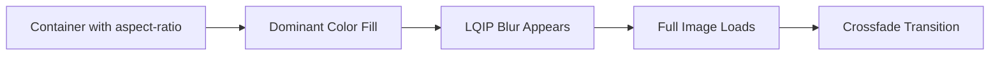

# UI Specification: OptiView

## 1. Overview

This document defines the user interface design for OptiView - a high-performance image gallery application. The UI prioritizes visual content, fast loading, and intuitive interactions.

---

## 2. Design Principles

| Principle               | Description                                                          |
|:------------------------|:---------------------------------------------------------------------|
| **Content-First**       | Images are the hero; UI elements should be minimal and non-intrusive |
| **Performance-Visible** | Loading states (LQIP, dominant color) enhance perceived speed        |
| **Responsive**          | Adapts seamlessly from mobile to desktop                             |
| **Accessible**          | Keyboard navigation, proper contrast, screen reader support          |

---

## 3. Page Structure

### 3.1 Application Routes

| Route | Description |
|-------|-------------|
| `/` | Main gallery with filters and grid |
| `/upload` | Full-page upload interface |

---

## 4. Components

### 4.1 Header

**Location:** Fixed at top of viewport

**Elements:**

- Logo (left)
- Genre filter dropdown
- Rating filter dropdown
- Sort dropdown (Date/Rating + ASC/DESC)

```
┌─────────────────────────────────────────────────────────────────┐
│ [Logo] OptiView    [Genre ▼] [Min Rating ▼] [Sort by ▼]        │
└─────────────────────────────────────────────────────────────────┘
```

**Behavior:**

- Filters update URL query parameters
- Gallery reloads via TanStack Query when filters change
- Sticky on scroll

---

### 4.2 Gallery Grid (Masonry Layout)

**Layout:** CSS Grid or CSS Columns-based masonry

**Responsive Columns:**

| Viewport Width          | Columns |
|:------------------------|:--------|
| < 640px (Mobile)        | 2       |
| 640px - 1024px (Tablet) | 3       |
| > 1024px (Desktop)      | 4       |

**Image Card Structure:**

```
┌────────────────────┐
│                    │
│                    │  ← Aspect ratio preserved
│      [Image]       │  ← LQIP blur while loading
│                    │  ← Dominant color background
│                    │
├────────────────────┤
│ ★★★★☆  Nature      │  ← Rating stars + Genre tag
└────────────────────┘
```

**Loading Sequence per Card:**

1. **Immediate:** Container renders with aspect-ratio (prevents CLS)
2. **Immediate:** Dominant color fills the image area
3. **~100ms:** LQIP (blurred 20px preview) appears
4. **Final:** Full-resolution image fades in, blur transitions to sharp

---

### 4.3 Floating Action Button (FAB)

**Location:** Fixed, bottom-right corner

**Style:**

- Circular button, 56px diameter
- Plus icon (+)
- Elevated shadow
- Secondary color from theme

**Behavior:**

- Click navigates to `/upload` route
- Subtle hover/focus animation

---

### 4.4 Lightbox / Image Modal

**Trigger:** Click on any image card

**Layout:**

```
┌─────────────────────────────────────────────────────────────────┐
│                                                         [X]    │
│                                                                 │
│         [<]                                           [>]       │
│                                                                 │
│                     ┌─────────────────┐                        │
│                     │                 │                        │
│                     │    Full Image   │                        │
│                     │                 │                        │
│                     │   (centered)    │                        │
│                     │                 │                        │
│                     └─────────────────┘                        │
│                                                                 │
│           [Download 1920px] [Download 1280px] [Download 640px] │
│                                                                 │
└─────────────────────────────────────────────────────────────────┘
```

**Elements:**

- Dark semi-transparent overlay (rgba(0,0,0,0.9))
- Close button (X) - top right
- Navigation arrows (< / >) - sides or bottom
- Image centered, max 90vh height
- Download buttons below image

**Download Options:**

- Provide 2-3 size options (e.g., 1920px, 1280px, 640px)
- Format: Use same format negotiation as gallery (AVIF/WebP/JPEG)

**Interactions:**

- Click outside image closes modal
- ESC key closes modal
- Arrow keys navigate between images
- Swipe gestures on mobile

---

### 4.5 Upload Page

**Route:** `/upload`

**Layout:**

```
┌─────────────────────────────────────────────────────────────────┐
│ [← Back to Gallery]                                             │
├─────────────────────────────────────────────────────────────────┤
│                                                                 │
│   ┌─────────────────────────────────────────────────────────┐   │
│   │                                                         │   │
│   │           📁 Drag & Drop Images Here                    │   │
│   │                  or click to browse                     │   │
│   │                                                         │   │
│   │          Supports: JPEG, PNG, WebP                      │   │
│   │          Max file size: 10MB                            │   │
│   │                                                         │   │
│   └─────────────────────────────────────────────────────────┘   │
│                                                                 │
│   Upload Queue:                                                 │
│   ┌─────────────────────────────────────────────────────────┐   │
│   │ photo1.jpg  ██████████████████████ 100%  ✅ Done        │   │
│   │ photo2.jpg  ████████████░░░░░░░░░░░░ 60%   ⏳ Uploading │   │
│   │ photo3.jpg  ░░░░░░░░░░░░░░░░░░░░░░░░ 0%    ⏸ Waiting   │   │
│   └─────────────────────────────────────────────────────────┘   │
│                                                                 │
│                                           [Upload More]         │
│                                                                 │
└─────────────────────────────────────────────────────────────────┘
```

**Features:**

- Full-page dropzone
- Multiple file selection supported
- File type validation (JPEG, PNG, WebP only)
- File size validation (max 10MB per file)
- Progress bar per file
- Status indicators: Waiting / Uploading / Processing / Done / Error
- Auto-navigate to gallery after all uploads complete (optional)

**Default Values for New Uploads:**

| Field  | Default Value |
|:-------|:--------------|
| Genre  | Uncategorized |
| Rating | 3 (of 5)      |

---

## 5. Responsive Breakpoints

| Breakpoint | Width          | Columns | Header          |
|:-----------|:---------------|:--------|:----------------|
| Mobile     | < 640px        | 2       | Stacked filters |
| Tablet     | 640px - 1024px | 3       | Inline filters  |
| Desktop    | > 1024px       | 4       | Inline filters  |

---

## 6. Loading States

### 6.1 Gallery Initial Load

- Show skeleton placeholders with correct aspect ratios
- Or show empty grid structure with dominant color backgrounds

### 6.2 Image Card Loading Sequence



**CSS Implementation Reference:**

```css
.image-container {
  position: relative;
  background-color: var(--dominant-color); /* From API */
  aspect-ratio: var(--aspect-ratio);       /* From API */
}

.image-placeholder {
  position: absolute;
  inset: 0;
  background-image: url(var(--lqip-base64));
  background-size: cover;
  filter: blur(20px);
  transform: scale(1.1);
  transition: opacity 0.3s ease;
}

.image-full {
  opacity: 0;
  transition: opacity 0.3s ease;
}

.image-full.loaded {
  opacity: 1;
}

.image-full.loaded + .image-placeholder {
  opacity: 0;
}
```

---

## 7. Accessibility

| Requirement         | Implementation                                |
|:--------------------|:----------------------------------------------|
| Keyboard Navigation | Tab through images, Enter to open lightbox    |
| Focus Management    | Focus trap in lightbox, return focus on close |
| Alt Text            | Use filename or future caption field          |
| Contrast            | Minimum 4.5:1 for text on backgrounds         |
| Touch Targets       | Minimum 44x44px for interactive elements      |

---

## 8. Color Palette (Suggested)

| Role           | Color           | Usage                      |
|:---------------|:----------------|:---------------------------|
| Primary        | #2563EB         | Focus rings, active states |
| Background     | #FAFAFA         | Page background            |
| Surface        | #FFFFFF         | Cards, header              |
| Text Primary   | #1F2937         | Body text                  |
| Text Secondary | #6B7280         | Metadata, captions         |
| Border         | #E5E7EB         | Dividers, card borders     |
| Overlay        | rgba(0,0,0,0.9) | Lightbox background        |
| Success        | #10B981         | Upload success             |
| Error          | #EF4444         | Upload error               |

---

## 9. Animation Guidelines

| Element               | Animation    | Duration |
|:----------------------|:-------------|:---------|
| Image load transition | Crossfade    | 300ms    |
| LQIP blur removal     | Fade out     | 300ms    |
| Modal open/close      | Fade + scale | 200ms    |
| Card hover            | Subtle lift  | 150ms    |
| FAB hover             | Scale 1.05   | 150ms    |

---

## 10. Out of Scope for MVP

- Image editing after upload
- User profiles / authentication
- Image collections / albums
- Social sharing features
- Comments system

---

## 11. Reference Implementations

For design inspiration and interaction patterns:

1. **Unsplash** (<https://unsplash.com>) - Masonry layout, LQIP technique
2. **Pexels** (<https://pexels.com>) - Filter UI, download options
3. **Pinterest** (<https://pinterest.com>) - Masonry grid behavior
