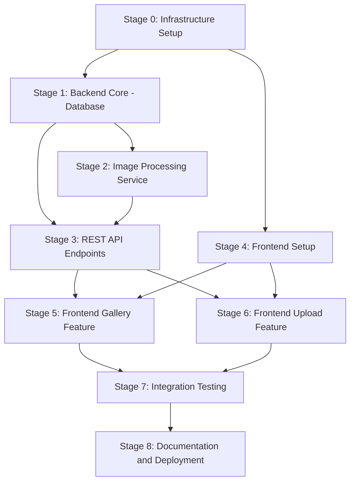
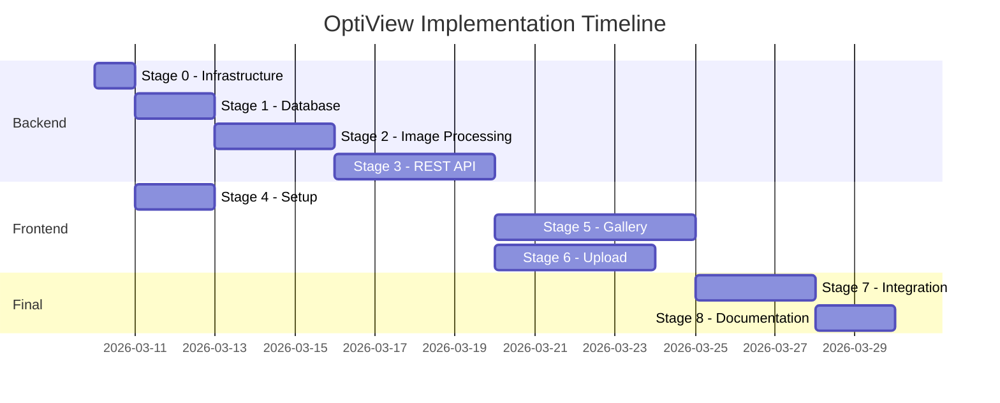

# Implementation Plan: OptiView

## Overview

This document outlines the implementation plan for OptiView - a high-performance image delivery web application. The plan is organized into stages with clear dependencies, deliverables, and acceptance criteria.

**Key Assumptions:**
- Frontend template will be provided by the user
- Backend and Frontend are developed and deployed separately
- Local filesystem storage for MVP phase

---

## Stage Diagram



---

## Stage 0: Infrastructure Setup

### Goal
Establish the foundational infrastructure for both backend and frontend development.

### Dependencies
None - this is the starting point.

### Input
- ADR.md documentation
- Technology stack decisions

### Output
- Working development environment
- Docker Compose configuration
- Database container running

### Artifacts

| Type | Artifact | Description |
|:-----|:---------|:------------|
| Code | `docker-compose.yml` | Multi-container setup for backend + PostgreSQL |
| Code | `.env` | Environment variables template |
| Code | `backend/nest-cli.json` | NestJS configuration |
| Code | `backend/tsconfig.json` | TypeScript configuration |
| Doc | `backend/README.md` | Backend setup instructions |

### Tasks

- [ ] Create project structure directories: `backend/`, `uploads/`
- [ ] Initialize NestJS project with TypeScript
- [ ] Create Docker Compose with PostgreSQL 16 Alpine
- [ ] Configure environment variables for database connection
- [ ] Set up TypeORM integration with NestJS
- [ ] Verify database connectivity

### Risks

| Risk | Probability | Impact | Mitigation |
|:-----|:------------|:-------|:-----------|
| Docker compatibility issues | Low | Medium | Use specific version tags for images |
| Database connection failures | Medium | High | Document troubleshooting steps, use health checks |

### Definition of Done

- [ ] `docker-compose up` starts PostgreSQL successfully
- [ ] NestJS application starts and connects to database
- [ ] Health check endpoint returns 200 OK
- [ ] README documentation allows new developer to start in under 15 minutes

---

## Stage 1: Backend Core - Database & Entities

### Goal
Implement the database schema and TypeORM entities for image metadata storage.

### Dependencies
- Stage 0: Infrastructure Setup completed

### Input
- ADR-007: TypeORM entity structure
- Image metadata fields from ADR.md

### Output
- Database migrations
- TypeORM Image entity
- Genre enum

### Artifacts

| Type | Artifact | Description |
|:-----|:---------|:------------|
| Code | `backend/src/entities/image.entity.ts` | Image entity with all fields |
| Code | `backend/src/entities/genre.enum.ts` | Genre enumeration |
| Code | `backend/src/migrations/` | Initial migration files |
| Test | `backend/src/entities/image.entity.spec.ts` | Entity unit tests |
| Doc | Swagger documentation | |

### Tasks

- [ ] Create Genre enum: Nature, Architecture, Portrait, Uncategorized
- [ ] Create Image entity with fields:
  - id: UUID
  - filename: string
  - originalPath: string
  - genre: Genre
  - rating: number, default 3
  - aspectRatio: float
  - dominantColor: string
  - lqipBase64: text
  - width: number
  - height: number
  - createdAt: Date
- [ ] Generate and run initial migration
- [ ] Write unit tests for entity validation

### Risks

| Risk | Probability | Impact | Mitigation |
|:-----|:------------|:-------|:-----------|
| Migration conflicts | Low | Medium | Use consistent migration naming, version control |
| Missing field validation | Medium | Medium | Use class-validator decorators on entity |

### Definition of Done

- [ ] Database table `images` created with correct schema
- [ ] Entity validation prevents invalid data
- [ ] Unit tests pass with 80%+ coverage on entity
- [ ] Migration is reversible with down method

---

## Stage 2: Image Processing Service

### Goal
Implement the core image processing capabilities using Sharp library.

### Dependencies
- Stage 1: Database & Entities completed

### Input
- ADR-001: Storage structure
- ADR-003: Fixed breakpoints
- ADR-005: LQIP strategy

### Output
- ImageService with Sharp integration
- File storage utilities
- Metadata extraction

### Artifacts

| Type | Artifact | Description |
|:-----|:---------|:------------|
| Code | `backend/src/modules/images/image.service.ts` | Core image processing logic |
| Code | `backend/src/modules/images/image.module.ts` | NestJS module definition |
| Code | `backend/src/utils/storage.util.ts` | File system operations |
| Code | `backend/src/utils/breakpoint.util.ts` | Breakpoint rounding algorithm |
| Test | `backend/src/modules/images/image.service.spec.ts` | Service unit tests |
| Test | `backend/test/images.e2e-spec.ts` | E2E processing tests |

### Tasks

- [ ] Install and configure Sharp library
- [ ] Create uploads directory structure: originals/, processed/, lqip/
- [ ] Implement metadata extraction: width, height, aspectRatio
- [ ] Implement dominant color extraction
- [ ] Implement LQIP generation with 20px width, JPEG 20% quality
- [ ] Implement breakpoint rounding function
- [ ] Implement image resizing with format conversion: AVIF, WebP, JPEG
- [ ] Create caching mechanism for processed images
- [ ] Write unit tests for all processing functions

### Risks

| Risk | Probability | Impact | Mitigation |
|:-----|:------------|:-------|:-----------|
| Sharp memory issues with large files | Medium | High | Implement file size limits, memory limits |
| Unsupported image formats | Medium | Medium | Validate input formats before processing |
| Slow processing for batch uploads | Low | Medium | Consider queue-based processing for future |

### Definition of Done

- [ ] Sharp processes JPEG, PNG, WebP inputs correctly
- [ ] LQIP generated under 500 bytes base64
- [ ] Metadata extracted matches actual image properties
- [ ] Dominant color extracted as valid hex string
- [ ] All breakpoints generate correctly
- [ ] Unit tests cover all public methods with 80%+ coverage

---

## Stage 3: REST API Endpoints

### Goal
Implement all REST API endpoints for image management according to ADR-002.

### Dependencies
- Stage 1: Database & Entities completed
- Stage 2: Image Processing Service completed

### Input
- ADR-002: API design and endpoints
- ADR-004: Query parameters for filtering
- UI.md: Upload requirements

### Output
- Complete REST API
- DTO validation
- Error handling

### Artifacts

| Type | Artifact | Description |
|:-----|:---------|:------------|
| Code | `backend/src/modules/images/images.controller.ts` | REST API controller |
| Code | `backend/src/modules/images/dto/` | Data Transfer Objects |
| Code | `backend/src/modules/upload/upload.controller.ts` | Upload endpoint |
| Code | `backend/src/modules/upload/upload.module.ts` | Upload module |
| Code | `backend/src/filters/http-exception.filter.ts` | Global exception filter |
| Test | `backend/test/api.e2e-spec.ts` | API endpoint tests |
| Doc | `backend/API.md` | API documentation |

### API Endpoints to Implement

| Method | Endpoint | Description |
|:-------|:---------|:------------|
| GET | `/api/images` | List with filters, pagination, sorting |
| GET | `/api/images/:id?width=N` | Get processed image |
| GET | `/api/images/:id/metadata` | Get image metadata JSON |
| POST | `/api/images/upload` | Upload new image |
| GET | `/api/images/:id/lqip` | Get LQIP placeholder |
| PATCH | `/api/images/:id/rating` | Update rating 1-5 |

### Tasks

- [ ] Create DTOs with class-validator:
  - ImageFilterDto: genre, rating, sort, sortOrder, page, pageSize
  - UploadImageDto: genre, file
  - UpdateRatingDto: rating with min:1, max:5
- [ ] Implement GET /api/images with pagination and filtering
- [ ] Implement GET /api/images/:id with width parameter and Accept header negotiation
- [ ] Implement GET /api/images/:id/metadata
- [ ] Implement POST /api/images/upload with:
  - File validation: type, size max 10MB
  - Genre selection
  - LQIP generation
  - Metadata extraction
  - Database record creation
- [ ] Implement GET /api/images/:id/lqip
- [ ] Implement PATCH /api/images/:id/rating
- [ ] Add global exception filter for consistent error responses
- [ ] Write e2e tests for all endpoints

### Risks

| Risk | Probability | Impact | Mitigation |
|:-----|:------------|:-------|:-----------|
| MIME type validation bypass | Medium | High | Validate file magic bytes, not just extension |
| Large upload memory consumption | Medium | High | Use streaming, limit request body size |
| Incorrect Accept header handling | Low | Medium | Unit test format negotiation logic |

### Definition of Done

- [ ] All endpoints return correct HTTP status codes
- [ ] Invalid input returns 400 with descriptive error message
- [ ] File upload validates MIME type and size
- [ ] Accept header correctly negotiated for image format
- [ ] Pagination returns correct page metadata
- [ ] E2E tests cover all endpoints with success and error cases
- [ ] API documentation complete and accurate

---

## Stage 4: Frontend Setup

### Goal
Configure the frontend application using the provided template and integrate with the backend API.

### Dependencies
- Stage 0: Infrastructure Setup completed

**Note:** User provides initial frontend template. This stage focuses on configuration and API integration setup.

### Input
- User-provided frontend template: React + Vite + TypeScript
- ADR-004: TanStack Query integration
- Technology stack from ADR.md

### Output
- Configured frontend application
- API client setup
- TanStack Query configuration

### Artifacts

| Type | Artifact | Description |
|:-----|:---------|:------------|
| Code | `frontend/src/api/client.ts` | Axios or fetch API client |
| Code | `frontend/src/api/images.api.ts` | Images API methods |
| Code | `frontend/src/hooks/useImages.ts` | TanStack Query hooks |
| Code | `frontend/src/types/image.ts` | TypeScript types |
| Config | `frontend/.env` | API base URL configuration |

### Tasks

- [ ] Review and understand provided template structure
- [ ] Install additional dependencies: tanstack/react-query, react-router-dom
- [ ] Configure environment variables for API base URL
- [ ] Create TypeScript types matching backend DTOs:
  - Image: id, filename, genre, rating, aspectRatio, dominantColor, lqipBase64, width, height, createdAt
  - ImageFilters: genre, rating, sort, sortOrder, page, pageSize
  - Genre enum
- [ ] Create API client with base URL from environment
- [ ] Create TanStack Query hooks for:
  - useImages - fetch image list with filters
  - useImage - fetch single image
  - useImageMetadata - fetch metadata
  - useUpdateRating - mutation for rating update
  - useUploadImage - mutation for image upload
- [ ] Set up React Router with routes: /, /upload
- [ ] Configure TanStack Query DevTools for development

### Risks

| Risk | Probability | Impact | Mitigation |
|:-----|:------------|:-------|:-----------|
| Template structure incompatibility | Medium | Medium | Document required template structure |
| API types mismatch | Medium | Medium | Generate types from backend OpenAPI spec or keep manual sync |
| CORS issues in development | Medium | Low | Configure Vite proxy or backend CORS |

### Definition of Done

- [ ] Frontend starts with `npm run dev`
- [ ] API client successfully connects to backend
- [ ] TanStack Query hooks return typed data
- [ ] Router navigates between / and /upload
- [ ] Environment configuration allows easy API URL changes

---

## Stage 5: Frontend Gallery Feature

### Goal
Implement the main gallery page with masonry grid, filters, sorting, and image lightbox.

### Dependencies
- Stage 3: REST API Endpoints completed
- Stage 4: Frontend Setup completed

### Input
- UI.md Section 4.1: Header component
- UI.md Section 4.2: Gallery Grid
- UI.md Section 4.4: Lightbox/Modal
- UI.md Section 6: Loading States

### Output
- Fully functional gallery page
- Interactive rating system
- Image lightbox with navigation

### Artifacts

| Type | Artifact | Description |
|:-----|:---------|:------------|
| Code | `frontend/src/components/Header/Header.tsx` | Filter header component |
| Code | `frontend/src/components/Gallery/Gallery.tsx` | Masonry grid component |
| Code | `frontend/src/components/Gallery/ImageCard.tsx` | Individual image card |
| Code | `frontend/src/components/Gallery/Lightbox.tsx` | Image modal component |
| Code | `frontend/src/components/RatingStars/RatingStars.tsx` | Rating component |
| Code | `frontend/src/hooks/useFilters.ts` | URL state management for filters |
| Code | `frontend/src/styles/gallery.css` | Gallery styles |
| Test | `frontend/src/components/**/*.test.tsx` | Component tests |

### Tasks

- [ ] Implement Header component:
  - Genre filter dropdown
  - Rating filter dropdown
  - Sort dropdown with ASC/DESC
  - Sync filters with URL query parameters
- [ ] Implement Gallery Grid:
  - CSS masonry or CSS Grid layout
  - Responsive columns: 2 for mobile, 3 for tablet, 4 for desktop
  - Proper aspect ratio preservation
- [ ] Implement ImageCard component:
  - Container with aspect-ratio from metadata
  - Dominant color background
  - LQIP blur effect while loading
  - Full image fade-in transition
  - Rating stars display - interactive
  - Genre tag display
- [ ] Implement Lightbox component:
  - Dark overlay background
  - Close button and ESC key support
  - Navigation arrows with keyboard support
  - Image centered, max 90vh height
  - Interactive rating stars below image
  - Download buttons with size options
  - Click outside to close
- [ ] Implement RatingStars component:
  - 5 clickable stars
  - Hover preview effect
  - Optimistic UI update
  - Revert on API error
  - Accessibility: keyboard navigation, ARIA labels
- [ ] Implement loading states:
  - Skeleton placeholders for initial load
  - LQIP blur sequence for individual cards
- [ ] Write component tests with React Testing Library

### Risks

| Risk | Probability | Impact | Mitigation |
|:-----|:------------|:-------|:-----------|
| Masonry layout performance with many images | Medium | Medium | Implement virtualization for large datasets |
| LQIP blur transition jank | Low | Medium | Use CSS transforms, will-change property |
| Lightbox focus trap issues | Medium | Medium | Use established focus-trap library or test thoroughly |

### Definition of Done

- [ ] Gallery displays images in responsive masonry grid
- [ ] Filters update URL and refetch data
- [ ] LQIP blur effect shows before full image loads
- [ ] No CLS during image loading
- [ ] Lightbox opens, closes, and navigates correctly
- [ ] Rating update works with optimistic UI
- [ ] Keyboard navigation works for all interactive elements
- [ ] Component tests cover main user flows

---

## Stage 6: Frontend Upload Feature

### Goal
Implement the upload page with drag-and-drop, progress tracking, and genre selection.

### Dependencies
- Stage 3: REST API Endpoints completed
- Stage 4: Frontend Setup completed

### Input
- UI.md Section 4.3: FAB component
- UI.md Section 4.5: Upload Page

### Output
- Fully functional upload page
- File validation
- Progress tracking

### Artifacts

| Type | Artifact | Description |
|:-----|:---------|:------------|
| Code | `frontend/src/pages/UploadPage.tsx` | Upload page component |
| Code | `frontend/src/components/Upload/DropZone.tsx` | Drag and drop component |
| Code | `frontend/src/components/Upload/UploadQueue.tsx` | Queue display component |
| Code | `frontend/src/components/Upload/UploadItem.tsx` | Individual upload item |
| Code | `frontend/src/components/FAB/FAB.tsx` | Floating action button |
| Test | `frontend/src/pages/UploadPage.test.tsx` | Upload page tests |

### Tasks

- [ ] Implement FAB component:
  - Fixed position bottom-right
  - Plus icon
  - Navigate to /upload on click
- [ ] Implement DropZone component:
  - Full-page dropzone area
  - Click to browse files
  - File type validation: JPEG, PNG, WebP only
  - File size validation: max 10MB per file
  - Multiple file support
  - Visual feedback on drag-over
- [ ] Implement UploadQueue component:
  - List of files to upload
  - Each item shows: filename, genre dropdown, progress bar, status
  - Status indicators: Waiting, Uploading, Processing, Done, Error
- [ ] Implement genre selection per file:
  - Default to Uncategorized
  - Allow custom genre input for new genres
  - Genre selection required before upload starts
- [ ] Implement upload progress tracking:
  - Track upload progress percentage
  - Update UI in real-time
- [ ] Implement error handling:
  - Display error messages for failed uploads
  - Allow retry for failed uploads
- [ ] Implement success flow:
  - Show success indicator when done
  - Option to navigate to gallery
- [ ] Write component tests

### Risks

| Risk | Probability | Impact | Mitigation |
|:-----|:------------|:-------|:-----------|
| Large file upload timeouts | Medium | Medium | Chunk upload or increase timeout |
| Browser file API limitations | Low | Low | Test across browsers |
| Memory issues with many files queued | Low | Medium | Limit concurrent uploads |

### Definition of Done

- [ ] Drag and drop accepts valid file types
- [ ] Invalid files show appropriate error message
- [ ] Genre selection works for each file
- [ ] Progress bar updates during upload
- [ ] Success and error states display correctly
- [ ] Uploads complete and images appear in gallery
- [ ] Component tests cover upload flow

---

## Stage 7: Integration Testing

### Goal
Validate end-to-end functionality and performance requirements.

### Dependencies
- Stage 5: Frontend Gallery Feature completed
- Stage 6: Frontend Upload Feature completed

### Input
- Complete application stack
- PRD.md success metrics: Lighthouse 90+, zero CLS

### Output
- Integration test suite
- Performance benchmarks
- Bug fixes

### Artifacts

| Type | Artifact | Description |
|:-----|:---------|:------------|
| Test | `backend/test/integration/*.e2e-spec.ts` | Backend integration tests |
| Test | `frontend/e2e/*.spec.ts` | Frontend E2E tests with Playwright or Cypress |
| Doc | `test-results/` | Test reports and coverage |
| Doc | `docs/performance.md` | Performance test results |

### Tasks

- [ ] Set up E2E testing framework: Playwright or Cypress
- [ ] Write E2E tests for critical paths:
  - Upload image flow
  - View gallery with filters
  - Update rating
  - Lightbox navigation
- [ ] Run Lighthouse audit and achieve 90+ score
- [ ] Verify Core Web Vitals:
  - CLS < 0.1
  - LCP < 2.5s
  - FID < 100ms
- [ ] Test responsive design across breakpoints
- [ ] Test accessibility with axe-core
- [ ] Test error scenarios and recovery
- [ ] Document and fix discovered bugs

### Risks

| Risk | Probability | Impact | Mitigation |
|:-----|:------------|:-------|:-----------|
| Lighthouse score below target | Medium | High | Profile and optimize critical rendering path |
| E2E test flakiness | Medium | Medium | Use proper wait strategies, retry configuration |
| Cross-browser inconsistencies | Low | Medium | Test on Chrome, Firefox, Safari |

### Definition of Done

- [ ] All E2E tests pass consistently
- [ ] Lighthouse score 90+ for Performance, Accessibility, Best Practices
- [ ] CLS measures below 0.1
- [ ] LCP measures below 2.5 seconds
- [ ] No critical bugs remain
- [ ] Test coverage documented

---

## Stage 8: Documentation & Deployment Preparation

### Goal
Finalize documentation and prepare deployment configuration.

### Dependencies
- Stage 7: Integration Testing completed

### Input
- Complete tested application
- All ADR decisions implemented

### Output
- Deployment-ready application
- Complete documentation
- Docker production configuration

### Artifacts

| Type | Artifact | Description |
|:-----|:---------|:------------|
| Config | `backend/Dockerfile` | Production Docker image |
| Config | `docker-compose.prod.yml` | Production compose file |
| Doc | `README.md` | Project overview and quick start |
| Doc | `docs/deployment.md` | Deployment guide |
| Doc | `docs/api.md` | Complete API documentation |

### Tasks

- [ ] Create production Dockerfile for backend:
  - Multi-stage build for smaller image
  - Production environment variables
  - Health check configuration
- [ ] Create production docker-compose:
  - Volume persistence for uploads
  - Database backup strategy
  - Environment variable management
- [ ] Write deployment documentation:
  - Prerequisites
  - Environment setup
  - Deployment steps
  - Monitoring and logging
- [ ] Complete API documentation:
  - All endpoints with examples
  - Error response formats
  - Authentication if applicable - currently none per ADR
- [ ] Update main README with:
  - Project description
  - Quick start guide
  - Technology stack
  - Links to detailed documentation
- [ ] Create sample data or seed script for demo purposes

### Risks

| Risk | Probability | Impact | Mitigation |
|:-----|:------------|:-------|:-----------|
| Production config drift from development | Low | Medium | Use environment-specific overrides |
| Missing deployment documentation | Low | Medium | Follow documentation checklist |

### Definition of Done

- [ ] Docker production build completes successfully
- [ ] Application runs from production Docker image
- [ ] Deployment guide allows fresh deployment in under 30 minutes
- [ ] API documentation covers all endpoints
- [ ] README provides clear project overview
- [ ] All documentation reviewed for accuracy

---

## Summary Timeline View



---

## Parallel Execution Opportunities

| Parallel Track | Stages | Notes |
|:---------------|:-------|:------|
| Backend Core | 0 → 1 → 2 → 3 | Sequential backend development |
| Frontend | 0 → 4 → wait for API → 5/6 | Starts after Stage 0, continues after Stage 3 |
| Documentation | Can run alongside Stage 8 | Update docs as features complete |

---

## Critical Path

```
Stage 0 → Stage 1 → Stage 2 → Stage 3 → Stage 5 → Stage 7 → Stage 8
```

The critical path runs through backend development, as frontend features depend on the REST API being available.

---

## Open Items from ADR Review

These items from ADR.md Section 8 should be resolved before implementation:

| # | Question | Recommendation | Resolution Needed By |
|:--|:---------|:---------------|:---------------------|
| 1 | Max file size for uploads? | 10MB per UI.md | Stage 2 |
| 2 | Supported input formats? | JPEG, PNG, WebP per UI.md | Stage 2 |
| 3 | Pagination strategy? | Offset-based for simplicity, cursor in Phase 2 | Stage 3 |
| 4 | Rate limiting? | Defer to Phase 2 for MVP simplicity | N/A |

---

## Notes

- **Frontend Template**: User will provide initial frontend template, so Stage 4 focuses on configuration and integration rather than project creation.
- **Testing Strategy**: Each stage includes unit tests. E2E tests are concentrated in Stage 7 but can be written incrementally.
- **Performance Targets**: Lighthouse 90+ and CLS < 0.1 are verified in Stage 7 but should be considered throughout development.
