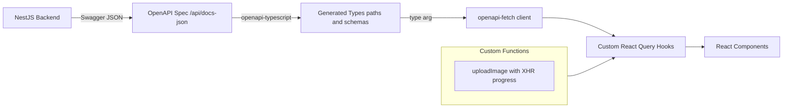

# Frontend Code Generation from OpenAPI - Options Analysis

## Overview

This document analyzes available options for generating TypeScript types, API methods, and React Query hooks from the backend's OpenAPI specification, instead of manually duplicating types and implementing API methods.

## Current Situation

In the existing plan (`stage4-frontend-setup-detailed-plan.md`):
- Types are manually duplicated from backend to frontend
- API methods are manually implemented using fetch
- TanStack Query hooks are manually created

**Problems with this approach:**
- Risk of type mismatch between frontend and backend
- Manual synchronization required when API changes
- Boilerplate code that could be auto-generated

## Available Solutions

### Option 1: Orval

**Library:** [orval-labs/orval](https://github.com/orval-labs/orval)

**What it generates:**
- TypeScript types from OpenAPI spec
- API client methods
- TanStack Query hooks (useQuery, useMutation, useInfinite)
- Mock data (optional)

**Installation:**
```bash
npm install -D orval
```

**Configuration example:**
```typescript
// orval.config.ts
import { defineConfig } from 'orval';

export default defineConfig({
  optiView: {
    input: 'http://localhost:3000/api/docs-json', // NestJS Swagger JSON endpoint
    output: {
      target: './src/api/generated.ts',
      schemas: './src/api/models',
      client: 'react-query',
      override: {
        query: {
          useQuery: true,
          useMutation: true,
          options: {
            staleTime: 1000 * 60 * 5, // 5 minutes
          },
        },
      },
    },
  },
});
```

**Generated hooks example:**
```typescript
// Auto-generated by Orval
export const useGetImages = (filters: ImageFilters, options?: { staleTime?: number }) => {
  return useQuery({
    queryKey: ['images', filters],
    queryFn: () => getImages(filters),
    ...options,
  });
};

export const useUpdateImageRating = () => {
  return useMutation({
    mutationFn: (params: { id: string; rating: number }) =>
      updateImageRating(params.id, params.rating),
  });
};
```

**Pros:**
- All-in-one solution (types + API client + hooks)
- Good TanStack Query v5 support
- Can fetch spec directly from running backend
- Supports file uploads
- Active community and regular updates
- Can generate mocks for testing

**Cons:**
- Generated code can be verbose
- Less control over generated hook implementations
- Custom hooks (like optimistic updates) need manual wrapper

---

### Option 2: openapi-typescript + openapi-react-query

**Libraries:**
- [openapi-typescript](https://github.com/openapi-ts/openapi-typescript) - Type generation
- [openapi-fetch](https://github.com/openapi-ts/openapi-typescript) - Type-safe fetch client
- [openapi-react-query](https://github.com/openapi-ts/openapi-typescript) - React Query integration

**What it generates:**
- TypeScript types only (no runtime code)
- Type-safe fetch client with autocomplete
- React Query hooks wrapper

**Installation:**
```bash
npm install -D openapi-typescript
npm install openapi-fetch openapi-react-query
```

**Configuration:**
```bash
# Generate types only
npx openapi-typescript http://localhost:3000/api/docs-json -o ./src/api/schema.gen.ts
```

**Usage example:**
```typescript
// src/api/client.ts
import createFetchClient from "openapi-fetch";
import createClient from "openapi-react-query";
import type { paths } from "./schema.gen";

const fetchClient = createFetchClient<paths>({
  baseUrl: import.meta.env.VITE_API_BASE_URL || "http://localhost:3000",
});

export const $api = createClient(fetchClient);

// In component
const { data, isLoading } = $api.useQuery("get", "/api/images", {
  params: {
    query: { genre: "Nature", page: 1 },
  },
});
```

**Pros:**
- Zero runtime cost for types (type-only generation)
- Very lightweight and fast
- Full type safety with autocomplete
- More control over hook implementations
- Works great with React Query v5

**Cons:**
- Need to set up client manually
- Hooks use method/path strings (less discoverable)
- File uploads need custom handling

---

### Option 3: Hybrid Approach (Recommended)

Use **openapi-typescript** for type generation + custom API client with React Query hooks.

**Workflow:**
1. Generate TypeScript types from OpenAPI spec
2. Create a custom type-safe API client using generated types
3. Create custom React Query hooks with fine-grained control

**Implementation:**

```typescript
// 1. Generate types
// npx openapi-typescript http://localhost:3000/api/docs-json -o ./src/api/types.gen.ts

// 2. Type-safe API client
// src/api/client.ts
import type { paths, components } from './types.gen';

type Image = components['schemas']['Image'];
type ImageFilters = components['schemas']['ImageFilterDto'];

const API_BASE_URL = import.meta.env.VITE_API_BASE_URL || 'http://localhost:3000';

export async function getImages(filters: ImageFilters): Promise<PaginatedResponse<Image>> {
  const params = new URLSearchParams();
  // ... build query string
  const response = await fetch(`${API_BASE_URL}/api/images?${params}`);
  return response.json();
}

// 3. Custom hooks with full control
// src/hooks/useImages.ts
export function useImages(filters: ImageFilters) {
  return useQuery({
    queryKey: ['images', filters],
    queryFn: () => getImages(filters),
    staleTime: 5 * 60 * 1000,
  });
}

// Custom mutation with optimistic updates
export function useUpdateRating() {
  const queryClient = useQueryClient();

  return useMutation({
    mutationFn: ({ id, rating }: { id: string; rating: number }) =>
      updateImageRating(id, rating),
    onMutate: async ({ id, rating }) => {
      // Full control over optimistic update logic
      await queryClient.cancelQueries({ queryKey: ['image', id] });
      const previous = queryClient.getQueryData(['image', id]);
      queryClient.setQueryData(['image', id], (old: Image) => ({
        ...old,
        rating,
      }));
      return { previous };
    },
    onError: (err, { id }, context) => {
      queryClient.setQueryData(['image', id], context.previous);
    },
  });
}
```

**Pros:**
- Types always in sync with backend
- Full control over hook implementations
- Can implement optimistic updates, custom caching strategies
- Cleaner generated code (types only)
- Better for complex scenarios like file upload with progress

**Cons:**
- More manual code to write for API methods
- Need to maintain API method implementations

---

## Comparison Summary

| Feature | Orval | openapi-typescript + openapi-fetch | Hybrid with openapi-fetch |
|---------|-------|----------------------------------|--------|
| Types generation | ✅ Full | ✅ Full | ✅ Full |
| API client generation | ✅ Auto | ✅ Auto via openapi-fetch | ✅ Auto via openapi-fetch |
| React Query hooks | ✅ Auto | ⚠️ Manual in hooks layer | ⚠️ Manual in hooks layer |
| Optimistic updates | ❌ Manual wrapper | ❌ Manual wrapper | ✅ Built-in in hooks |
| File upload progress | ⚠️ Limited | ⚠️ Manual | ✅ Full control (custom XHR) |
| Bundle size | Larger | Minimal (~3KB) | Minimal (~3KB) |
| Learning curve | Low | Low | Low |
| Customization | Limited | Medium | High |

---

## Recommendation

I recommend the **Hybrid Approach with openapi-fetch** for OptiView because:

1. **Types synchronization** - Guaranteed sync between frontend and backend via `openapi-typescript`
2. **Reduced boilerplate** - No manual API methods needed, openapi-fetch provides type-safe calls
3. **Full autocomplete** - Endpoints and parameters discovered via TypeScript
4. **Custom upload logic** - Image uploads with XHR progress tracking in separate function
5. **Optimistic updates** - Rating updates benefit from custom optimistic logic in hooks
6. **Minimal bundle** - openapi-fetch is tiny (~3KB gzipped)
7. **Easy maintenance** - When API changes, just regenerate types

### Proposed Workflow



### Implementation Steps

1. Add `openapi-typescript` (dev) and `openapi-fetch` as dependencies
2. Create npm script to generate types from running backend
3. Create openapi-fetch client with type argument from generated schema
4. Create custom upload function with XHR progress tracking
5. Create custom React Query hooks using openapi-fetch client
6. Add types regeneration to development workflow

---

## Decision

**Selected approach:** Hybrid Approach with openapi-fetch

**Rationale:**
1. Types synchronized with backend via `openapi-typescript`
2. Reduced boilerplate - no manual API methods for standard CRUD operations
3. Full type safety with autocomplete for all API endpoints
4. Keep custom upload implementation with XHR progress tracking
5. Custom optimistic updates for rating mutations still in hooks layer
6. Minimal bundle size (openapi-fetch is tiny, ~3KB gzipped)
7. Committed to git for stability and offline development

**Implementation decisions:**
1. **Type regeneration:** Manual when API changes (not automatically)
2. **Storage location:** `src/api/schema.gen.ts`
3. **API client:** `openapi-fetch` for all standard requests
4. **File uploads:** Keep custom `uploadImage` with XHR progress tracking
5. **CI/CD:** Generated types committed to git

---

## Updated Plan

The detailed implementation plan has been updated in [`stage4-frontend-setup-detailed-plan.md`](./stage4-frontend-setup-detailed-plan.md).

### Key changes from original plan:

| Aspect | Original | New |
|--------|----------|-----|
| Types | Manually duplicated | Generated from OpenAPI |
| Type file | `src/types/image.ts` | `src/api/schema.gen.ts` + `src/api/types.ts` |
| Synchronization | Manual | `npm run gen` |
| API client | Manual fetch wrappers | `openapi-fetch` client |
| Standard API methods | Manual each time | Automatic via openapi-fetch |
| File upload | Manual with XHR | Manual with XHR (preserved for progress) |
| Hooks | Manual | Manual (using openapi-fetch client) |

### New dependencies:

```bash
npm install openapi-fetch
npm install -D openapi-typescript
```

### New npm script:

```bash
npm run gen
```

This fetches the OpenAPI spec from `http://localhost:3000/api/docs-json` and generates TypeScript types.

### API Client Usage Example:

```typescript
import createFetchClient from "openapi-fetch";
import type { paths } from "./schema.gen";

const client = createFetchClient<paths>({
  baseUrl: import.meta.env.VITE_API_BASE_URL || "http://localhost:3000",
});

// Type-safe GET with autocomplete
const { data, error } = await client.GET("/api/images", {
  params: {
    query: { genre: "Nature", page: 1 }
  }
});

// Type-safe PATCH
const { data: updated } = await client.PATCH("/api/images/{id}/rating", {
  params: { path: { id: "123" } },
  body: { rating: 5 },
});
```

### Custom upload function (preserved):

```typescript
// src/api/images.api.ts - Only custom function needed
export async function uploadImage(
  file: File,
  genre: Genre,
  onProgress?: (progress: number) => void,
): Promise<Image> {
  // XHR-based upload with progress tracking
  // ... implementation
}
```

### Workflow when API changes:

1. Backend developer updates API/Swagger decorators
2. Backend is running at `localhost:3000`
3. Frontend developer runs `npm run gen`
4. New endpoints immediately available via `client.GET/POST/PATCH/DELETE`
5. TypeScript compiler catches any breaking changes
6. Commit updated `schema.gen.ts` to git
