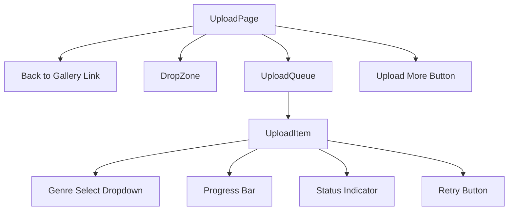
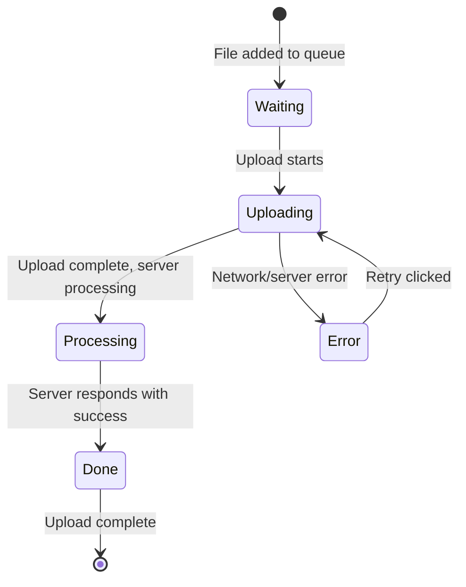

# Stage 6: Frontend Upload Feature - Detailed Implementation Plan

## 1. Overview

This document provides a comprehensive implementation plan for the Frontend Upload Feature (Stage 6) of the OptiView project. The upload feature enables users to upload images via drag-and-drop or file browser, with genre selection, progress tracking, and status indicators.

### Goal

Implement the upload page with drag-and-drop, progress tracking, and genre selection.

### Dependencies

- Stage 3: REST API Endpoints (completed)
- Stage 4: Frontend Setup (completed)
- Stage 5: Frontend Gallery Feature (completed)

### Existing Infrastructure

The following components are already in place:

- [`FAB.tsx`](frontend/src/components/FAB/FAB.tsx) - Floating action button navigating to `/upload`
- [`useUploadImage`](frontend/src/hooks/useImages.ts:105) hook - TanStack Query mutation with progress tracking
- [`uploadImage`](frontend/src/api/images.api.ts:23) API function - Axios-based upload with progress callback
- [`Genre`](frontend/src/api/types.ts:11) type from generated OpenAPI schema

---

## 2. Prerequisites

Before starting implementation, ensure the following are in place:

| Prerequisite                             | Status       | Notes                             |
|:-----------------------------------------|:-------------|:----------------------------------|
| Backend POST /api/images/upload endpoint | ✅ Complete  | Returns 201 with ImageResponseDto |
| TanStack Query configuration             | ✅ Complete  | Configured in main.tsx            |
| useUploadImage hook                      | ✅ Complete  | Has progress tracking support     |
| FAB component                            | ✅ Complete  | Navigates to /upload              |
| React Router /upload route               | ✅ Complete  | Placeholder exists in App.tsx     |
| Flowbite React components                | ✅ Available | For UI consistency                |
| react-dropzone package                   | ⬜ Required  | Install: `npm install react-dropzone` |

---

## 3. Component Architecture

### Component Hierarchy



### Component Responsibilities

| Component     | Responsibility                                                  |
|:--------------|:----------------------------------------------------------------|
| `UploadPage`  | Page container, manages upload queue state, coordinates uploads |
| `DropZone`    | Drag-and-drop area, file validation, file selection             |
| `UploadQueue` | Displays list of files with their upload status                 |
| `UploadItem`  | Individual file row with genre selection, progress, status      |

---

## 4. State Management

### Upload State Structure

> **Note:** Complete type definitions are provided in [Section 10: Types/Interfaces](#10-typesinterfaces). This section describes the state management approach.

State will be managed at the `UploadPage` level using `useState`. See Section 6 Step 6 for implementation details.

### State Flow Diagram



---

## 5. API Integration

### Upload Endpoint

```
POST /api/images/upload
Content-Type: multipart/form-data

Request Body:
- file: File (required)
- genre: string (optional, defaults to "Uncategorized")

Response (201 Created):
{
  "id": "uuid",
  "filename": "string",
  "genre": "string",
  "rating": 3,
  "aspectRatio": number,
  "dominantColor": "string",
  "lqipBase64": "string",
  "width": number,
  "height": number,
  "createdAt": "ISO date string"
}
```

### Existing Integration

The [`uploadImage`](frontend/src/api/images.api.ts:23) function already handles:

- FormData construction
- Axios POST request
- Progress tracking via `onUploadProgress` callback

```typescript
// Usage example from existing code
const { mutate: uploadImage } = useUploadImage();

uploadImage({
  file: selectedFile,
  genre: 'Nature',
  onProgress: (progress) => console.log(`${progress}%`),
});
```

---

## 6. Implementation Steps

### Step 1: Create Type Definitions

Create `frontend/src/types/upload.ts` with the types defined in [Section 10: Types/Interfaces](#10-typesinterfaces).

> **Note:** The complete type definitions with JSDoc comments are provided in Section 10 to avoid duplication.

### Step 2: Install react-dropzone

Install the react-dropzone package:

```bash
npm install react-dropzone
```

**Why react-dropzone?**

- Provides battle-tested drag-and-drop functionality
- Built-in file type and size validation via `accept` and `maxSize` props
- Handles keyboard navigation and accessibility automatically
- Exposes visual state flags: `isDragActive`, `isDragAccept`, `isDragReject`
- Reduces boilerplate code significantly

### Step 3: Implement DropZone Component

Create `frontend/src/components/Upload/DropZone.tsx`:

> **Note:** Props interface is defined in [Section 10: Types/Interfaces](#10-typesinterfaces).

**Key Features:**

- Full-page clickable dropzone area
- Drag-over visual feedback (border highlight, background change)
- Click to open file browser
- Multiple file selection support
- File type and size validation with error display
- Supported formats hint text

**Implementation with react-dropzone:**

```tsx
import { useCallback } from 'react';
import { useDropzone, FileRejection } from 'react-dropzone';
import { Alert } from 'flowbite-react';

const MAX_FILE_SIZE = 10 * 1024 * 1024; // 10MB

export function DropZone({ onFilesSelected, disabled = false }: DropZoneProps) {
  const onDrop = useCallback((acceptedFiles: File[]) => {
    if (acceptedFiles.length > 0) {
      onFilesSelected(acceptedFiles);
    }
  }, [onFilesSelected]);

  const {
    getRootProps,
    getInputProps,
    isDragActive,
    isDragAccept,
    isDragReject,
    fileRejections
  } = useDropzone({
    accept: {
      'image/jpeg': ['.jpg', '.jpeg'],
      'image/png': ['.png'],
      'image/webp': ['.webp']
    },
    maxSize: MAX_FILE_SIZE,
    multiple: true,
    disabled,
    onDrop
  });

  // Build dynamic className based on state
  const getClassName = () => {
    const baseClasses = 'border-2 rounded-lg p-8 text-center transition-colors cursor-pointer';

    if (disabled) {
      return `${baseClasses} opacity-50 cursor-not-allowed border-dashed border-gray-300 bg-gray-50`;
    }
    if (isDragReject) {
      return `${baseClasses} border-solid border-red-500 bg-red-50`;
    }
    if (isDragAccept) {
      return `${baseClasses} border-solid border-green-500 bg-green-50`;
    }
    if (isDragActive) {
      return `${baseClasses} border-solid border-blue-500 bg-blue-50`;
    }
    return `${baseClasses} border-dashed border-gray-300 bg-gray-50 hover:border-gray-400`;
  };

  return (
    <div {...getRootProps({ className: getClassName() })}>
      <input {...getInputProps()} />

      {isDragReject ? (
        <p className="text-red-600">Some files will be rejected</p>
      ) : isDragActive ? (
        <p className="text-blue-600">Drop files here...</p>
      ) : (
        <>
          <p className="text-gray-600">Drag and drop images here, or click to select</p>
          <p className="text-sm text-gray-400 mt-2">
            Supports: JPEG, PNG, WebP • Max size: 10MB
          </p>
        </>
      )}

      {/* Display validation errors */}
      {fileRejections.length > 0 && (
        <div className="mt-4 space-y-2">
          {fileRejections.map(({ file, errors }: FileRejection) => (
            <Alert key={file.name} color="failure" className="text-left">
              <span className="font-medium">{file.name}:</span>{' '}
              {errors.map(e => e.message).join(', ')}
            </Alert>
          ))}
        </div>
      )}
    </div>
  );
}
```

**Key react-dropzone Features Used:**

| Feature | Prop/Return Value | Purpose |
|:--------|:------------------|:--------|
| File type restriction | `accept` prop | Restrict to JPEG, PNG, WebP |
| File size limit | `maxSize` prop | Reject files > 10MB |
| Multiple files | `multiple: true` | Allow multiple file selection |
| Disabled state | `disabled` prop | Disable during uploads |
| Visual feedback | `isDragActive`, `isDragAccept`, `isDragReject` | Style based on drag state |
| Error handling | `fileRejections` array | Display validation errors |

### Step 4: Implement UploadItem Component

Create `frontend/src/components/Upload/UploadItem.tsx`:

> **Note:** Props interface is defined in [Section 10: Types/Interfaces](#10-typesinterfaces).

**Key Features:**

- Display filename (truncate if too long)
- Genre dropdown with predefined options + custom input
- Progress bar with percentage
- Status indicator with icon (see [Section 11: Styling Guidelines](#11-styling-guidelines) for status colors)
- Retry button for failed uploads
- Remove button for waiting items

### Step 5: Implement UploadQueue Component

Create `frontend/src/components/Upload/UploadQueue.tsx`:

> **Note:** Props interface is defined in [Section 10: Types/Interfaces](#10-typesinterfaces).

**Key Features:**

- List container for upload items
- Empty state message when no items
- Scrollable if many items
- Summary stats (X of Y uploaded)

### Step 6: Implement UploadPage Component

Update `frontend/src/pages/UploadPage.tsx`:

**State Management:**

```typescript
const [uploadQueue, setUploadQueue] = useState<UploadItemState[]>([]);
const [isUploading, setIsUploading] = useState(false);
```

**Key Functions:**

1. `handleFilesSelected` - Add files to queue with default genre
2. `handleGenreChange` - Update genre for specific item
3. `handleUploadAll` - Start uploading all waiting items
4. `handleRetry` - Retry failed upload
5. `handleRemove` - Remove item from queue
6. `processUpload` - Execute single upload with progress tracking

**Upload Processing Logic:**

```typescript
const processUpload = async (item: UploadItemState) => {
  // Update status to uploading
  updateItemStatus(item.id, 'uploading');

  try {
    const result = await uploadImage(item.file, item.genre, (progress) => {
      updateItemProgress(item.id, progress);
    });

    // Update status to done with result
    updateItemResult(item.id, result);
  } catch (error) {
    // Update status to error with message
    updateItemError(item.id, error.message);
  }
};
```

### Step 7: Update App.tsx Routes

The route already exists but needs the actual component:

```typescript
// App.tsx
import {UploadPage} from './pages/UploadPage';

// Route is already configured
<Route path="/upload" element={<UploadPage />} />
```

---

## 7. File Structure

```
frontend/src/
├── components/
│   └── Upload/
│       ├── DropZone.tsx          # Drag-and-drop component (uses react-dropzone)
│       ├── DropZone.test.tsx     # DropZone tests
│       ├── UploadQueue.tsx       # Queue list component
│       ├── UploadQueue.test.tsx  # UploadQueue tests
│       ├── UploadItem.tsx        # Individual item component
│       └── UploadItem.test.tsx   # UploadItem tests
├── pages/
│   ├── UploadPage.tsx            # Upload page (update existing)
│   └── UploadPage.test.tsx       # Upload page tests
└── types/
    └── upload.ts                 # Upload-specific types
```

> **Note:** File validation utilities are no longer needed as react-dropzone handles validation via its `accept` and `maxSize` props. The `fileRejections` array provides detailed error information.

---

## 8. Component Specifications

### 8.1 DropZone Component

**Location:** `frontend/src/components/Upload/DropZone.tsx`

**Props:**

| Prop            | Type                    | Required | Description                               |
|:----------------|:------------------------|:---------|:------------------------------------------|
| onFilesSelected | (files: File[]) => void | Yes      | Callback when valid files are selected    |
| disabled        | boolean                 | No       | Disable dropzone when uploads in progress |

**Visual States:**

- Default: Dashed border, light background
- Drag-accept: Solid green border, green background
- Drag-reject: Solid red border, red background
- Drag-active: Solid blue border, blue background
- Disabled: Reduced opacity, cursor not-allowed

**Accessibility (handled by react-dropzone):**

- Role: button
- TabIndex: 0
- Keyboard: Enter/Space opens file browser
- ARIA attributes: Automatically managed by react-dropzone

**Implementation Note:**

The DropZone component uses `react-dropzone`'s `useDropzone` hook which handles:
- Drag event management
- File input handling
- Keyboard navigation
- ARIA attributes

See Step 3 for the complete implementation code.

### 8.2 UploadItem Component

**Location:** `frontend/src/components/Upload/UploadItem.tsx`

**Props:**

| Prop                | Type                                      | Required | Description                 |
|:--------------------|:------------------------------------------|:---------|:----------------------------|
| item                | UploadItemState                           | Yes      | Upload item state           |
| onGenreChange       | (id: string, genre: Genre) => void        | Yes      | Genre change callback       |
| onCustomGenreChange | (id: string, customGenre: string) => void | Yes      | Custom genre input callback |
| onRetry             | (id: string) => void                      | Yes      | Retry upload callback       |
| onRemove            | (id: string) => void                      | Yes      | Remove from queue callback  |

**Layout:**

```
┌─────────────────────────────────────────────────────────────────┐
│ [Thumbnail] filename.jpg  [Genre ▼]  ████████░░ 80%  [Status]  │
└─────────────────────────────────────────────────────────────────┘
```

**Genre Selection:**

- Predefined options: Nature, Architecture, Portrait, Uncategorized
- "Custom..." option that reveals text input
- Default: Uncategorized
- Disabled when status is not 'waiting' or 'error'

### 8.3 UploadQueue Component

**Location:** `frontend/src/components/Upload/UploadQueue.tsx`

**Props:**

| Prop                | Type                                      | Required | Description           |
|:--------------------|:------------------------------------------|:---------|:----------------------|
| items               | UploadItemState[]                         | Yes      | List of upload items  |
| onGenreChange       | (id: string, genre: Genre) => void        | Yes      | Genre change callback |
| onCustomGenreChange | (id: string, customGenre: string) => void | Yes      | Custom genre callback |
| onRetry             | (id: string) => void                      | Yes      | Retry callback        |
| onRemove            | (id: string) => void                      | Yes      | Remove callback       |

**Features:**

- Scrollable container with max-height
- Empty state when no items
- Summary: "X of Y uploads complete"

### 8.4 UploadPage Component

**Location:** `frontend/src/pages/UploadPage.tsx`

**Layout:**

```
┌─────────────────────────────────────────────────────────────────┐
│ [← Back to Gallery]                                             │
├─────────────────────────────────────────────────────────────────┤
│                                                                 │
│   ┌─────────────────────────────────────────────────────────┐   │
│   │           DropZone Component                            │   │
│   └─────────────────────────────────────────────────────────┘   │
│                                                                 │
│   Upload Queue:                                                 │
│   ┌─────────────────────────────────────────────────────────┐   │
│   │           UploadQueue Component                         │   │
│   └─────────────────────────────────────────────────────────┘   │
│                                                                 │
│   [Upload All]  [Upload More]  [Go to Gallery]                 │
│                                                                 │
└─────────────────────────────────────────────────────────────────┘
```

> **Note:** State management implementation is shown in [Section 6 Step 6](#step-6-implement-uploadpage-component).

---

## 9. Custom Hooks

### useUploadQueue Hook

Create `frontend/src/hooks/useUploadQueue.ts`:

```typescript
export function useUploadQueue() {
  const [items, setItems] = useState<UploadItemState[]>([]);
  const [isUploading, setIsUploading] = useState(false);
  const uploadMutation = useUploadImage();

  const addFiles = useCallback((files: File[]) => {
    const newItems: UploadItemState[] = files.map(file => ({
      id: crypto.randomUUID(),
      file,
      genre: 'Uncategorized' as Genre,
      status: 'waiting',
      progress: 0,
    }));
    setItems(prev => [...prev, ...newItems]);
  }, []);

  const updateGenre = useCallback((id: string, genre: Genre) => {
    setItems(prev => prev.map(item =>
      item.id === id ? { ...item, genre } : item
    ));
  }, []);

  const updateProgress = useCallback((id: string, progress: number) => {
    setItems(prev => prev.map(item =>
      item.id === id ? { ...item, progress } : item
    ));
  }, []);

  const updateStatus = useCallback((id: string, status: UploadStatus, error?: string) => {
    setItems(prev => prev.map(item =>
      item.id === id ? { ...item, status, error } : item
    ));
  }, []);

  const removeItem = useCallback((id: string) => {
    setItems(prev => prev.filter(item => item.id !== id));
  }, []);

  const uploadItem = useCallback(async (item: UploadItemState) => {
    updateStatus(item.id, 'uploading');

    try {
      const result = await uploadMutation.mutateAsync({
        file: item.file,
        genre: item.genre,
        onProgress: (progress) => updateProgress(item.id, progress),
      });

      setItems(prev => prev.map(i =>
        i.id === item.id ? { ...i, status: 'done', result } : i
      ));
    } catch (error) {
      updateStatus(item.id, 'error', error instanceof Error ? error.message : 'Upload failed');
    }
  }, [uploadMutation, updateProgress, updateStatus]);

  const uploadAll = useCallback(async () => {
    setIsUploading(true);
    const waitingItems = items.filter(item => item.status === 'waiting');

    for (const item of waitingItems) {
      await uploadItem(item);
    }

    setIsUploading(false);
  }, [items, uploadItem]);

  const retryItem = useCallback((id: string) => {
    const item = items.find(i => i.id === id);
    if (item) {
      uploadItem(item);
    }
  }, [items, uploadItem]);

  return {
    items,
    isUploading,
    addFiles,
    updateGenre,
    removeItem,
    uploadAll,
    retryItem,
  };
}
```

---

## 10. Types/Interfaces

### Complete Type Definitions

```typescript
// frontend/src/types/upload.ts

import type { Genre, Image } from '@/api/types';

/**
 * Upload status for tracking file upload progress
 */
export type UploadStatus =
  | 'waiting'     // In queue, waiting to start
  | 'uploading'   // Currently uploading with progress
  | 'processing'  // Upload complete, server processing
  | 'done'        // Successfully completed
  | 'error';      // Failed with error

/**
 * State for a single upload item in the queue
 */
export interface UploadItemState {
  /** Unique identifier for queue management */
  id: string;
  /** The file being uploaded */
  file: File;
  /** Selected genre category */
  genre: Genre;
  /** Custom genre name if genre is custom */
  customGenre?: string;
  /** Current upload status */
  status: UploadStatus;
  /** Upload progress percentage (0-100) */
  progress: number;
  /** Error message if status is 'error' */
  error?: string;
  /** Server response on successful upload */
  result?: Image;
}

/**
 * Props for DropZone component
 */
export interface DropZoneProps {
  /** Callback when valid files are selected */
  onFilesSelected: (files: File[]) => void;
  /** Disable dropzone during uploads */
  disabled?: boolean;
}

/**
 * Props for UploadItem component
 */
export interface UploadItemProps {
  /** Upload item state */
  item: UploadItemState;
  /** Genre change callback */
  onGenreChange: (id: string, genre: Genre) => void;
  /** Custom genre input callback */
  onCustomGenreChange: (id: string, customGenre: string) => void;
  /** Retry upload callback */
  onRetry: (id: string) => void;
  /** Remove from queue callback */
  onRemove: (id: string) => void;
}

/**
 * Props for UploadQueue component
 */
export interface UploadQueueProps {
  /** List of upload items */
  items: UploadItemState[];
  /** Genre change callback */
  onGenreChange: (id: string, genre: Genre) => void;
  /** Custom genre input callback */
  onCustomGenreChange: (id: string, customGenre: string) => void;
  /** Retry callback */
  onRetry: (id: string) => void;
  /** Remove callback */
  onRemove: (id: string) => void;
}
```

> **Note:** The `ValidationResult` interface is no longer needed as react-dropzone handles validation through its `accept` and `maxSize` props, with errors available via the `fileRejections` array.

---

## 11. Styling Guidelines

### CSS Approach

- Use Tailwind CSS classes (already configured)
- Use Flowbite React components for consistency
- Follow existing patterns from Gallery components

### Key Styles

**DropZone:**

```css
/* Default state */
border-2 border-dashed border-gray-300
bg-gray-50
rounded-lg
p-8
text-center
cursor-pointer
transition-colors

/* Drag-over state */
border-solid border-blue-500
bg-blue-50

/* Disabled state */
opacity-50
cursor-not-allowed
```

**Progress Bar:**

```css
/* Using Flowbite Progress component */
<Progress progress={item.progress} color="blue" />
```

**Status Colors:**

| Status | Tailwind Color Class |
|:-------|:---------------------|
| waiting | text-gray-500 |
| uploading | text-blue-500 |
| processing | text-yellow-500 |
| done | text-green-500 |
| error | text-red-500 |

**Upload Item Container:**

```css
flex items-center gap-4
p-4
bg-white
rounded-lg
border border-gray-200
shadow-sm
```

---

## 12. Error Handling

### Error Scenarios

| Scenario               | Error Type | User Message                                   | Recovery Action                |
|:-----------------------|:-----------|:-----------------------------------------------|:-------------------------------|
| Invalid file type      | Validation | "Invalid file type. Allowed: JPEG, PNG, WebP"  | Show error, reject file        |
| File too large         | Validation | "File too large. Maximum size: 10MB"           | Show error, reject file        |
| Network error          | Network    | "Network error. Please check your connection." | Show retry button              |
| Server error (500)     | Server     | "Server error. Please try again later."        | Show retry button              |
| Validation error (400) | Server     | Display server message                         | Show retry with different file |
| Timeout                | Network    | "Upload timed out. Please try again."          | Show retry button              |

### Error Display

```tsx
import { ExclamationCircleIcon } from '@heroicons/react/24/outline';

// In UploadItem component
{item.status === 'error' && (
  <div className="flex items-center gap-2 text-red-500">
    <ExclamationCircleIcon className="h-5 w-5" />
    <span className="text-sm">{item.error}</span>
    <Button size="xs" onClick={() => onRetry(item.id)}>
      Retry
    </Button>
  </div>
)}
```

### Validation Error Display (react-dropzone)

```tsx
// In DropZone component - fileRejections provided by useDropzone
{fileRejections.length > 0 && (
  <div className="mt-4 space-y-2">
    {fileRejections.map(({ file, errors }: FileRejection) => (
      <Alert key={file.name} color="failure" className="text-left">
        <span className="font-medium">{file.name}:</span>{' '}
        {errors.map(e => e.message).join(', ')}
      </Alert>
    ))}
  </div>
)}
```

> **Note:** react-dropzone provides the `fileRejections` array which contains files that failed validation along with their error messages. No manual validation utilities are needed.

---

## 13. Testing Strategy

### Unit Tests

#### DropZone Tests (`DropZone.test.tsx`)

```typescript
describe('DropZone', () => {
  it('should render dropzone area', () => {});
  it('should accept valid file types on drop', () => {});
  it('should reject invalid file types', () => {});
  it('should reject files larger than 10MB', () => {});
  it('should show visual feedback on drag-over', () => {});
  it('should open file browser on click', () => {});
  it('should open file browser on Enter key', () => {});
  it('should be disabled when disabled prop is true', () => {});
  it('should accept multiple files', () => {});
});
```

#### UploadItem Tests (`UploadItem.test.tsx`)

```typescript
describe('UploadItem', () => {
  it('should display filename', () => {});
  it('should show progress bar', () => {});
  it('should show correct status indicator', () => {});
  it('should allow genre selection when waiting', () => {});
  it('should disable genre selection when uploading', () => {});
  it('should show retry button on error', () => {});
  it('should show remove button when waiting', () => {});
  it('should call onRetry when retry clicked', () => {});
  it('should call onRemove when remove clicked', () => {});
});
```

#### UploadQueue Tests (`UploadQueue.test.tsx`)

```typescript
describe('UploadQueue', () => {
  it('should render list of upload items', () => {});
  it('should show empty state when no items', () => {});
  it('should show upload summary', () => {});
  it('should pass callbacks to items', () => {});
});
```

#### UploadPage Tests (`UploadPage.test.tsx`)

```typescript
describe('UploadPage', () => {
  it('should render back to gallery link', () => {});
  it('should render dropzone', () => {});
  it('should add files to queue on drop', () => {});
  it('should start upload when upload all clicked', () => {});
  it('should show success state after upload', () => {});
  it('should show error state on failure', () => {});
  it('should navigate to gallery on success', () => {});
});
```

> **Note:** File validation tests are no longer needed as react-dropzone handles validation internally. The DropZone tests verify that validation works correctly through the library's `accept` and `maxSize` props.

### Integration Tests

```typescript
describe('Upload Flow', () => {
  it('should complete full upload flow', async () => {
    // 1. Render UploadPage
    // 2. Drop valid file
    // 3. Select genre
    // 4. Click upload
    // 5. Wait for success
    // 6. Verify image in gallery
  });
});
```

---

## 14. Accessibility Requirements

### Keyboard Navigation

| Element       | Key         | Action                 |
|:--------------|:------------|:-----------------------|
| DropZone      | Tab         | Focus dropzone         |
| DropZone      | Enter/Space | Open file browser      |
| UploadItem    | Tab         | Navigate between items |
| Genre Select  | Enter       | Open dropdown          |
| Retry Button  | Enter       | Retry upload           |
| Remove Button | Enter       | Remove from queue      |

### ARIA Attributes

**DropZone (handled by react-dropzone):**

react-dropzone automatically provides proper ARIA attributes through `getRootProps()`. No manual ARIA attributes are needed:

```tsx
// react-dropzone handles these automatically:
// - role="button"
// - tabIndex={0}
// - aria-label (descriptive text)
// - aria-disabled={disabled}
```

**Progress Bar:**

```tsx
<Progress
  progress={item.progress}
  aria-label={`Upload progress: ${item.progress}%`}
/>
```

**Status Indicator:**

```tsx
<span aria-live="polite" aria-atomic="true">
  {statusMessages[item.status]}
</span>
```

### Focus Management

- Focus should remain on DropZone after file selection
- Focus should move to first UploadItem after files added
- Focus trap not required (not a modal)

### Screen Reader Announcements

- Announce when files are added to queue
- Announce upload progress at 25%, 50%, 75%, 100%
- Announce success/failure of each upload

---

## 15. Risks and Mitigations

| Risk                                | Probability | Impact | Mitigation                                          |
|:------------------------------------|:------------|:-------|:----------------------------------------------------|
| Large file upload timeouts          | Medium      | Medium | Configure axios timeout, show progress feedback     |
| Browser file API limitations        | Low         | Low    | Test across Chrome, Firefox, Safari, Edge           |
| Memory issues with many files       | Low         | Medium | Limit concurrent uploads to 3, warn for >10 files   |
| Network interruption during upload  | Medium      | Medium | Implement retry logic, show error state             |
| Server processing delays            | Low         | Low    | Show "processing" status after upload complete      |
| MIME type spoofing                  | Low         | High   | Backend validates magic bytes (already implemented) |
| Drag-and-drop not working on mobile | High        | Low    | Provide click-to-browse fallback (already planned)  |

### Mobile Considerations

- Drag-and-drop not supported on most mobile browsers
- Click-to-browse is the primary method on mobile
- Touch-friendly button sizes (min 44x44px)
- Consider camera capture option for mobile

---

## 16. Definition of Done Checklist

### Functionality

- [ ] Drag and drop accepts valid file types (JPEG, PNG, WebP)
- [ ] Invalid files show appropriate error message
- [ ] File size validation rejects files > 10MB
- [ ] Multiple files can be selected and uploaded
- [ ] Genre selection works for each file
- [ ] Default genre is "Uncategorized"
- [ ] Custom genre input is available
- [ ] Progress bar updates during upload
- [ ] Status indicators show correct state
- [ ] Success state displays correctly
- [ ] Error state displays with retry option
- [ ] Uploads complete and images appear in gallery
- [ ] Back to Gallery link works
- [ ] FAB navigates to upload page

### Code Quality

- [ ] All components use named exports
- [ ] TypeScript types are complete and accurate
- [ ] No console errors in browser
- [ ] ESLint passes with no errors
- [ ] Code follows existing project patterns

### Testing

- [ ] Unit tests for DropZone component pass
- [ ] Unit tests for UploadItem component pass
- [ ] Unit tests for UploadQueue component pass
- [ ] Unit tests for UploadPage pass
- [ ] Test coverage meets project standards

> **Note:** File validation tests are no longer needed as react-dropzone handles validation internally.

### Accessibility

- [ ] Keyboard navigation works throughout
- [ ] ARIA labels are present and correct
- [ ] Screen reader announces status changes
- [ ] Focus states are visible
- [ ] Touch targets are at least 44x44px

### Documentation

- [ ] Component props are documented
- [ ] Complex logic has inline comments
- [ ] README updated if needed

---

## Appendix A: Genre Selection Implementation

### Genre Dropdown with Custom Option

```tsx
import { Select, TextInput } from 'flowbite-react';
import type { Genre } from '@/api/types';

const PREDEFINED_GENRES: Genre[] = ['Nature', 'Architecture', 'Portrait', 'Uncategorized'];

interface GenreSelectProps {
  value: Genre;
  customValue?: string;
  onChange: (genre: Genre) => void;
  onCustomChange: (customGenre: string) => void;
  disabled?: boolean;
}

export function GenreSelect({ value, customValue, onChange, onCustomChange, disabled }: GenreSelectProps) {
  const [showCustomInput, setShowCustomInput] = useState(false);

  const handleChange = (e: React.ChangeEvent<HTMLSelectElement>) => {
    const selectedValue = e.target.value;
    if (selectedValue === '__custom__') {
      setShowCustomInput(true);
    } else {
      setShowCustomInput(false);
      onChange(selectedValue as Genre);
    }
  };

  return (
    <div className="flex flex-col gap-2">
      <Select
        value={showCustomInput ? '__custom__' : value}
        onChange={handleChange}
        disabled={disabled}
        className="w-40"
      >
        {PREDEFINED_GENRES.map(genre => (
          <option key={genre} value={genre}>{genre}</option>
        ))}
        <option value="__custom__">Custom...</option>
      </Select>

      {showCustomInput && (
        <TextInput
          type="text"
          placeholder="Enter custom genre"
          value={customValue ?? ''}
          onChange={(e) => onCustomChange(e.target.value)}
          disabled={disabled}
          className="w-40"
        />
      )}
    </div>
  );
}
```

---

## Appendix B: Upload Status Icons

The project uses `@heroicons/react` for icons. Import from `@heroicons/react/24/outline` for consistent styling with existing components like [`Lightbox.tsx`](frontend/src/components/Gallery/Lightbox.tsx:3).

```tsx
// StatusIcon component
import {
  ClockIcon,
  ArrowUpIcon,
  ArrowPathIcon,
  CheckIcon,
  XMarkIcon,
} from '@heroicons/react/24/outline';

const statusIcons: Record<UploadStatus, React.ReactNode> = {
  waiting: <ClockIcon className="h-5 w-5 text-gray-500" />,
  uploading: <ArrowUpIcon className="h-5 w-5 text-blue-500 animate-bounce" />,
  processing: <ArrowPathIcon className="h-5 w-5 text-yellow-500 animate-spin" />,
  done: <CheckIcon className="h-5 w-5 text-green-500" />,
  error: <XMarkIcon className="h-5 w-5 text-red-500" />,
};

export function StatusIcon({ status }: { status: UploadStatus }) {
  return statusIcons[status];
}
```

> **Note:** Error display implementation is shown in [Section 12: Error Handling](#12-error-handling).

---

## Appendix C: Concurrent Upload Management

To prevent overwhelming the server and browser, limit concurrent uploads:

```tsx
// In useUploadQueue hook
const MAX_CONCURRENT_UPLOADS = 3;

const uploadAll = useCallback(async () => {
  setIsUploading(true);
  const waitingItems = items.filter(item => item.status === 'waiting');

  // Process in batches
  for (let i = 0; i < waitingItems.length; i += MAX_CONCURRENT_UPLOADS) {
    const batch = waitingItems.slice(i, i + MAX_CONCURRENT_UPLOADS);
    await Promise.all(batch.map(item => uploadItem(item)));
  }

  setIsUploading(false);
}, [items, uploadItem]);
```
