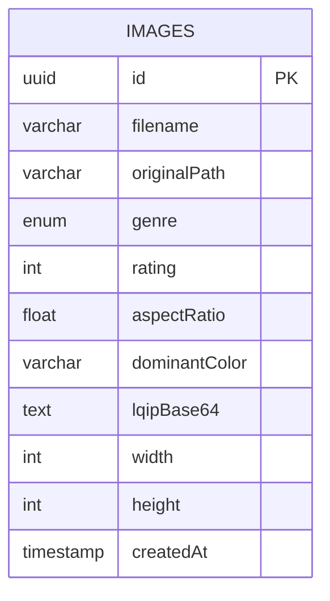
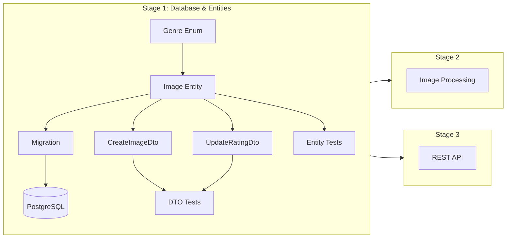

# Stage 1: Backend Core - Database & Entities

## Detailed Implementation Plan

---

## 1. Overview

### Goal

Implement the database schema and TypeORM entities for image metadata storage as the foundation for the OptiView image delivery system.

### Dependencies

- **Stage 0: Infrastructure Setup** must be completed
- PostgreSQL 16 container running via Docker Compose
- NestJS project initialized with TypeORM integration
- Database connectivity verified

### Key Decisions (Clarified)

| Decision | Choice | Rationale |
|:---------|:-------|:----------|
| Rating default value | Database level `DEFAULT 3` | Ensures consistency at data level |
| lqipBase64 column type | `text` | Base64 strings can exceed varchar limits |
| Validation decorators | DTOs only | Follows NestJS best practices |

---

## 2. Architecture Context

### Entity Relationship Diagram



### File Structure

```
backend/
├── src/
│   ├── entities/
│   │   ├── image.entity.ts
│   │   ├── image.entity.spec.ts
│   │   └── genre.enum.ts
│   ├── modules/
│   │   └── images/
│   │       ├── dto/
│   │       │   ├── create-image.dto.ts
│   │       │   └── update-rating.dto.ts
│   │       └── ...
│   └── migrations/
│       └── [timestamp]-initial-schema.ts
└── ...
```

---

## 3. Implementation Tasks

### Task 1: Create Genre Enum

**File:** `backend/src/entities/genre.enum.ts`

```typescript
export enum Genre {
  NATURE = 'Nature',
  ARCHITECTURE = 'Architecture',
  PORTRAIT = 'Portrait',
  UNCATEGORIZED = 'Uncategorized',
}
```

**Details:**

- Use string enum for database readability
- Values match UI requirements from UI.md
- `Uncategorized` serves as default for new uploads

**Acceptance Criteria:**

- [ ] Enum compiles without errors
- [ ] All four genres are defined
- [ ] Enum is exported correctly for use in entity

---

### Task 2: Create Image Entity

**File:** `backend/src/entities/image.entity.ts`

#### Field Specifications

| Field           | Type         | Constraints             | Description                      |
|:----------------|:-------------|:------------------------|:---------------------------------|
| `id`            | UUID         | PRIMARY KEY, NOT NULL   | Auto-generated unique identifier |
| `filename`      | varchar(255) | NOT NULL                | Original filename from upload    |
| `originalPath`  | varchar(500) | NOT NULL                | Relative path to original file   |
| `genre`         | enum         | NOT NULL                | Image category from Genre enum   |
| `rating`        | int          | NOT NULL, DEFAULT 3     | User rating 1-5                  |
| `aspectRatio`   | float        | NOT NULL                | Width / Height ratio             |
| `dominantColor` | varchar(7)   | NOT NULL                | Hex color code e.g. #FF5733      |
| `lqipBase64`    | text         | NOT NULL                | Base64-encoded LQIP image        |
| `width`         | int          | NOT NULL                | Original image width in pixels   |
| `height`        | int          | NOT NULL                | Original image height in pixels  |
| `createdAt`     | timestamp    | NOT NULL, DEFAULT NOW() | Record creation timestamp        |

#### Entity Implementation

```typescript
import {
  Entity,
  PrimaryGeneratedColumn,
  Column,
  CreateDateColumn,
} from 'typeorm';
import { Genre } from './genre.enum';

@Entity('images')
export class Image {
  @PrimaryGeneratedColumn('uuid')
  id: string;

  @Column({ length: 255 })
  filename: string;

  @Column({ length: 500 })
  originalPath: string;

  @Column({
    type: 'enum',
    enum: Genre,
    default: Genre.UNCATEGORIZED,
  })
  genre: Genre;

  @Column({
    type: 'int',
    default: 3,
  })
  rating: number;

  @Column({ type: 'float' })
  aspectRatio: number;

  @Column({ length: 7 })
  dominantColor: string;

  @Column({ type: 'text' })
  lqipBase64: string;

  @Column({ type: 'int' })
  width: number;

  @Column({ type: 'int' })
  height: number;

  @CreateDateColumn({ type: 'timestamp' })
  createdAt: Date;
}
```

**Acceptance Criteria:**

- [ ] Entity compiles without errors
- [ ] All fields have appropriate TypeORM decorators
- [ ] Column types match specifications
- [ ] Default values are set for rating and genre
- [ ] Entity is registered in TypeORM configuration

---

### Task 3: Create DTOs for Validation

**Directory:** `backend/src/modules/images/dto/`

#### CreateImageDto (for future upload endpoint)

```typescript
// create-image.dto.ts
import { IsEnum, IsOptional } from 'class-validator';
import { Genre } from '../../../entities/genre.enum';

export class CreateImageDto {
  @IsOptional()
  @IsEnum(Genre, { message: 'Genre must be a valid category' })
  genre?: Genre;
}
```

#### UpdateRatingDto

```typescript
// update-rating.dto.ts
import { IsInt, Min, Max } from 'class-validator';

export class UpdateRatingDto {
  @IsInt({ message: 'Rating must be an integer' })
  @Min(1, { message: 'Rating must be at least 1' })
  @Max(5, { message: 'Rating must be at most 5' })
  rating: number;
}
```

**Acceptance Criteria:**

- [ ] DTOs compile without errors
- [ ] Validation decorators properly configured
- [ ] Error messages are descriptive
- [ ] DTOs are ready for controller use

---

### Task 4: Register Entity in TypeORM Configuration

**File:** `backend/src/app.module.ts` or `backend/src/config/typeorm.config.ts`

Update TypeORM configuration to include the Image entity:

```typescript
import { TypeOrmModule } from '@nestjs/typeorm';
import { Image } from './entities/image.entity';

@Module({
  imports: [
    TypeOrmModule.forRootAsync({
      // ... existing config
      entities: [Image],
      // OR use auto-load:
      // autoLoadEntities: true,
    }),
  ],
})
export class AppModule {}
```

**Acceptance Criteria:**

- [ ] Entity is registered in TypeORM
- [ ] Application starts without errors
- [ ] Database connection established

---

### Task 5: Generate Initial Migration

#### Step 5.1: Configure Migration Settings

Ensure `ormconfig.js` or TypeORM config in `app.module.ts` has:

```typescript
{
  // ...
  synchronize: false, // Always false in production
  migrations: ['src/migrations/*.ts'],
  migrationsRun: true, // Optional: auto-run migrations
}
```

#### Step 5.2: Generate Migration

Run the TypeORM CLI command:

```bash
# Using NestJS CLI
npm run migration:generate -- -n initial-schema

# OR using TypeORM CLI directly
npx typeorm migration:generate -n initial-schema
```

#### Step 5.3: Review Generated Migration

Expected migration structure:

```typescript
import { MigrationInterface, QueryRunner } from 'typeorm';

export class InitialSchema1234567890123 implements MigrationInterface {
  name = 'InitialSchema1234567890123';

  public async up(queryRunner: QueryRunner): Promise<void> {
    // Create enum type
    await queryRunner.query(
      `CREATE TYPE "public"."images_genre_enum" AS ENUM('Nature', 'Architecture', 'Portrait', 'Uncategorized')`
    );

    // Create table
    await queryRunner.query(
      `CREATE TABLE "images" (
        "id" UUID NOT NULL DEFAULT uuid_generate_v4(),
        "filename" character varying(255) NOT NULL,
        "originalPath" character varying(500) NOT NULL,
        "genre" "public"."images_genre_enum" NOT NULL DEFAULT 'Uncategorized',
        "rating" integer NOT NULL DEFAULT 3,
        "aspectRatio" double precision NOT NULL,
        "dominantColor" character varying(7) NOT NULL,
        "lqipBase64" text NOT NULL,
        "width" integer NOT NULL,
        "height" integer NOT NULL,
        "createdAt" TIMESTAMP NOT NULL DEFAULT now(),
        CONSTRAINT "PK_images" PRIMARY KEY ("id")
      )`
    );
  }

  public async down(queryRunner: QueryRunner): Promise<void> {
    await queryRunner.query(`DROP TABLE "images"`);
    await queryRunner.query(`DROP TYPE "public"."images_genre_enum"`);
  }
}
```

#### Step 5.4: Run Migration

```bash
npm run migration:run
```

**Acceptance Criteria:**

- [ ] Migration file generated successfully
- [ ] Migration up method creates correct schema
- [ ] Migration down method properly reverses changes
- [ ] Migration runs without errors
- [ ] Table created in database with correct structure

---

### Task 6: Write Entity Unit Tests

**File:** `backend/src/entities/image.entity.spec.ts`

```typescript
import { Image } from './image.entity';
import { Genre } from './genre.enum';

describe('Image Entity', () => {
  describe('Entity creation', () => {
    it('should create an image instance with all required fields', () => {
      const image = new Image();
      image.filename = 'test-image.jpg';
      image.originalPath = 'uploads/originals/test-uuid.jpg';
      image.genre = Genre.NATURE;
      image.rating = 4;
      image.aspectRatio = 1.5;
      image.dominantColor = '#FF5733';
      image.lqipBase64 = 'data:image/jpeg;base64,/9j/4AAQ...';
      image.width = 1920;
      image.height = 1280;

      expect(image.filename).toBe('test-image.jpg');
      expect(image.genre).toBe(Genre.NATURE);
      expect(image.rating).toBe(4);
      expect(image.aspectRatio).toBe(1.5);
    });

    it('should have correct default values', () => {
      const image = new Image();
      // Defaults are set by database, but we verify entity structure
      expect(image).toBeDefined();
    });
  });

  describe('Genre enum', () => {
    it('should have all required genres', () => {
      expect(Genre.NATURE).toBe('Nature');
      expect(Genre.ARCHITECTURE).toBe('Architecture');
      expect(Genre.PORTRAIT).toBe('Portrait');
      expect(Genre.UNCATEGORIZED).toBe('Uncategorized');
    });

    it('should have exactly 4 genres', () => {
      const genres = Object.values(Genre);
      expect(genres).toHaveLength(4);
    });
  });
});
```

**Acceptance Criteria:**

- [ ] Tests pass successfully
- [ ] Test coverage for entity file is 80%+
- [ ] All enum values are tested
- [ ] Entity instantiation is tested

---

### Task 7: Write DTO Validation Tests

**File:** `backend/src/modules/images/dto/update-rating.dto.spec.ts`

```typescript
import { validate } from 'class-validator';
import { plainToInstance } from 'class-transformer';
import { UpdateRatingDto } from './update-rating.dto';

describe('UpdateRatingDto', () => {
  it('should pass validation with valid rating 1', async () => {
    const dto = plainToInstance(UpdateRatingDto, { rating: 1 });
    const errors = await validate(dto);
    expect(errors).toHaveLength(0);
  });

  it('should pass validation with valid rating 5', async () => {
    const dto = plainToInstance(UpdateRatingDto, { rating: 5 });
    const errors = await validate(dto);
    expect(errors).toHaveLength(0);
  });

  it('should fail validation with rating 0', async () => {
    const dto = plainToInstance(UpdateRatingDto, { rating: 0 });
    const errors = await validate(dto);
    expect(errors).toHaveLength(1);
    expect(errors[0].constraints).toHaveProperty('min');
  });

  it('should fail validation with rating 6', async () => {
    const dto = plainToInstance(UpdateRatingDto, { rating: 6 });
    const errors = await validate(dto);
    expect(errors).toHaveLength(1);
    expect(errors[0].constraints).toHaveProperty('max');
  });

  it('should fail validation with non-integer rating', async () => {
    const dto = plainToInstance(UpdateRatingDto, { rating: 3.5 });
    const errors = await validate(dto);
    expect(errors.length).toBeGreaterThan(0);
  });

  it('should fail validation with missing rating', async () => {
    const dto = plainToInstance(UpdateRatingDto, {});
    const errors = await validate(dto);
    expect(errors.length).toBeGreaterThan(0);
  });
});
```

**Acceptance Criteria:**

- [ ] All validation tests pass
- [ ] Edge cases covered (min, max, non-integer, missing)
- [ ] Test coverage for DTO file is 80%+

---

## 4. Database Schema Verification

### Verify Table Structure

After migration, verify the schema with SQL:

```sql
-- Check table structure
\d images;

-- Expected output:
-- Column          | Type                        | Nullable | Default
-- ----------------+-----------------------------+----------+------------------
-- id              | uuid                        | not null | uuid_generate_v4()
-- filename        | character varying(255)      | not null |
-- originalPath    | character varying(500)      | not null |
-- genre           | images_genre_enum           | not null | 'Uncategorized'
-- rating          | integer                     | not null | 3
-- aspectRatio     | double precision            | not null |
-- dominantColor   | character varying(7)        | not null |
-- lqipBase64      | text                        | not null |
-- width           | integer                     | not null |
-- height          | integer                     | not null |
-- createdAt       | timestamp without time zone | not null | now()
```

### Verify Enum Type

```sql
-- Check enum values
SELECT unnest(enum_range(NULL::images_genre_enum));

-- Expected output:
-- Nature
-- Architecture
-- Portrait
-- Uncategorized
```

---

## 5. Risks and Mitigations

| Risk | Probability | Impact | Mitigation | Owner |
|:-----|:------------|:-------|:-----------|:------|
| Migration conflicts | Low | Medium | Use consistent naming convention, commit migrations to version control | Backend |
| Missing field validation | Medium | Medium | Comprehensive DTO tests, code review | Backend |
| TypeORM sync issues | Low | High | Never use synchronize: true in production, always use migrations | Backend |
| Entity registration failure | Low | Medium | Verify TypeORM config, check entity paths | Backend |

---

## 6. Definition of Done Checklist

### Code Quality

- [ ] All TypeScript files compile without errors
- [ ] ESLint passes with no warnings
- [ ] Prettier formatting applied
- [ ] Code reviewed and approved

### Database

- [ ] Database table `images` created with correct schema
- [ ] Enum type `images_genre_enum` created with all values
- [ ] Default values working (rating=3, genre=Uncategorized)
- [ ] Migration is reversible (down method works)

### Testing

- [ ] Unit tests for Image entity pass
- [ ] Unit tests for Genre enum pass
- [ ] DTO validation tests pass
- [ ] Test coverage ≥ 80% for entity and DTO files

### Documentation

- [ ] Entity fields documented with JSDoc comments
- [ ] README updated with migration commands
- [ ] Swagger/OpenAPI decorators added (if applicable)

### Integration

- [ ] Application starts successfully
- [ ] Database connection verified
- [ ] Entity registered in TypeORM

---

## 7. Commands Reference

```bash
# Generate migration
npm run migration:generate -- -n initial-schema

# Run migrations
npm run migration:run

# Revert last migration
npm run migration:revert

# Run unit tests
npm test -- --testPathPattern=entities

# Run tests with coverage
npm test -- --coverage --testPathPattern=entities

# Check TypeScript compilation
npm run build

# Lint check
npm run lint
```

---

## 8. Next Steps After Completion

After Stage 1 is complete, the following stages can begin:

1. **Stage 2: Image Processing Service** - Implement Sharp integration for image manipulation
2. **Stage 3: REST API Endpoints** - Build API endpoints using the entity and DTOs

The entity and DTOs created in Stage 1 will be used by:

- `ImageService` for database operations
- `ImagesController` for request/response handling
- `UploadModule` for creating new image records

---

## 9. Dependencies Diagram



---

## 10. Appendix: Package Dependencies

Ensure these packages are installed (from Stage 0):

```json
{
  "dependencies": {
    "@nestjs/typeorm": "^10.0.0",
    "typeorm": "^0.3.x",
    "pg": "^8.x",
    "class-validator": "^0.14.x",
    "class-transformer": "^0.2.x"
  },
  "devDependencies": {
    "@types/node": "^20.x",
    "typescript": "^5.x"
  }
}
```

---

*Document created: 2026-03-10*
*Last updated: 2026-03-10*
