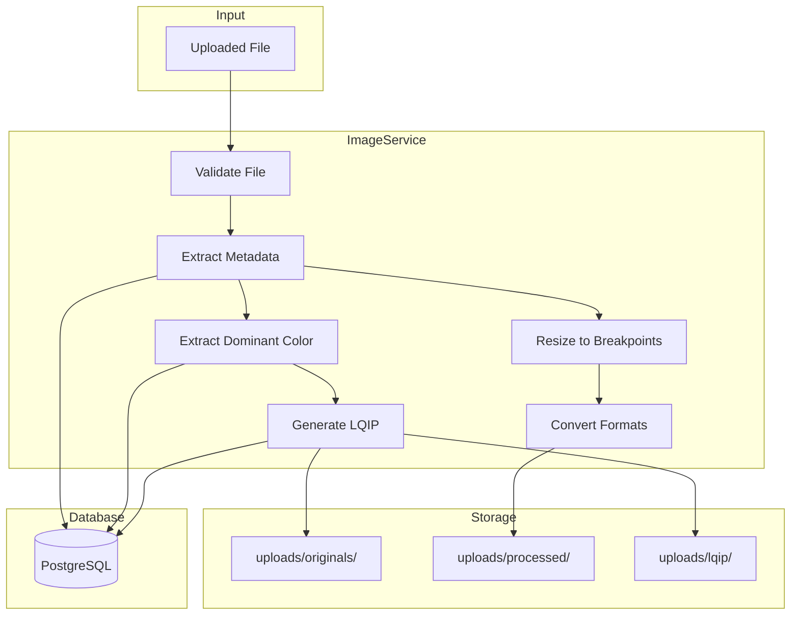
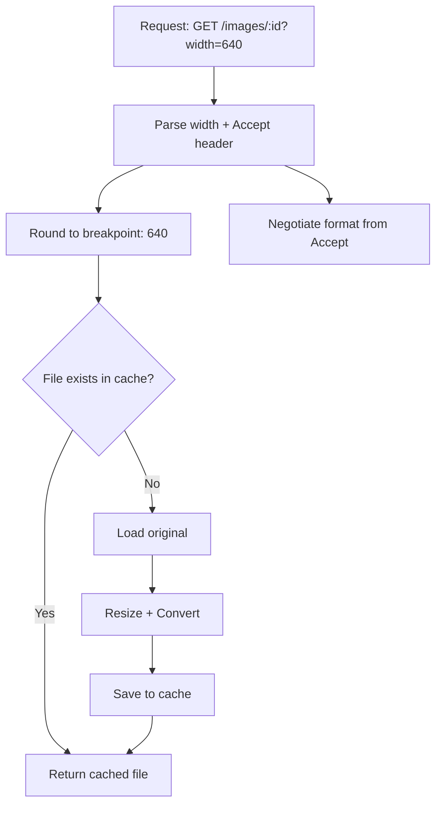
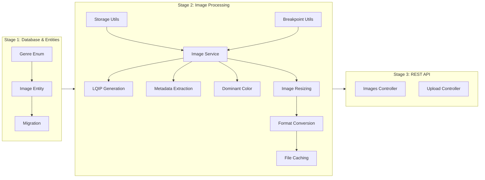

# Stage 2: Image Processing Service

## Detailed Implementation Plan

---

## 1. Overview

### Goal

Implement the core image processing capabilities using the Sharp library for OptiView - a high-performance image delivery system. This service handles metadata extraction, LQIP generation, dominant color extraction, format conversion, and intelligent caching.

### Dependencies

- **Stage 1: Database & Entities** must be completed
- Image entity with all fields available
- PostgreSQL database running with TypeORM integration
- NestJS project structure established

### Key Decisions (Clarified)

| Decision | Choice | Rationale |
|:---------|:-------|:----------|
| Dominant color extraction | Sharp built-in stats | Simple, fast, good enough for placeholder backgrounds |
| Caching strategy | File-based only | Check `processed/` directory, generate if missing |
| LQIP format | JPEG 20% quality, 20px width | Per ADR-005 specification |
| Output formats | AVIF, WebP, JPEG | Per ADR-002 format priority |
| Max file size | 10MB | Per UI.md specification |
| Input formats | JPEG, PNG, WebP | Per UI.md specification |

---

## 2. Architecture Context

### Service Flow Diagram



### File Structure

```
backend/
├── uploads/
│   ├── originals/           # Original uploaded images
│   │   └── {uuid}.{ext}
│   ├── processed/           # Cached processed versions
│   │   └── {uuid}/
│   │       ├── 320.avif
│   │       ├── 320.webp
│   │       ├── 320.jpeg
│   │       ├── 640.avif
│   │       └── ...
│   └── lqip/               # Low Quality Image Placeholders
│       └── {uuid}.jpg
├── src/
│   ├── modules/
│   │   └── images/
│   │       ├── image.service.ts
│   │       ├── image.service.spec.ts
│   │       ├── image.module.ts
│   │       └── ...
│   ├── utils/
│   │   ├── storage.util.ts
│   │   ├── storage.util.spec.ts
│   │   ├── breakpoint.util.ts
│   │   └── breakpoint.util.spec.ts
│   └── ...
└── test/
    └── images.e2e-spec.ts
```

### Breakpoints Configuration

| Breakpoint | Use Case | Column Reference |
|:-----------|:---------|:-----------------|
| 320px | Small mobile devices | 2-col mobile |
| 640px | Standard mobile @2x | 2-col mobile retina |
| 768px | Tablet portrait | 3-col tablet |
| 1024px | Tablet landscape / Small desktop | 4-col desktop |
| 1280px | Standard desktop | 4-col desktop retina |
| 1920px | Full HD displays | Large screens |

---

## 3. Implementation Tasks

### Task 1: Install and Configure Sharp Library

**Package Installation:**

```bash
npm install sharp
npm install -D @types/sharp
```

**Verification:**

Create a simple test to verify Sharp is working:

```typescript
// test/sharp-setup.spec.ts
import sharp from 'sharp';

describe('Sharp Setup', () => {
  it('should be able to create sharp instance', async () => {
    const instance = sharp();
    expect(instance).toBeDefined();
  });
});
```

**Acceptance Criteria:**

- [ ] Sharp package installed without errors
- [ ] TypeScript types available
- [ ] Test passes confirming Sharp is functional

---

### Task 2: Create Uploads Directory Structure

**Directories to Create:**

```
backend/uploads/
├── originals/
├── processed/
└── lqip/
```

**Implementation:** `backend/src/utils/storage.util.ts`

```typescript
import * as fs from 'fs/promises';
import * as path from 'path';

// Base uploads directory - relative to backend root
const UPLOADS_BASE = path.join(__dirname, '../../uploads');

export const DIRECTORIES = {
  ORIGINALS: path.join(UPLOADS_BASE, 'originals'),
  PROCESSED: path.join(UPLOADS_BASE, 'processed'),
  LQIP: path.join(UPLOADS_BASE, 'lqip'),
} as const;

/**
 * Ensure all required upload directories exist
 */
export async function ensureUploadDirectories(): Promise<void> {
  for (const dir of Object.values(DIRECTORIES)) {
    await fs.mkdir(dir, { recursive: true });
  }
}

/**
 * Get the path for an original image
 */
export function getOriginalPath(uuid: string, extension: string): string {
  return path.join(DIRECTORIES.ORIGINALS, `${uuid}.${extension}`);
}

/**
 * Get the directory for processed images of a specific UUID
 */
export function getProcessedDir(uuid: string): string {
  return path.join(DIRECTORIES.PROCESSED, uuid);
}

/**
 * Get the path for a processed image variant
 */
export function getProcessedPath(
  uuid: string,
  width: number,
  format: string,
): string {
  return path.join(getProcessedDir(uuid), `${width}.${format}`);
}

/**
 * Get the path for an LQIP image
 */
export function getLqipPath(uuid: string): string {
  return path.join(DIRECTORIES.LQIP, `${uuid}.jpg`);
}

/**
 * Check if a file exists
 */
export async function fileExists(filePath: string): Promise<boolean> {
  try {
    await fs.access(filePath);
    return true;
  } catch {
    return false;
  }
}

/**
 * Ensure a directory exists, create if missing
 */
export async function ensureDir(dirPath: string): Promise<void> {
  await fs.mkdir(dirPath, { recursive: true });
}
```

**Acceptance Criteria:**

- [ ] All three directories created under `backend/uploads/`
- [ ] Utility functions compile without errors
- [ ] `ensureUploadDirectories()` creates missing directories
- [ ] Path helpers return correct absolute paths

---

### Task 3: Implement Breakpoint Rounding Function

**File:** `backend/src/utils/breakpoint.util.ts`

```typescript
/**
 * Fixed breakpoints for responsive images
 * Per ADR-003: Fixed Breakpoints with Rounding
 */
export const BREAKPOINTS = [320, 640, 768, 1024, 1280, 1920] as const;

export type Breakpoint = (typeof BREAKPOINTS)[number];

/**
 * Round a given width to the nearest breakpoint
 * @param width - The requested image width
 * @returns The nearest breakpoint value
 */
export function roundToBreakpoint(width: number): Breakpoint {
  // Clamp to valid range
  const clampedWidth = Math.max(BREAKPOINTS[0], Math.min(width, BREAKPOINTS[BREAKPOINTS.length - 1]));

  // Find nearest breakpoint
  return BREAKPOINTS.reduce((prev, curr) =>
    Math.abs(curr - clampedWidth) < Math.abs(prev - clampedWidth) ? curr : prev
  );
}

/**
 * Get all breakpoints up to and including a maximum width
 * @param maxWidth - Maximum width to include
 * @returns Array of breakpoints up to maxWidth
 */
export function getBreakpointsUpTo(maxWidth: number): Breakpoint[] {
  return BREAKPOINTS.filter(bp => bp <= maxWidth);
}

/**
 * Check if a value is a valid breakpoint
 */
export function isValidBreakpoint(value: number): value is Breakpoint {
  return BREAKPOINTS.includes(value as Breakpoint);
}
```

**Unit Tests:** `backend/src/utils/breakpoint.util.spec.ts`

```typescript
import { roundToBreakpoint, BREAKPOINTS, isValidBreakpoint } from './breakpoint.util';

describe('BreakpointUtil', () => {
  describe('roundToBreakpoint', () => {
    it('should return 320 for very small widths', () => {
      expect(roundToBreakpoint(100)).toBe(320);
      expect(roundToBreakpoint(1)).toBe(320);
    });

    it('should return 1920 for very large widths', () => {
      expect(roundToBreakpoint(3000)).toBe(1920);
      expect(roundToBreakpoint(5000)).toBe(1920);
    });

    it('should round to nearest breakpoint', () => {
      expect(roundToBreakpoint(500)).toBe(640);  // Closer to 640 than 320
      expect(roundToBreakpoint(700)).toBe(640);  // Closer to 640 than 768
      expect(roundToBreakpoint(720)).toBe(768);  // Closer to 768 than 640
      expect(roundToBreakpoint(900)).toBe(1024); // Closer to 1024 than 768
    });

    it('should return exact breakpoints unchanged', () => {
      BREAKPOINTS.forEach(bp => {
        expect(roundToBreakpoint(bp)).toBe(bp);
      });
    });
  });

  describe('isValidBreakpoint', () => {
    it('should return true for valid breakpoints', () => {
      BREAKPOINTS.forEach(bp => {
        expect(isValidBreakpoint(bp)).toBe(true);
      });
    });

    it('should return false for invalid values', () => {
      expect(isValidBreakpoint(500)).toBe(false);
      expect(isValidBreakpoint(100)).toBe(false);
    });
  });
});
```

**Acceptance Criteria:**

- [ ] `roundToBreakpoint()` correctly rounds to nearest breakpoint
- [ ] Values below 320 are clamped to 320
- [ ] Values above 1920 are clamped to 1920
- [ ] All unit tests pass with 100% coverage

---

### Task 4: Implement Metadata Extraction

**File:** `backend/src/modules/images/image.service.ts`

```typescript
import { Injectable, Logger } from '@nestjs/common';
import sharp, { Sharp, Metadata } from 'sharp';
import { Image } from '../../entities/image.entity';

export interface ImageMetadata {
  width: number;
  height: number;
  aspectRatio: number;
  format: string;
}

@Injectable()
export class ImageService {
  private readonly logger = new Logger(ImageService.name);

  /**
   * Extract metadata from an image buffer or file path
   */
  async extractMetadata(input: Buffer | string): Promise<ImageMetadata> {
    let image: Sharp;

    if (typeof input === 'string') {
      image = sharp(input);
    } else {
      image = sharp(input);
    }

    const metadata = await image.metadata();

    if (!metadata.width || !metadata.height) {
      throw new Error('Unable to extract image dimensions');
    }

    return {
      width: metadata.width,
      height: metadata.height,
      aspectRatio: parseFloat((metadata.width / metadata.height).toFixed(4)),
      format: metadata.format || 'unknown',
    };
  }

  /**
   * Validate that the image format is supported
   */
  isFormatSupported(format: string): boolean {
    const supportedFormats = ['jpeg', 'jpg', 'png', 'webp'];
    return supportedFormats.includes(format.toLowerCase());
  }

  /**
   * Validate image meets requirements
   */
  async validateImage(input: Buffer | string): Promise<{ valid: boolean; error?: string }> {
    try {
      const metadata = await this.extractMetadata(input);

      if (!this.isFormatSupported(metadata.format)) {
        return {
          valid: false,
          error: `Unsupported format: ${metadata.format}. Supported: JPEG, PNG, WebP`
        };
      }

      // Check reasonable dimensions
      if (metadata.width > 10000 || metadata.height > 10000) {
        return {
          valid: false,
          error: 'Image dimensions too large. Maximum: 10000x10000 pixels'
        };
      }

      return { valid: true };
    } catch (error) {
      return {
        valid: false,
        error: `Invalid image file: ${error instanceof Error ? error.message : 'Unknown error'}`
      };
    }
  }
}
```

**Acceptance Criteria:**

- [ ] `extractMetadata()` returns width, height, aspectRatio
- [ ] Aspect ratio calculated with 4 decimal precision
- [ ] `isFormatSupported()` correctly identifies JPEG, PNG, WebP
- [ ] `validateImage()` rejects unsupported formats
- [ ] Unit tests cover all methods with edge cases

---

### Task 5: Implement Dominant Color Extraction

**File:** Add to `backend/src/modules/images/image.service.ts`

```typescript
/**
 * Extract dominant color from an image using Sharp's statistics
 * @param input - Buffer or file path
 * @returns Hex color string e.g. #FF5733
 */
async extractDominantColor(input: Buffer | string): Promise<string> {
  const image = typeof input === 'string' ? sharp(input) : sharp(input);

  // Get image statistics - channels: red, green, blue
  const stats = await image.stats();

  // Calculate average color from channel means
  // stats.channels array contains mean values for each channel
  // Order is typically: red, green, blue (and alpha if present)

  let r = 0, g = 0, b = 0;

  // Find channels by name
  for (const channel of stats.channels) {
    switch (channel._sharpChannelId) {
      case 0: // Red
        r = Math.round(channel.mean);
        break;
      case 1: // Green
        g = Math.round(channel.mean);
        break;
      case 2: // Blue
        b = Math.round(channel.mean);
        break;
    }
  }

  // Convert to hex with proper padding
  const toHex = (n: number): string => n.toString(16).padStart(2, '0');

  return `#${toHex(r)}${toHex(g)}${toHex(b)}`.toUpperCase();
}
```

**Alternative Implementation (using resize + raw for more accurate dominant color):**

```typescript
/**
 * Extract dominant color by sampling pixels from a resized version
 * This gives a more perceptually accurate dominant color
 */
async extractDominantColor(input: Buffer | string): Promise<string> {
  const image = typeof input === 'string' ? sharp(input) : sharp(input);

  // Resize to 1x1 pixel to get the "average" color
  const { data } = await image
    .clone()
    .resize(1, 1, { fit: 'cover' })
    .raw()
    .toBuffer({ resolveWithObject: true });

  const r = data[0];
  const g = data[1];
  const b = data[2];

  const toHex = (n: number): string => n.toString(16).padStart(2, '0');

  return `#${toHex(r)}${toHex(g)}${toHex(b)}`.toUpperCase();
}
```

**Unit Tests:**

```typescript
describe('extractDominantColor', () => {
  it('should return a valid hex color string', async () => {
    // Create a solid red test image
    const redBuffer = await sharp({
      create: {
        width: 100,
        height: 100,
        channels: 3,
        background: { r: 255, g: 0, b: 0 },
      },
    })
      .jpeg()
      .toBuffer();

    const color = await service.extractDominantColor(redBuffer);

    expect(color).toMatch(/^#[0-9A-F]{6}$/);
    // Should be approximately red
    expect(color.startsWith('#FF')).toBe(true);
  });

  it('should handle different image formats', async () => {
    // Test with PNG
    const pngBuffer = await sharp({
      create: {
        width: 50,
        height: 50,
        channels: 3,
        background: { r: 0, g: 128, b: 255 },
      },
    })
      .png()
      .toBuffer();

    const color = await service.extractDominantColor(pngBuffer);
    expect(color).toMatch(/^#[0-9A-F]{6}$/);
  });
});
```

**Acceptance Criteria:**

- [ ] Returns valid 7-character hex string (#RRGGBB)
- [ ] Handles all supported input formats (JPEG, PNG, WebP)
- [ ] Color extraction completes within reasonable time (<100ms for typical images)
- [ ] Unit tests pass with mock images

---

### Task 6: Implement LQIP Generation

**File:** Add to `backend/src/modules/images/image.service.ts`

```typescript
/**
 * Generate Low Quality Image Placeholder (LQIP)
 * Per ADR-005: 20px width, JPEG format, 20% quality
 * @param input - Buffer or file path
 * @returns Base64-encoded data URI string
 */
async generateLqip(input: Buffer | string): Promise<string> {
  const image = typeof input === 'string' ? sharp(input) : sharp(input);

  // Generate tiny JPEG preview
  const lqipBuffer = await image
    .clone()
    .resize(20, null, {
      fit: 'inside',
      withoutEnlargement: true, // Don't upscale small images
    })
    .jpeg({
      quality: 20,
      mozjpeg: true, // Better compression
    })
    .toBuffer();

  // Convert to base64 data URI
  const base64 = lqipBuffer.toString('base64');
  return `data:image/jpeg;base64,${base64}`;
}

/**
 * Generate LQIP and save to disk
 * @param input - Buffer or file path
 * @param uuid - Image UUID for filename
 * @returns Base64-encoded data URI string
 */
async generateAndSaveLqip(
  input: Buffer | string,
  uuid: string
): Promise<string> {
  const lqipBase64 = await this.generateLqip(input);

  // Extract the base64 data (without data URI prefix)
  const base64Data = lqipBase64.replace(/^data:image\/jpeg;base64,/, '');

  // Save to disk
  const lqipPath = getLqipPath(uuid);
  await fs.writeFile(lqipPath, base64Data, 'base64');

  return lqipBase64;
}
```

**LQIP Size Verification:**

```typescript
describe('generateLqip', () => {
  it('should generate LQIP under 500 bytes base64', async () => {
    // Create a test image
    const testImage = await sharp({
      create: {
        width: 1920,
        height: 1080,
        channels: 3,
        background: { r: 100, g: 150, b: 200 },
      },
    })
      .jpeg()
      .toBuffer();

    const lqip = await service.generateLqip(testImage);

    // Check format
    expect(lqip.startsWith('data:image/jpeg;base64,')).toBe(true);

    // Check size - should be small
    const base64Data = lqip.replace(/^data:image\/jpeg;base64,/, '');
    expect(base64Data.length).toBeLessThan(700); // ~500 bytes decoded = ~700 chars base64
  });

  it('should generate 20px wide image', async () => {
    const testImage = await sharp({
      create: {
        width: 800,
        height: 600,
        channels: 3,
        background: { r: 50, g: 50, b: 50 },
      },
    })
      .png()
      .toBuffer();

    // Generate LQIP buffer directly to check dimensions
    const lqipBuffer = await sharp(testImage)
      .resize(20, null, { fit: 'inside' })
      .jpeg({ quality: 20 })
      .toBuffer();

    const metadata = await sharp(lqipBuffer).metadata();
    expect(metadata.width).toBe(20);
  });
});
```

**Acceptance Criteria:**

- [ ] LQIP generated with 20px width, JPEG 20% quality
- [ ] Base64 output is under 500 bytes
- [ ] Returns proper data URI format: `data:image/jpeg;base64,...`
- [ ] Aspect ratio preserved in LQIP
- [ ] Unit tests verify size and format

---

### Task 7: Implement Image Resizing and Format Conversion

**File:** Add to `backend/src/modules/images/image.service.ts`

```typescript
import { BREAKPOINTS, roundToBreakpoint } from '../../utils/breakpoint.util';

export type ImageFormat = 'avif' | 'webp' | 'jpeg';

export interface ProcessedImage {
  buffer: Buffer;
  format: ImageFormat;
  width: number;
  contentType: string;
}

/**
 * Format priority per ADR-002
 */
const FORMAT_PRIORITY: ImageFormat[] = ['avif', 'webp', 'jpeg'];

const CONTENT_TYPES: Record<ImageFormat, string> = {
  avif: 'image/avif',
  webp: 'image/webp',
  jpeg: 'image/jpeg',
};

/**
 * Parse Accept header to determine best format
 * @param acceptHeader - HTTP Accept header value
 * @returns Best supported format
 */
export function negotiateFormat(acceptHeader: string = ''): ImageFormat {
  const accept = acceptHeader.toLowerCase();

  if (accept.includes('image/avif')) {
    return 'avif';
  }
  if (accept.includes('image/webp')) {
    return 'webp';
  }

  // Default fallback
  return 'jpeg';
}

/**
 * Process an image to a specific width and format
 * @param input - Original image buffer or path
 * @param width - Target width (will be rounded to breakpoint)
 * @param format - Output format
 * @returns Processed image buffer with metadata
 */
async processImage(
  input: Buffer | string,
  width: number,
  format: ImageFormat,
): Promise<ProcessedImage> {
  const breakpoint = roundToBreakpoint(width);
  const image = typeof input === 'string' ? sharp(input) : sharp(input);

  let processed: sharp.Sharp;

  // Common resize options
  processed = image.clone().resize(breakpoint, null, {
    fit: 'inside',
    withoutEnlargement: true,
  });

  // Format-specific options
  switch (format) {
    case 'avif':
      processed = processed.avif({
        quality: 80,
        effort: 4, // Balance between speed and compression
      });
      break;
    case 'webp':
      processed = processed.webp({
        quality: 80,
        effort: 4,
      });
      break;
    case 'jpeg':
    default:
      processed = processed.jpeg({
        quality: 85,
        mozjpeg: true,
      });
      break;
  }

  const buffer = await processed.toBuffer();

  return {
    buffer,
    format,
    width: breakpoint,
    contentType: CONTENT_TYPES[format],
  };
}

/**
 * Get a processed image, using cache if available
 * @param uuid - Image UUID
 * @param width - Requested width
 * @param format - Requested format
 * @param acceptHeader - HTTP Accept header for format negotiation
 * @returns Processed image with metadata
 */
async getProcessedImage(
  uuid: string,
  width: number,
  acceptHeader?: string,
): Promise<ProcessedImage> {
  const format = acceptHeader ? negotiateFormat(acceptHeader) : 'jpeg';
  const breakpoint = roundToBreakpoint(width);

  // Check cache
  const cachedPath = getProcessedPath(uuid, breakpoint, format);
  if (await fileExists(cachedPath)) {
    this.logger.debug(`Cache hit: ${cachedPath}`);
    const buffer = await fs.readFile(cachedPath);
    return {
      buffer,
      format,
      width: breakpoint,
      contentType: CONTENT_TYPES[format],
    };
  }

  // Cache miss - generate new
  this.logger.debug(`Cache miss: ${cachedPath}`);

  // Get original
  const originalPath = await this.findOriginalPath(uuid);
  if (!originalPath) {
    throw new Error(`Original image not found: ${uuid}`);
  }

  // Process
  const processed = await this.processImage(originalPath, breakpoint, format);

  // Save to cache
  await ensureDir(getProcessedDir(uuid));
  await fs.writeFile(cachedPath, processed.buffer);

  return processed;
}

/**
 * Find original image path by UUID
 */
private async findOriginalPath(uuid: string): Promise<string | null> {
  const extensions = ['jpg', 'jpeg', 'png', 'webp'];

  for (const ext of extensions) {
    const path = getOriginalPath(uuid, ext);
    if (await fileExists(path)) {
      return path;
    }
  }

  return null;
}
```

**Unit Tests:**

```typescript
describe('negotiateFormat', () => {
  it('should return avif when accepted', () => {
    expect(negotiateFormat('image/avif,image/webp,image/jpeg')).toBe('avif');
    expect(negotiateFormat('text/html,image/avif')).toBe('avif');
  });

  it('should return webp when avif not accepted', () => {
    expect(negotiateFormat('image/webp,image/jpeg')).toBe('webp');
    expect(negotiateFormat('text/html,application/xml,image/webp')).toBe('webp');
  });

  it('should return jpeg as fallback', () => {
    expect(negotiateFormat('image/jpeg')).toBe('jpeg');
    expect(negotiateFormat('')).toBe('jpeg');
    expect(negotiateFormat('text/html')).toBe('jpeg');
  });
});

describe('processImage', () => {
  it('should resize image to nearest breakpoint', async () => {
    const testImage = await createTestImage(2000, 1500);

    const result = await service.processImage(testImage, 700, 'jpeg');

    expect(result.width).toBe(640); // 700 rounds to 640
    expect(result.format).toBe('jpeg');
    expect(result.contentType).toBe('image/jpeg');
  });

  it('should convert to avif format', async () => {
    const testImage = await createTestImage(1000, 800);

    const result = await service.processImage(testImage, 1024, 'avif');

    expect(result.format).toBe('avif');
    expect(result.contentType).toBe('image/avif');

    // Verify it's valid AVIF
    const metadata = await sharp(result.buffer).metadata();
    expect(metadata.format).toBe('avif');
  });
});
```

**Acceptance Criteria:**

- [ ] Images resized to correct breakpoints
- [ ] All three formats (AVIF, WebP, JPEG) generated correctly
- [ ] Accept header negotiation works correctly
- [ ] Processed images saved to cache
- [ ] Cached images served without reprocessing
- [ ] Unit tests cover all format combinations

---

### Task 8: Create Image Module

**File:** `backend/src/modules/images/image.module.ts`

```typescript
import { Module } from '@nestjs/common';
import { TypeOrmModule } from '@nestjs/typeorm';
import { Image } from '../../entities/image.entity';
import { ImageService } from './image.service';

@Module({
  imports: [TypeOrmModule.forFeature([Image])],
  providers: [ImageService],
  exports: [ImageService],
})
export class ImageModule {}
```

**Acceptance Criteria:**

- [ ] Module compiles and imports correctly
- [ ] ImageService is provided and exported
- [ ] TypeORM integration for Image entity

---

### Task 9: Write Unit Tests

**File:** `backend/src/modules/images/image.service.spec.ts`

Complete test suite covering:

```typescript
import { Test, TestingModule } from '@nestjs/testing';
import { ImageService } from './image.service';
import sharp from 'sharp';
import * as fs from 'fs/promises';

describe('ImageService', () => {
  let service: ImageService;

  beforeAll(async () => {
    const module: TestingModule = await Test.createTestingModule({
      providers: [ImageService],
    }).compile();

    service = module.get<ImageService>(ImageService);
  });

  // Helper to create test images
  async function createTestImage(
    width: number,
    height: number,
    color: { r: number; g: number; b: number } = { r: 128, g: 128, b: 128 }
  ): Promise<Buffer> {
    return sharp({
      create: {
        width,
        height,
        channels: 3,
        background: color,
      },
    })
      .jpeg()
      .toBuffer();
  }

  describe('extractMetadata', () => {
    it('should extract width and height correctly', async () => {
      const image = await createTestImage(1920, 1080);
      const metadata = await service.extractMetadata(image);

      expect(metadata.width).toBe(1920);
      expect(metadata.height).toBe(1080);
    });

    it('should calculate aspect ratio correctly', async () => {
      const image = await createTestImage(1600, 900);
      const metadata = await service.extractMetadata(image);

      expect(metadata.aspectRatio).toBeCloseTo(1.7778, 3);
    });
  });

  describe('extractDominantColor', () => {
    it('should extract red color from red image', async () => {
      const image = await createTestImage(100, 100, { r: 255, g: 0, b: 0 });
      const color = await service.extractDominantColor(image);

      expect(color.startsWith('#FF')).toBe(true);
    });
  });

  describe('generateLqip', () => {
    it('should generate valid base64 data URI', async () => {
      const image = await createTestImage(1000, 800);
      const lqip = await service.generateLqip(image);

      expect(lqip).toMatch(/^data:image\/jpeg;base64,/);
    });

    it('should generate small LQIP under 500 bytes', async () => {
      const image = await createTestImage(2000, 1500);
      const lqip = await service.generateLqip(image);

      const base64Data = lqip.replace(/^data:image\/jpeg;base64,/, '');
      const buffer = Buffer.from(base64Data, 'base64');

      expect(buffer.length).toBeLessThan(500);
    });
  });

  describe('validateImage', () => {
    it('should accept valid JPEG', async () => {
      const image = await createTestImage(800, 600);
      const result = await service.validateImage(image);

      expect(result.valid).toBe(true);
    });

    it('should reject unsupported formats', async () => {
      // Create a GIF (unsupported)
      const gifBuffer = Buffer.from('GIF89a', 'ascii');
      const result = await service.validateImage(gifBuffer);

      expect(result.valid).toBe(false);
      expect(result.error).toContain('Unsupported format');
    });
  });
});
```

**Acceptance Criteria:**

- [ ] All public methods tested
- [ ] Edge cases covered (large images, small images, different formats)
- [ ] Test coverage ≥ 80%

---

### Task 10: Write E2E Tests

**File:** `backend/test/images.e2e-spec.ts`

```typescript
import { Test, TestingModule } from '@nestjs/testing';
import { INestApplication } from '@nestjs/common';
import * as request from 'supertest';
import sharp from 'sharp';
import * as fs from 'fs/promises';
import * as path from 'path';

describe('Image Processing (e2e)', () => {
  let app: INestApplication;

  beforeAll(async () => {
    // Setup app with test configuration
    // This will depend on your app structure
  });

  afterAll(async () => {
    await app.close();
  });

  describe('Image upload and processing', () => {
    it('should process uploaded image and generate all variants', async () => {
      // Create test image
      const testImage = await sharp({
        create: {
          width: 1920,
          height: 1080,
          channels: 3,
          background: { r: 100, g: 150, b: 200 },
        },
      })
        .jpeg()
        .toBuffer();

      // Upload would be tested here
      // For now, test processing directly
    });
  });
});
```

**Acceptance Criteria:**

- [ ] E2E tests verify complete processing pipeline
- [ ] Test cleanup removes generated files

---

## 4. Caching Strategy Details

### Cache Structure

```
uploads/processed/{uuid}/
├── 320.avif
├── 320.webp
├── 320.jpeg
├── 640.avif
├── 640.webp
├── 640.jpeg
├── 768.avif
├── 768.webp
├── 768.jpeg
├── 1024.avif
├── 1024.webp
├── 1024.jpeg
├── 1280.avif
├── 1280.webp
├── 1280.jpeg
├── 1920.avif
├── 1920.webp
└── 1920.jpeg
```

### Cache Lookup Logic



### Cache Invalidation

For MVP, cache is permanent. Future considerations:

- Manual invalidation via API endpoint
- TTL-based cleanup job
- Cache purge on image deletion

---

## 5. Risks and Mitigations

| Risk | Probability | Impact | Mitigation | Owner |
|:-----|:------------|:-------|:-----------|:------|
| Sharp memory issues with large files | Medium | High | Implement file size limits (10MB), use streaming for large files | Backend |
| Unsupported image formats | Medium | Medium | Validate format early, provide clear error messages | Backend |
| Slow processing for batch uploads | Low | Medium | Process sequentially for MVP, consider queue for Phase 2 | Backend |
| Cache directory growth | Low | Medium | Document expected cache size, plan cleanup strategy | Backend |
| AVIF encoding slowness | Medium | Low | Use effort=4 for balanced speed/compression | Backend |

---

## 6. Definition of Done Checklist

### Code Quality

- [ ] All TypeScript files compile without errors
- [ ] ESLint passes with no warnings
- [ ] Prettier formatting applied
- [ ] Code reviewed and approved

### Functionality

- [ ] Sharp processes JPEG, PNG, WebP inputs correctly
- [ ] LQIP generated under 500 bytes base64
- [ ] Metadata extracted matches actual image properties
- [ ] Dominant color extracted as valid hex string (#RRGGBB)
- [ ] All 6 breakpoints generate correctly
- [ ] All 3 formats (AVIF, WebP, JPEG) generate correctly
- [ ] Format negotiation works from Accept header
- [ ] Cache files saved to correct directory structure
- [ ] Cached files served without reprocessing

### Testing

- [ ] Unit tests for `ImageService` pass with 80%+ coverage
- [ ] Unit tests for `breakpoint.util.ts` pass with 100% coverage
- [ ] Unit tests for `storage.util.ts` pass
- [ ] E2E tests for processing pipeline pass

### Integration

- [ ] ImageModule imports correctly in AppModule
- [ ] ImageService can be injected in other modules
- [ ] Upload directories created on application start

---

## 7. Commands Reference

```bash
# Install Sharp
npm install sharp

# Run unit tests
npm test -- --testPathPattern=images

# Run tests with coverage
npm test -- --coverage --testPathPattern=images

# Run specific test file
npm test -- --testPathPattern=breakpoint.util

# Run e2e tests
npm run test:e2e -- --testPathPattern=images

# Check TypeScript compilation
npm run build

# Lint check
npm run lint
```

---

## 8. Next Steps After Completion

After Stage 2 is complete, the following stages can begin:

1. **Stage 3: REST API Endpoints** - Build API endpoints using the ImageService
   - `GET /api/images/:id?width=N` - Use `getProcessedImage()`
   - `POST /api/images/upload` - Use `processUpload()`
   - `GET /api/images/:id/metadata` - Return stored metadata
   - `GET /api/images/:id/lqip` - Return LQIP base64

The ImageService methods created in Stage 2 will be used by:

- `ImagesController` for serving processed images
- `UploadController` for processing new uploads

---

## 9. Dependencies Diagram



---

## 10. Appendix: Package Dependencies

Add these packages to `backend/package.json`:

```json
{
  "dependencies": {
    "sharp": "^0.33.x"
  },
  "devDependencies": {
    "@types/sharp": "^0.32.x"
  }
}
```

---

## 11. Appendix: Quality Settings Reference

### Output Format Quality Settings

| Format | Quality | Additional Options | Notes |
|:-------|:--------|:-------------------|:------|
| JPEG | 85 | mozjpeg: true | Better compression |
| WebP | 80 | effort: 4 | Balance speed/size |
| AVIF | 80 | effort: 4 | Slower but better compression |
| LQIP JPEG | 20 | mozjpeg: true | Smallest possible |

### Resize Options

| Option | Value | Rationale |
|:-------|:------|:----------|
| fit | 'inside' | Preserve aspect ratio, never crop |
| withoutEnlargement | true | Don't upscale small images |

---

*Document created: 2026-03-10*
*Last updated: 2026-03-10*
