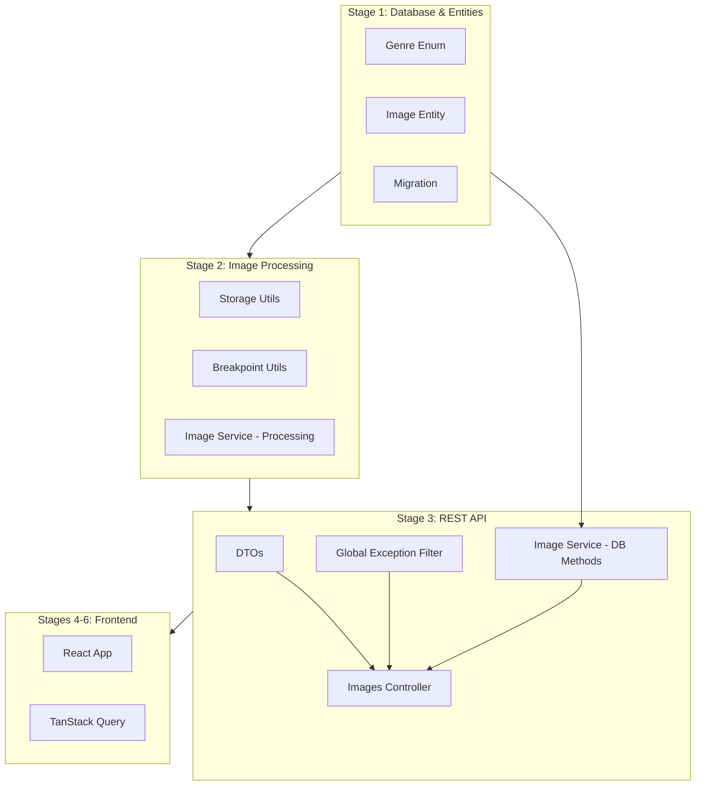

# Stage 3: REST API Endpoints

## Detailed Implementation Plan

---

## 1. Overview

### Goal

Implement all REST API endpoints for image management according to ADR-002. This stage builds upon the database entities from Stage 1 and the image processing service from Stage 2 to provide a complete HTTP API for image operations including listing, uploading, serving, and managing images.

### Prerequisites

| Prerequisite                      | Status      | Location                                      |
|:----------------------------------|:------------|:----------------------------------------------|
| Stage 1: Database & Entities      | ✅ Complete | `backend/src/entities/`                       |
| Stage 2: Image Processing Service | ✅ Complete | `backend/src/modules/images/image.service.ts` |
| TypeORM Integration               | ✅ Complete | `backend/src/data-source.ts`                  |
| Swagger Setup                     | ✅ Complete | `backend/src/main.ts`                         |

### Existing Files to Reference

| File                                                                                | Purpose                       |
|:------------------------------------------------------------------------------------|:------------------------------|
| [`image.entity.ts`](../../backend/src/entities/image.entity.ts)                     | Image database entity         |
| [`genre.enum.ts`](../../backend/src/entities/genre.enum.ts)                         | Genre enumeration             |
| [`image.service.ts`](../../backend/src/modules/images/image.service.ts)             | Image processing service      |
| [`breakpoint.util.ts`](../../backend/src/utils/breakpoint.util.ts)                  | Breakpoint rounding utilities |
| [`storage.util.ts`](../../backend/src/utils/storage.util.ts)                        | File storage utilities        |
| [`create-image.dto.ts`](../../backend/src/modules/images/dto/create-image.dto.ts)   | Existing upload DTO           |
| [`update-rating.dto.ts`](../../backend/src/modules/images/dto/update-rating.dto.ts) | Existing rating DTO           |

### Input Artifacts

- ADR-002: API design and endpoints
- ADR-004: Query parameters for filtering
- UI.md: Upload requirements
- Existing Image entity and ImageService

### Output Artifacts

| Type | Artifact                                | Description              |
|:-----|:----------------------------------------|:-------------------------|
| Code | `images.controller.ts`                  | REST API controller      |
| Code | `dto/image-filter.dto.ts`               | Filtering/pagination DTO |
| Code | `dto/image-response.dto.ts`             | Response DTOs            |
| Code | `dto/paginated-response.dto.ts`         | Pagination wrapper DTO   |
| Code | `filters/http-exception.filter.ts`      | Global exception filter  |
| Code | `interceptors/transform.interceptor.ts` | Response transformation  |
| Test | `test/api.e2e-spec.ts`                  | API endpoint tests       |
| Doc  | Swagger documentation implemented       | All endpoints documented |

---

## 2. API Endpoints Specification

### 2.1 GET /api/images - List Images

**Description:** Retrieve a paginated list of images with optional filtering and sorting.

#### Request

**Query Parameters:**

| Parameter   | Type   | Required | Default     | Description                                                    |
|:------------|:-------|:---------|:------------|:---------------------------------------------------------------|
| `genre`     | string | No       | -           | Filter by genre: Nature, Architecture, Portrait, Uncategorized |
| `rating`    | number | No       | -           | Minimum rating filter (1-5)                                    |
| `sort`      | string | No       | `createdAt` | Sort field: createdAt, rating, filename                        |
| `sortOrder` | string | No       | `DESC`      | Sort direction: ASC, DESC                                      |
| `page`      | number | No       | `1`         | Page number (1-based)                                          |
| `pageSize`  | number | No       | `10`        | Items per page (max 100)                                       |

**Example Request:**

```http
GET /api/images?genre=Nature&rating=3&sort=createdAt&sortOrder=DESC&page=1&pageSize=10
```

#### Response DTOs

**ImageResponseDto:**

```typescript
{
  "id": "550e8400-e29b-41d4-a716-446655440000",
  "filename": "sunset.jpg",
  "genre": "Nature",
  "rating": 4,
  "aspectRatio": 1.7778,
  "dominantColor": "#FF6B35",
  "lqipBase64": "data:image/jpeg;base64,/9j/4AAQ...",
  "width": 1920,
  "height": 1080,
  "createdAt": "2026-03-10T12:00:00.000Z"
}
```

**PaginatedResponseDto<ImageResponseDto>:**

```typescript
{
  "data": [
    {
      "id": "550e8400-e29b-41d4-a716-446655440000",
      "filename": "sunset.jpg",
      "genre": "Nature",
      "rating": 4,
      "aspectRatio": 1.7778,
      "dominantColor": "#FF6B35",
      "lqipBase64": "data:image/jpeg;base64,/9j/4AAQ...",
      "width": 1920,
      "height": 1080,
      "createdAt": "2026-03-10T12:00:00.000Z"
    }
  ],
  "pagination": {
    "page": 1,
    "pageSize": 10,
    "totalItems": 45,
    "totalPages": 5,
    "hasNextPage": true,
    "hasPrevPage": false
  }
}
```

#### Success Response

- **200 OK** - Returns paginated list of images

#### Error Responses

- **400 Bad Request** - Invalid query parameters
- **500 Internal Server Error** - Database error

---

### 2.2 GET /api/images/:id - Get Processed Image

**Description:** Retrieve a processed image optimized for the client's browser and requested width.

#### Request

**Path Parameters:**

| Parameter | Type | Required | Description             |
|:----------|:-----|:---------|:------------------------|
| `id`      | UUID | Yes      | Image unique identifier |

**Query Parameters:**

| Parameter | Type   | Required | Default | Description                                 |
|:----------|:-------|:---------|:--------|:--------------------------------------------|
| `width`   | number | No       | `1280`  | Desired image width (rounded to breakpoint) |

**Headers:**

| Header   | Required | Description                                                             |
|:---------|:---------|:------------------------------------------------------------------------|
| `Accept` | No       | Content negotiation header (e.g., `image/avif, image/webp, image/jpeg`) |

**Example Request:**

```http
GET /api/images/550e8400-e29b-41d4-a716-446655440000?width=640
Accept: image/avif, image/webp, image/jpeg
```

#### Response

**Success:**

- **200 OK** - Returns processed image binary
- **Content-Type:** `image/avif` | `image/webp` | `image/jpeg` (based on Accept header)
- **Cache-Control:** `public, max-age=31536000` (1 year for cached images)

**Error Responses:**

- **404 Not Found** - Image with specified ID does not exist
- **500 Internal Server Error** - Processing error

---

### 2.3 GET /api/images/:id/metadata - Get Image Metadata

**Description:** Retrieve complete metadata for a specific image as JSON.

#### Request

**Path Parameters:**

| Parameter | Type | Required | Description             |
|:----------|:-----|:---------|:------------------------|
| `id`      | UUID | Yes      | Image unique identifier |

**Example Request:**

```http
GET /api/images/550e8400-e29b-41d4-a716-446655440000/metadata
```

#### Response

**Success Response (200 OK):**

```json
{
  "id": "550e8400-e29b-41d4-a716-446655440000",
  "filename": "sunset.jpg",
  "genre": "Nature",
  "rating": 4,
  "aspectRatio": 1.7778,
  "dominantColor": "#FF6B35",
  "lqipBase64": "data:image/jpeg;base64,/9j/4AAQ...",
  "width": 1920,
  "height": 1080,
  "createdAt": "2026-03-10T12:00:00.000Z"
}
```

**Error Responses:**

- **404 Not Found** - Image not found
- **500 Internal Server Error** - Database error

---

### 2.4 POST /api/images/upload - Upload New Image

**Description:** Upload a new image with optional genre classification. The image is processed automatically to extract metadata, generate LQIP, and save the original.

#### Request

**Content-Type:** `multipart/form-data`

**Form Fields:**

| Field   | Type   | Required | Description                                      |
|:--------|:-------|:---------|:-------------------------------------------------|
| `file`  | File   | Yes      | Image file (JPEG, PNG, WebP)                     |
| `genre` | string | No       | Genre classification (defaults to Uncategorized) |

**Constraints:**

- Max file size: 10MB
- Supported formats: JPEG, PNG, WebP
- Max dimensions: 10000x10000 pixels

**Example Request:**

```http
POST /api/images/upload
Content-Type: multipart/form-data; boundary=----WebKitFormBoundary

------WebKitFormBoundary
Content-Disposition: form-data; name="file"; filename="photo.jpg"
Content-Type: image/jpeg

[binary image data]
------WebKitFormBoundary
Content-Disposition: form-data; name="genre"

Nature
------WebKitFormBoundary--
```

#### Response

**Success Response (201 Created):**

```json
{
  "id": "550e8400-e29b-41d4-a716-446655440000",
  "filename": "photo.jpg",
  "genre": "Nature",
  "rating": 3,
  "aspectRatio": 1.7778,
  "dominantColor": "#FF6B35",
  "lqipBase64": "data:image/jpeg;base64,/9j/4AAQ...",
  "width": 1920,
  "height": 1080,
  "createdAt": "2026-03-10T12:00:00.000Z"
}
```

**Error Responses:**

- **400 Bad Request** - Invalid file, format not supported, or file too large
- **500 Internal Server Error** - Processing error

---

### 2.5 GET /api/images/:id/lqip - Get LQIP Placeholder

**Description:** Retrieve the Low Quality Image Placeholder for a specific image. Returns the pre-generated base64 LQIP data.

#### Request

**Path Parameters:**

| Parameter | Type | Required | Description |
|:----------|:-----|:---------|:------------|
| `id` | UUID | Yes | Image unique identifier |

**Example Request:**

```http
GET /api/images/550e8400-e29b-41d4-a716-446655440000/lqip
```

#### Response

**Success Response (200 OK):**

```json
{
  "lqipBase64": "data:image/jpeg;base64,/9j/4AAQSkZJRgABAQAAAQ..."
}
```

**Error Responses:**

- **404 Not Found** - Image not found
- **500 Internal Server Error** - Database error

---

### 2.6 PATCH /api/images/:id/rating - Update Rating

**Description:** Update the rating for a specific image. Supports optimistic UI updates in the frontend.

#### Request

**Path Parameters:**

| Parameter | Type | Required | Description |
|:----------|:-----|:---------|:------------|
| `id` | UUID | Yes | Image unique identifier |

**Request Body:**

```json
{
  "rating": 4
}
```

**Validation Rules:**

- `rating`: Required, integer, min: 1, max: 5

**Example Request:**

```http
PATCH /api/images/550e8400-e29b-41d4-a716-446655440000/rating
Content-Type: application/json

{
  "rating": 4
}
```

#### Response

**Success Response (200 OK):**

```json
{
  "id": "550e8400-e29b-41d4-a716-446655440000",
  "rating": 4,
  "updatedAt": "2026-03-10T14:30:00.000Z"
}
```

**Error Responses:**

- **400 Bad Request** - Invalid rating value
- **404 Not Found** - Image not found
- **500 Internal Server Error** - Database error

---

## 3. DTOs Specification

### 3.1 ImageFilterDto

**File:** `backend/src/modules/images/dto/image-filter.dto.ts`

```typescript
import { IsOptional, IsEnum, IsInt, Min, Max, IsString } from 'class-validator';
import { Type } from 'class-transformer';
import { ApiPropertyOptional } from '@nestjs/swagger';
import { Genre } from '../../../entities/genre.enum';

export enum SortField {
  CREATED_AT = 'createdAt',
  RATING = 'rating',
  FILENAME = 'filename',
}

export enum SortOrder {
  ASC = 'ASC',
  DESC = 'DESC',
}

export class ImageFilterDto {
  @ApiPropertyOptional({
    enum: Genre,
    description: 'Filter by image genre/category',
    example: Genre.NATURE,
  })
  @IsOptional()
  @IsEnum(Genre, { message: 'Genre must be a valid category' })
  genre?: Genre;

  @ApiPropertyOptional({
    type: Number,
    description: 'Minimum rating filter (1-5)',
    example: 3,
    minimum: 1,
    maximum: 5,
  })
  @IsOptional()
  @Type(() => Number)
  @IsInt({ message: 'Rating must be an integer' })
  @Min(1, { message: 'Rating must be at least 1' })
  @Max(5, { message: 'Rating must be at most 5' })
  rating?: number;

  @ApiPropertyOptional({
    enum: SortField,
    description: 'Field to sort by',
    default: SortField.CREATED_AT,
    example: SortField.CREATED_AT,
  })
  @IsOptional()
  @IsEnum(SortField, { message: 'Invalid sort field' })
  sort?: SortField = SortField.CREATED_AT;

  @ApiPropertyOptional({
    enum: SortOrder,
    description: 'Sort direction',
    default: SortOrder.DESC,
    example: SortOrder.DESC,
  })
  @IsOptional()
  @IsEnum(SortOrder, { message: 'Sort order must be ASC or DESC' })
  sortOrder?: SortOrder = SortOrder.DESC;

  @ApiPropertyOptional({
    type: Number,
    description: 'Page number (1-based)',
    default: 1,
    minimum: 1,
    example: 1,
  })
  @IsOptional()
  @Type(() => Number)
  @IsInt({ message: 'Page must be an integer' })
  @Min(1, { message: 'Page must be at least 1' })
  page?: number = 1;

  @ApiPropertyOptional({
    type: Number,
    description: 'Number of items per page',
    default: 10,
    minimum: 1,
    maximum: 100,
    example: 10,
  })
  @IsOptional()
  @Type(() => Number)
  @IsInt({ message: 'Page size must be an integer' })
  @Min(1, { message: 'Page size must be at least 1' })
  @Max(100, { message: 'Page size cannot exceed 100' })
  pageSize?: number = 10;
}
```

---

### 3.2 UploadImageDto

**File:** `backend/src/modules/images/dto/upload-image.dto.ts`

```typescript
import { IsOptional, IsEnum } from 'class-validator';
import { ApiPropertyOptional } from '@nestjs/swagger';
import { Genre } from '../../../entities/genre.enum';

export class UploadImageDto {
  @ApiPropertyOptional({
    enum: Genre,
    description: 'The genre/category of the uploaded image',
    example: Genre.NATURE,
    default: Genre.UNCATEGORIZED,
  })
  @IsOptional()
  @IsEnum(Genre, { message: 'Genre must be a valid category' })
  genre?: Genre;
}
```

**Note:** File validation is handled separately in the controller using `FileInterceptor` with size limits.

---

### 3.3 UpdateRatingDto

**File:** `backend/src/modules/images/dto/update-rating.dto.ts` (already exists)

The existing DTO is correct:

```typescript
import { IsInt, Min, Max } from 'class-validator';
import { ApiProperty } from '@nestjs/swagger';

export class UpdateRatingDto {
  @ApiProperty({
    type: Number,
    description: 'User rating for the image (1-5 scale)',
    example: 4,
    minimum: 1,
    maximum: 5,
  })
  @IsInt({ message: 'Rating must be an integer' })
  @Min(1, { message: 'Rating must be at least 1' })
  @Max(5, { message: 'Rating must be at most 5' })
  rating: number;
}
```

---

### 3.4 ImageResponseDto

**File:** `backend/src/modules/images/dto/image-response.dto.ts`

```typescript
import { ApiProperty } from '@nestjs/swagger';
import { Genre } from '../../../entities/genre.enum';

export class ImageResponseDto {
  @ApiProperty({
    description: 'Unique identifier (UUID)',
    example: '550e8400-e29b-41d4-a716-446655440000',
  })
  id: string;

  @ApiProperty({
    description: 'Original filename',
    example: 'sunset.jpg',
  })
  filename: string;

  @ApiProperty({
    enum: Genre,
    description: 'Image genre/category',
    example: Genre.NATURE,
  })
  genre: Genre;

  @ApiProperty({
    description: 'User rating (1-5)',
    example: 4,
    minimum: 1,
    maximum: 5,
  })
  rating: number;

  @ApiProperty({
    description: 'Aspect ratio (width/height)',
    example: 1.7778,
  })
  aspectRatio: number;

  @ApiProperty({
    description: 'Dominant color in hex format',
    example: '#FF6B35',
  })
  dominantColor: string;

  @ApiProperty({
    description: 'Low Quality Image Placeholder (base64)',
    example: 'data:image/jpeg;base64,/9j/4AAQ...',
  })
  lqipBase64: string;

  @ApiProperty({
    description: 'Original width in pixels',
    example: 1920,
  })
  width: number;

  @ApiProperty({
    description: 'Original height in pixels',
    example: 1080,
  })
  height: number;

  @ApiProperty({
    description: 'Creation timestamp',
    example: '2026-03-10T12:00:00.000Z',
  })
  createdAt: Date;
}
```

---

### 3.5 PaginatedResponseDto

**File:** `backend/src/modules/images/dto/paginated-response.dto.ts`

```typescript
import { ApiProperty } from '@nestjs/swagger';
import { Type } from 'class-transformer';
import { ImageResponseDto } from './image-response.dto';

export class PaginationMetaDto {
  @ApiProperty({
    description: 'Current page number (1-based)',
    example: 1,
  })
  page: number;

  @ApiProperty({
    description: 'Number of items per page',
    example: 10,
  })
  pageSize: number;

  @ApiProperty({
    description: 'Total number of items',
    example: 45,
  })
  totalItems: number;

  @ApiProperty({
    description: 'Total number of pages',
    example: 5,
  })
  totalPages: number;

  @ApiProperty({
    description: 'Whether there is a next page',
    example: true,
  })
  hasNextPage: boolean;

  @ApiProperty({
    description: 'Whether there is a previous page',
    example: false,
  })
  hasPrevPage: boolean;
}

export class PaginatedResponseDto<T> {
  @ApiProperty({
    description: 'Array of items',
    type: [ImageResponseDto],
  })
  data: T[];

  @ApiProperty({
    description: 'Pagination metadata',
    type: PaginationMetaDto,
  })
  pagination: PaginationMetaDto;

  static create<T>(
    data: T[],
    page: number,
    pageSize: number,
    totalItems: number,
  ): PaginatedResponseDto<T> {
    const totalPages = Math.ceil(totalItems / pageSize);
    return {
      data,
      pagination: {
        page,
        pageSize,
        totalItems,
        totalPages,
        hasNextPage: page < totalPages,
        hasPrevPage: page > 1,
      },
    };
  }
}
```

---

### 3.6 RatingUpdateResponseDto

**File:** `backend/src/modules/images/dto/rating-update-response.dto.ts`

```typescript
import { ApiProperty } from '@nestjs/swagger';

export class RatingUpdateResponseDto {
  @ApiProperty({
    description: 'Unique identifier (UUID)',
    example: '550e8400-e29b-41d4-a716-446655440000',
  })
  id: string;

  @ApiProperty({
    description: 'Updated rating value',
    example: 4,
    minimum: 1,
    maximum: 5,
  })
  rating: number;

  @ApiProperty({
    description: 'Last update timestamp',
    example: '2026-03-10T14:30:00.000Z',
  })
  updatedAt: Date;
}
```

---

### 3.7 LqipResponseDto

**File:** `backend/src/modules/images/dto/lqip-response.dto.ts`

```typescript
import { ApiProperty } from '@nestjs/swagger';

export class LqipResponseDto {
  @ApiProperty({
    description: 'Low Quality Image Placeholder as base64 data URI',
    example: 'data:image/jpeg;base64,/9j/4AAQSkZJRgABAQAAAQ...',
  })
  lqipBase64: string;
}
```

---

## 4. File Structure

```
backend/
├── src/
│   ├── main.ts                              # Update Swagger config
│   ├── app.module.ts                        # Add imports
│   ├── entities/
│   │   ├── image.entity.ts                  # ✅ Exists
│   │   └── genre.enum.ts                    # ✅ Exists
│   ├── modules/
│   │   └── images/
│   │       ├── image.module.ts              # Update with controller
│   │       ├── image.service.ts             # ✅ Exists - add DB methods
│   │       ├── image.service.spec.ts        # Update tests
│   │       ├── images.controller.ts         # 🆕 Create
│   │       └── dto/
│   │           ├── create-image.dto.ts      # ✅ Exists
│   │           ├── update-rating.dto.ts     # ✅ Exists
│   │           ├── image-filter.dto.ts      # 🆕 Create
│   │           ├── image-response.dto.ts    # 🆕 Create
│   │           ├── paginated-response.dto.ts# 🆕 Create
│   │           ├── upload-image.dto.ts      # 🆕 Create
│   │           ├── rating-update-response.dto.ts # 🆕 Create
│   │           └── lqip-response.dto.ts     # 🆕 Create
│   ├── filters/
│   │   └── http-exception.filter.ts         # 🆕 Create
│   ├── interceptors/
│   │   └── transform.interceptor.ts         # 🆕 Optional
│   └── utils/
│       ├── breakpoint.util.ts               # ✅ Exists
│       ├── breakpoint.util.spec.ts          # ✅ Exists
│       ├── storage.util.ts                  # ✅ Exists
│       └── storage.util.spec.ts             # ✅ Exists
├── test/
│   ├── images.e2e-spec.ts                   # ✅ Exists - add API tests
│   └── api.e2e-spec.ts                      # 🆕 Create for controller tests
└── uploads/
    ├── originals/                           # ✅ Exists
    ├── processed/                           # ✅ Exists
    └── lqip/                                # ✅ Exists
```

### Legend

- ✅ Exists - File already exists from Stage 1 or Stage 2
- 🆕 Create - New file to be created in Stage 3
- Update - Existing file needs modification

---

## 5. Implementation Steps

### Step 1: Create DTOs with class-validator decorators

**Order of creation:**

1. `image-filter.dto.ts` - Filtering and pagination
2. `image-response.dto.ts` - Response format
3. `paginated-response.dto.ts` - Pagination wrapper
4. `upload-image.dto.ts` - Upload validation
5. `rating-update-response.dto.ts` - Rating response
6. `lqip-response.dto.ts` - LQIP response

**Implementation Notes:**

- Use `class-transformer` `@Type()` decorator for number conversion
- All optional fields should use `@IsOptional()`
- Use `@ApiProperty()` and `@ApiPropertyOptional()` for Swagger

---

### Step 2: Create Global Exception Filter

**File:** `backend/src/filters/http-exception.filter.ts`

```typescript
import {
  ExceptionFilter,
  Catch,
  ArgumentsHost,
  HttpException,
  HttpStatus,
  Logger,
} from '@nestjs/common';
import { Request, Response } from 'express';

export interface ErrorResponse {
  statusCode: number;
  message: string;
  error: string;
  timestamp: string;
  path: string;
  details?: Record<string, string[]>;
}

@Catch()
export class GlobalExceptionFilter implements ExceptionFilter {
  private readonly logger = new Logger(GlobalExceptionFilter.name);

  catch(exception: unknown, host: ArgumentsHost) {
    const ctx = host.switchToHttp();
    const response = ctx.getResponse<Response>();
    const request = ctx.getRequest<Request>();

    let status = HttpStatus.INTERNAL_SERVER_ERROR;
    let message = 'Internal server error';
    let error = 'Internal Server Error';
    let details: Record<string, string[]> | undefined;

    if (exception instanceof HttpException) {
      status = exception.getStatus();
      const exceptionResponse = exception.getResponse();

      if (typeof exceptionResponse === 'string') {
        message = exceptionResponse;
      } else if (typeof exceptionResponse === 'object') {
        const responseObj = exceptionResponse as Record<string, unknown>;
        message = (responseObj.message as string) || exception.message;
        error = (responseObj.error as string) || 'Error';

        // Handle validation errors from class-validator
        if (Array.isArray(responseObj.message)) {
          details = { validation: responseObj.message as string[] };
          message = 'Validation failed';
        }
      }
    } else if (exception instanceof Error) {
      this.logger.error(
        `Unhandled exception: ${exception.message}`,
        exception.stack,
      );
      message = exception.message;
    }

    const errorResponse: ErrorResponse = {
      statusCode: status,
      message,
      error,
      timestamp: new Date().toISOString(),
      path: request.url,
    };

    if (details) {
      errorResponse.details = details;
    }

    response.status(status).json(errorResponse);
  }
}
```

**Register in `main.ts`:**

```typescript
import { GlobalExceptionFilter } from './filters/http-exception.filter';

async function bootstrap() {
  const app = await NestFactory.create(AppModule);
  app.enableCors();

  // Register global exception filter
  app.useGlobalFilters(new GlobalExceptionFilter());

  // ... rest of bootstrap
}
```

---

### Step 3: Add Database Methods to ImageService

Extend the existing [`image.service.ts`](../../backend/src/modules/images/image.service.ts) with database operations:

```typescript
import { InjectRepository } from '@nestjs/typeorm';
import { Repository, Like, Between, MoreThanOrEqual } from 'typeorm';
import { Image } from '../../entities/image.entity';
import { ImageFilterDto, SortField, SortOrder } from './dto/image-filter.dto';

@Injectable()
export class ImageService {
  constructor(
    @InjectRepository(Image)
    private imageRepository: Repository<Image>,
  ) {}

  /**
   * Find all images with filtering, sorting, and pagination
   */
  async findAll(filters: ImageFilterDto): Promise<{
    data: Image[];
    total: number;
  }> {
    const {
      genre,
      rating,
      sort = SortField.CREATED_AT,
      sortOrder = SortOrder.DESC,
      page = 1,
      pageSize = 10,
    } = filters;

    const queryBuilder = this.imageRepository.createQueryBuilder('image');

    // Apply filters
    if (genre) {
      queryBuilder.andWhere('image.genre = :genre', { genre });
    }

    if (rating !== undefined) {
      queryBuilder.andWhere('image.rating >= :rating', { rating });
    }

    // Apply sorting
    queryBuilder.orderBy(`image.${sort}`, sortOrder);

    // Apply pagination
    const skip = (page - 1) * pageSize;
    queryBuilder.skip(skip).take(pageSize);

    const [data, total] = await queryBuilder.getManyAndCount();

    return { data, total };
  }

  /**
   * Find image by ID
   */
  async findById(id: string): Promise<Image | null> {
    return this.imageRepository.findOne({ where: { id } });
  }

  /**
   * Create a new image record
   */
  async create(imageData: Partial<Image>): Promise<Image> {
    const image = this.imageRepository.create(imageData);
    return this.imageRepository.save(image);
  }

  /**
   * Update image rating
   */
  async updateRating(id: string, rating: number): Promise<Image | null> {
    const image = await this.findById(id);
    if (!image) {
      return null;
    }
    image.rating = rating;
    return this.imageRepository.save(image);
  }

  /**
   * Process complete upload: save file, extract metadata, create record
   */
  async processUpload(
    file: Express.Multer.File,
    genre?: Genre,
  ): Promise<Image> {
    const uuid = randomUUID();
    const extension = this.getFileExtension(file.originalname);

    // Validate image
    const validation = await this.validateImage(file.buffer);
    if (!validation.valid) {
      throw new BadRequestException(validation.error);
    }

    // Extract metadata
    const metadata = await this.extractMetadata(file.buffer);
    const dominantColor = await this.extractDominantColor(file.buffer);
    const lqipBase64 = await this.generateLqip(file.buffer);

    // Save original file
    const originalPath = getOriginalPath(uuid, extension);
    await ensureDir(path.dirname(originalPath));
    await fs.writeFile(originalPath, file.buffer);

    // Save LQIP
    await this.generateAndSaveLqip(file.buffer, uuid);

    // Create database record
    const image = await this.create({
      filename: file.originalname,
      originalPath,
      genre: genre || Genre.UNCATEGORIZED,
      rating: 3,
      aspectRatio: metadata.aspectRatio,
      dominantColor,
      lqipBase64,
      width: metadata.width,
      height: metadata.height,
    });

    return image;
  }

  private getFileExtension(filename: string): string {
    const ext = filename.split('.').pop()?.toLowerCase();
    return ext === 'jpeg' ? 'jpg' : ext || 'jpg';
  }
}
```

---

### Step 4: Implement ImagesController

**File:** `backend/src/modules/images/images.controller.ts`

```typescript
import {
  Controller,
  Get,
  Post,
  Patch,
  Param,
  Query,
  Body,
  UseInterceptors,
  UploadedFile,
  Header,
  Res,
  NotFoundException,
  BadRequestException,
  ParseUUIDPipe,
} from '@nestjs/common';
import { FileInterceptor } from '@nestjs/platform-express';
import {
  ApiTags,
  ApiOperation,
  ApiResponse,
  ApiParam,
  ApiConsumes,
  ApiQuery,
} from '@nestjs/swagger';
import { Response } from 'express';
import { ImageService } from './image.service';
import { ImageFilterDto } from './dto/image-filter.dto';
import { UpdateRatingDto } from './dto/update-rating.dto';
import { UploadImageDto } from './dto/upload-image.dto';
import { PaginatedResponseDto } from './dto/paginated-response.dto';
import { RatingUpdateResponseDto } from './dto/rating-update-response.dto';
import { LqipResponseDto } from './dto/lqip-response.dto';
import { ImageResponseDto } from './dto/image-response.dto';
import { Image } from '../../entities/image.entity';

@ApiTags('images')
@Controller('api/images')
export class ImagesController {
  constructor(private readonly imageService: ImageService) {}

  // =====================
  // GET /api/images - List with filters
  // =====================
  @Get()
  @ApiOperation({ summary: 'List images with filtering, sorting, and pagination' })
  @ApiResponse({
    status: 200,
    description: 'Returns paginated list of images',
    type: PaginatedResponseDto,
  })
  @ApiResponse({ status: 400, description: 'Invalid query parameters' })
  async findAll(@Query() filters: ImageFilterDto): Promise<PaginatedResponseDto<ImageResponseDto>> {
    const { page = 1, pageSize = 10 } = filters;
    const { data, total } = await this.imageService.findAll(filters);

    return PaginatedResponseDto.create(
      data.map(this.toResponseDto),
      page,
      pageSize,
      total,
    );
  }

  // =====================
  // GET /api/images/:id - Get processed image
  // =====================
  @Get(':id')
  @ApiOperation({ summary: 'Get processed image with format negotiation' })
  @ApiParam({ name: 'id', description: 'Image UUID', format: 'uuid' })
  @ApiQuery({ name: 'width', required: false, description: 'Desired width (rounded to breakpoint)' })
  @ApiResponse({ status: 200, description: 'Returns processed image binary' })
  @ApiResponse({ status: 404, description: 'Image not found' })
  async getProcessedImage(
    @Param('id', ParseUUIDPipe) id: string,
    @Query('width') width?: number,
    @Res({ passthrough: true }) res?: Response,
  ): Promise<Buffer> {
    // Check if image exists
    const image = await this.imageService.findById(id);
    if (!image) {
      throw new NotFoundException(`Image with ID ${id} not found`);
    }

    const targetWidth = width ? parseInt(String(width), 10) : 1280;
    const acceptHeader = res?.req?.headers?.accept || '';

    const processed = await this.imageService.getProcessedImage(
      id,
      targetWidth,
      undefined,
      acceptHeader,
    );

    // Set response headers
    res?.set('Content-Type', processed.contentType);
    res?.set('Cache-Control', 'public, max-age=31536000'); // 1 year

    return processed.buffer;
  }

  // =====================
  // GET /api/images/:id/metadata - Get image metadata
  // =====================
  @Get(':id/metadata')
  @ApiOperation({ summary: 'Get image metadata as JSON' })
  @ApiParam({ name: 'id', description: 'Image UUID', format: 'uuid' })
  @ApiResponse({ status: 200, description: 'Returns image metadata', type: ImageResponseDto })
  @ApiResponse({ status: 404, description: 'Image not found' })
  async getMetadata(
    @Param('id', ParseUUIDPipe) id: string,
  ): Promise<ImageResponseDto> {
    const image = await this.imageService.findById(id);
    if (!image) {
      throw new NotFoundException(`Image with ID ${id} not found`);
    }
    return this.toResponseDto(image);
  }

  // =====================
  // POST /api/images/upload - Upload new image
  // =====================
  @Post('upload')
  @ApiOperation({ summary: 'Upload a new image' })
  @ApiConsumes('multipart/form-data')
  @ApiResponse({ status: 201, description: 'Image uploaded successfully', type: ImageResponseDto })
  @ApiResponse({ status: 400, description: 'Invalid file or format not supported' })
  @UseInterceptors(
    FileInterceptor('file', {
      limits: {
        fileSize: 10 * 1024 * 1024, // 10MB
      },
      fileFilter: (req, file, callback) => {
        const allowedMimes = ['image/jpeg', 'image/png', 'image/webp'];
        if (allowedMimes.includes(file.mimetype)) {
          callback(null, true);
        } else {
          callback(
            new BadRequestException(
              `Unsupported file type: ${file.mimetype}. Supported: JPEG, PNG, WebP`,
            ),
            false,
          );
        }
      },
    }),
  )
  async uploadImage(
    @UploadedFile() file: Express.Multer.File,
    @Body() uploadDto: UploadImageDto,
  ): Promise<ImageResponseDto> {
    if (!file) {
      throw new BadRequestException('No file uploaded');
    }

    const image = await this.imageService.processUpload(file, uploadDto.genre);
    return this.toResponseDto(image);
  }

  // =====================
  // GET /api/images/:id/lqip - Get LQIP placeholder
  // =====================
  @Get(':id/lqip')
  @ApiOperation({ summary: 'Get Low Quality Image Placeholder' })
  @ApiParam({ name: 'id', description: 'Image UUID', format: 'uuid' })
  @ApiResponse({ status: 200, description: 'Returns LQIP base64 data', type: LqipResponseDto })
  @ApiResponse({ status: 404, description: 'Image not found' })
  async getLqip(
    @Param('id', ParseUUIDPipe) id: string,
  ): Promise<LqipResponseDto> {
    const image = await this.imageService.findById(id);
    if (!image) {
      throw new NotFoundException(`Image with ID ${id} not found`);
    }
    return { lqipBase64: image.lqipBase64 };
  }

  // =====================
  // PATCH /api/images/:id/rating - Update rating
  // =====================
  @Patch(':id/rating')
  @ApiOperation({ summary: 'Update image rating (1-5)' })
  @ApiParam({ name: 'id', description: 'Image UUID', format: 'uuid' })
  @ApiResponse({ status: 200, description: 'Rating updated', type: RatingUpdateResponseDto })
  @ApiResponse({ status: 400, description: 'Invalid rating value' })
  @ApiResponse({ status: 404, description: 'Image not found' })
  async updateRating(
    @Param('id', ParseUUIDPipe) id: string,
    @Body() updateRatingDto: UpdateRatingDto,
  ): Promise<RatingUpdateResponseDto> {
    const image = await this.imageService.updateRating(id, updateRatingDto.rating);
    if (!image) {
      throw new NotFoundException(`Image with ID ${id} not found`);
    }
    return {
      id: image.id,
      rating: image.rating,
      updatedAt: new Date(),
    };
  }

  // =====================
  // Helper: Convert entity to response DTO
  // =====================
  private toResponseDto(image: Image): ImageResponseDto {
    return {
      id: image.id,
      filename: image.filename,
      genre: image.genre,
      rating: image.rating,
      aspectRatio: image.aspectRatio,
      dominantColor: image.dominantColor,
      lqipBase64: image.lqipBase64,
      width: image.width,
      height: image.height,
      createdAt: image.createdAt,
    };
  }
}
```

---

### Step 5: Update ImageModule

**File:** `backend/src/modules/images/image.module.ts`

```typescript
import { Module } from '@nestjs/common';
import { TypeOrmModule } from '@nestjs/typeorm';
import { Image } from '../../entities/image.entity';
import { ImageService } from './image.service';
import { ImagesController } from './images.controller';

@Module({
  imports: [TypeOrmModule.forFeature([Image])],
  controllers: [ImagesController],
  providers: [ImageService],
  exports: [ImageService],
})
export class ImageModule {}
```

---

### Step 6: Update AppModule

**File:** `backend/src/app.module.ts`

```typescript
import { Module } from '@nestjs/common';
import { TypeOrmModule } from '@nestjs/typeorm';
import { AppController } from './app.controller';
import { AppService } from './app.service';
import { dataSourceOptions } from './data-source';
import { ImageModule } from './modules/images/image.module';

@Module({
  imports: [
    TypeOrmModule.forRoot(dataSourceOptions),
    ImageModule,
  ],
  controllers: [AppController],
  providers: [AppService],
})
export class AppModule {}
```

---

### Step 7: Update main.ts

**File:** `backend/src/main.ts`

```typescript
import { NestFactory } from '@nestjs/core';
import { ValidationPipe, Logger } from '@nestjs/common';
import { DocumentBuilder, SwaggerModule } from '@nestjs/swagger';
import { AppModule } from './app.module';
import { GlobalExceptionFilter } from './filters/http-exception.filter';

async function bootstrap() {
  const logger = new Logger('Bootstrap');

  const app = await NestFactory.create(AppModule);

  // Enable CORS
  app.enableCors();

  // Global validation pipe
  app.useGlobalPipes(
    new ValidationPipe({
      whitelist: true,
      forbidNonWhitelisted: true,
      transform: true,
      transformOptions: {
        enableImplicitConversion: true,
      },
    }),
  );

  // Global exception filter
  app.useGlobalFilters(new GlobalExceptionFilter());

  // Swagger configuration
  const config = new DocumentBuilder()
    .setTitle('OptiView API')
    .setDescription('High-performance image delivery API')
    .setVersion('1.0')
    .addTag('images', 'Image management endpoints')
    .build();

  const document = SwaggerModule.createDocument(app, config);
  SwaggerModule.setup('api/docs', app, document);

  const port = process.env.PORT ?? 3000;
  await app.listen(port);

  logger.log(`Application is running on: http://localhost:${port}`);
  logger.log(`Swagger documentation: http://localhost:${port}/api/docs`);
}
void bootstrap();
```

---

### Step 8: Write E2E Tests

**File:** `backend/test/api.e2e-spec.ts`

```typescript
import { Test, TestingModule } from '@nestjs/testing';
import { INestApplication, ValidationPipe } from '@nestjs/common';
import * as request from 'supertest';
import { getRepositoryToken } from '@nestjs/typeorm';
import { Repository } from 'typeorm';
import sharp from 'sharp';
import * as fs from 'fs/promises';
import { AppModule } from '../src/app.module';
import { Image } from '../src/entities/image.entity';
import { Genre } from '../src/entities/genre.enum';
import { DIRECTORIES, ensureUploadDirectories } from '../src/utils/storage.util';

describe('Images API (e2e)', () => {
  let app: INestApplication;
  let imageRepository: Repository<Image>;
  let testImageBuffer: Buffer;
  let testImageId: string;

  beforeAll(async () => {
    // Ensure directories exist
    await ensureUploadDirectories();

    // Create test image
    testImageBuffer = await sharp({
      create: {
        width: 1920,
        height: 1080,
        channels: 3,
        background: { r: 100, g: 150, b: 200 },
      },
    })
      .jpeg({ quality: 90 })
      .toBuffer();

    const moduleFixture: TestingModule = await Test.createTestingModule({
      imports: [AppModule],
    }).compile();

    app = moduleFixture.createNestApplication();

    // Apply same configuration as main.ts
    app.useGlobalPipes(
      new ValidationPipe({
        whitelist: true,
        forbidNonWhitelisted: true,
        transform: true,
      }),
    );

    imageRepository = moduleFixture.get<Repository<Image>>(
      getRepositoryToken(Image),
    );

    await app.init();
  });

  afterAll(async () => {
    // Cleanup test data
    if (testImageId) {
      try {
        await imageRepository.delete(testImageId);
      } catch (err) {
        console.error('Cleanup error:', err);
      }
    }
    await app.close();
  });

  // =====================
  // POST /api/images/upload
  // =====================
  describe('POST /api/images/upload', () => {
    it('should upload an image successfully', () => {
      return request(app.getHttpServer())
        .post('/api/images/upload')
        .attach('file', testImageBuffer, 'test-image.jpg')
        .field('genre', 'Nature')
        .expect(201)
        .expect((res) => {
          expect(res.body).toHaveProperty('id');
          expect(res.body.filename).toBe('test-image.jpg');
          expect(res.body.genre).toBe('Nature');
          expect(res.body.rating).toBe(3);
          expect(res.body.aspectRatio).toBeCloseTo(1.7778, 2);
          expect(res.body.dominantColor).toMatch(/^#[0-9A-F]{6}$/);
          expect(res.body.lqipBase64).toMatch(/^data:image\/jpeg;base64,/);
          expect(res.body.width).toBe(1920);
          expect(res.body.height).toBe(1080);

          testImageId = res.body.id;
        });
    });

    it('should reject unsupported file types', () => {
      return request(app.getHttpServer())
        .post('/api/images/upload')
        .attach('file', Buffer.from('GIF89a'), 'test.gif')
        .expect(400);
    });

    it('should reject missing file', () => {
      return request(app.getHttpServer())
        .post('/api/images/upload')
        .field('genre', 'Nature')
        .expect(400);
    });

    it('should accept upload without genre (defaults to Uncategorized)', () => {
      return request(app.getHttpServer())
        .post('/api/images/upload')
        .attach('file', testImageBuffer, 'test-no-genre.jpg')
        .expect(201)
        .expect((res) => {
          expect(res.body.genre).toBe('Uncategorized');
        });
    });
  });

  // =====================
  // GET /api/images
  // =====================
  describe('GET /api/images', () => {
    it('should return paginated list of images', () => {
      return request(app.getHttpServer())
        .get('/api/images')
        .expect(200)
        .expect((res) => {
          expect(res.body).toHaveProperty('data');
          expect(res.body).toHaveProperty('pagination');
          expect(Array.isArray(res.body.data)).toBe(true);
          expect(res.body.pagination).toHaveProperty('page');
          expect(res.body.pagination).toHaveProperty('pageSize');
          expect(res.body.pagination).toHaveProperty('totalItems');
          expect(res.body.pagination).toHaveProperty('totalPages');
        });
    });

    it('should filter by genre', () => {
      return request(app.getHttpServer())
        .get('/api/images?genre=Nature')
        .expect(200)
        .expect((res) => {
          res.body.data.forEach((img: Image) => {
            expect(img.genre).toBe('Nature');
          });
        });
    });

    it('should filter by minimum rating', () => {
      return request(app.getHttpServer())
        .get('/api/images?rating=4')
        .expect(200)
        .expect((res) => {
          res.body.data.forEach((img: Image) => {
            expect(img.rating).toBeGreaterThanOrEqual(4);
          });
        });
    });

    it('should sort by rating ascending', () => {
      return request(app.getHttpServer())
        .get('/api/images?sort=rating&sortOrder=ASC')
        .expect(200)
        .expect((res) => {
          const ratings = res.body.data.map((img: Image) => img.rating);
          expect(ratings).toEqual([...ratings].sort((a, b) => a - b));
        });
    });

    it('should paginate correctly', () => {
      return request(app.getHttpServer())
        .get('/api/images?page=1&pageSize=5')
        .expect(200)
        .expect((res) => {
          expect(res.body.pagination.page).toBe(1);
          expect(res.body.pagination.pageSize).toBe(5);
          expect(res.body.data.length).toBeLessThanOrEqual(5);
        });
    });

    it('should reject invalid page number', () => {
      return request(app.getHttpServer())
        .get('/api/images?page=0')
        .expect(400);
    });

    it('should reject invalid genre', () => {
      return request(app.getHttpServer())
        .get('/api/images?genre=Invalid')
        .expect(400);
    });
  });

  // =====================
  // GET /api/images/:id/metadata
  // =====================
  describe('GET /api/images/:id/metadata', () => {
    it('should return image metadata', () => {
      return request(app.getHttpServer())
        .get(`/api/images/${testImageId}/metadata`)
        .expect(200)
        .expect((res) => {
          expect(res.body.id).toBe(testImageId);
          expect(res.body).toHaveProperty('filename');
          expect(res.body).toHaveProperty('genre');
          expect(res.body).toHaveProperty('rating');
          expect(res.body).toHaveProperty('aspectRatio');
          expect(res.body).toHaveProperty('dominantColor');
          expect(res.body).toHaveProperty('lqipBase64');
          expect(res.body).toHaveProperty('width');
          expect(res.body).toHaveProperty('height');
          expect(res.body).toHaveProperty('createdAt');
        });
    });

    it('should return 404 for non-existent image', () => {
      return request(app.getHttpServer())
        .get('/api/images/00000000-0000-0000-0000-000000000000/metadata')
        .expect(404);
    });

    it('should reject invalid UUID format', () => {
      return request(app.getHttpServer())
        .get('/api/images/invalid-uuid/metadata')
        .expect(400);
    });
  });

  // =====================
  // GET /api/images/:id
  // =====================
  describe('GET /api/images/:id (processed image)', () => {
    it('should return processed image with default width', () => {
      return request(app.getHttpServer())
        .get(`/api/images/${testImageId}`)
        .expect(200)
        .expect((res) => {
          expect(res.headers['content-type']).toMatch(/^image\//);
          expect(res.headers['cache-control']).toContain('max-age=');
          expect(Buffer.isBuffer(res.body)).toBe(true);
        });
    });

    it('should return processed image with specified width', () => {
      return request(app.getHttpServer())
        .get(`/api/images/${testImageId}?width=640`)
        .set('Accept', 'image/webp')
        .expect(200)
        .expect((res) => {
          expect(res.headers['content-type']).toBe('image/webp');
        });
    });

    it('should negotiate AVIF format from Accept header', () => {
      return request(app.getHttpServer())
        .get(`/api/images/${testImageId}?width=320`)
        .set('Accept', 'image/avif, image/webp, image/jpeg')
        .expect(200)
        .expect((res) => {
          expect(res.headers['content-type']).toBe('image/avif');
        });
    });

    it('should fallback to JPEG when no modern formats accepted', () => {
      return request(app.getHttpServer())
        .get(`/api/images/${testImageId}?width=768`)
        .set('Accept', 'image/jpeg')
        .expect(200)
        .expect((res) => {
          expect(res.headers['content-type']).toBe('image/jpeg');
        });
    });

    it('should return 404 for non-existent image', () => {
      return request(app.getHttpServer())
        .get('/api/images/00000000-0000-0000-0000-000000000000')
        .expect(404);
    });
  });

  // =====================
  // GET /api/images/:id/lqip
  // =====================
  describe('GET /api/images/:id/lqip', () => {
    it('should return LQIP base64 data', () => {
      return request(app.getHttpServer())
        .get(`/api/images/${testImageId}/lqip`)
        .expect(200)
        .expect((res) => {
          expect(res.body).toHaveProperty('lqipBase64');
          expect(res.body.lqipBase64).toMatch(/^data:image\/jpeg;base64,/);
        });
    });

    it('should return 404 for non-existent image', () => {
      return request(app.getHttpServer())
        .get('/api/images/00000000-0000-0000-0000-000000000000/lqip')
        .expect(404);
    });
  });

  // =====================
  // PATCH /api/images/:id/rating
  // =====================
  describe('PATCH /api/images/:id/rating', () => {
    it('should update rating successfully', () => {
      return request(app.getHttpServer())
        .patch(`/api/images/${testImageId}/rating`)
        .send({ rating: 5 })
        .expect(200)
        .expect((res) => {
          expect(res.body.id).toBe(testImageId);
          expect(res.body.rating).toBe(5);
          expect(res.body).toHaveProperty('updatedAt');
        });
    });

    it('should reject rating below 1', () => {
      return request(app.getHttpServer())
        .patch(`/api/images/${testImageId}/rating`)
        .send({ rating: 0 })
        .expect(400);
    });

    it('should reject rating above 5', () => {
      return request(app.getHttpServer())
        .patch(`/api/images/${testImageId}/rating`)
        .send({ rating: 6 })
        .expect(400);
    });

    it('should reject non-integer rating', () => {
      return request(app.getHttpServer())
        .patch(`/api/images/${testImageId}/rating`)
        .send({ rating: 3.5 })
        .expect(400);
    });

    it('should reject missing rating', () => {
      return request(app.getHttpServer())
        .patch(`/api/images/${testImageId}/rating`)
        .send({})
        .expect(400);
    });

    it('should return 404 for non-existent image', () => {
      return request(app.getHttpServer())
        .patch('/api/images/00000000-0000-0000-0000-000000000000/rating')
        .send({ rating: 4 })
        .expect(404);
    });
  });
});
```

---

### Step 9: Add Swagger Documentation

All controllers and DTOs should have Swagger decorators. Key additions:

**Controller-level:**

- `@ApiTags('images')` - Group endpoints in Swagger UI

**Operation-level:**

- `@ApiOperation({ summary: '...' })` - Brief description
- `@ApiResponse({ status: ..., description: ..., type: ... })` - Response info
- `@ApiParam({ name: ..., description: ... })` - Path parameters
- `@ApiQuery({ name: ..., required: ..., description: ... })` - Query parameters
- `@ApiConsumes('multipart/form-data')` - For file uploads

**DTO-level:**

- `@ApiProperty()` - Document each response field
- `@ApiPropertyOptional()` - Document optional response fields

---

## 6. Format Negotiation Logic

### Algorithm Details

The format negotiation is implemented in [`ImageService.negotiateFormat()`](../../backend/src/modules/images/image.service.ts:188):

```typescript
negotiateFormat(acceptHeader: string = ''): ImageFormat {
  const accept = acceptHeader.toLowerCase();

  // Priority order: AVIF > WebP > JPEG
  if (accept.includes('image/avif')) {
    return 'avif';
  }
  if (accept.includes('image/webp')) {
    return 'webp';
  }

  // Default fallback
  return 'jpeg';
}
```

### Format Priority Order

| Priority | Format | Content-Type | Browser Support |
|:---------|:-------|:-------------|:----------------|
| 1 | AVIF | `image/avif` | Chrome 85+, Firefox 93+, Safari 16+ |
| 2 | WebP | `image/webp` | Chrome 32+, Firefox 65+, Safari 14+ |
| 3 | JPEG | `image/jpeg` | Universal |

### Accept Header Examples

| Accept Header | Selected Format |
|:--------------|:----------------|
| `image/avif, image/webp, image/jpeg` | AVIF |
| `image/webp, image/jpeg` | WebP |
| `image/jpeg` | JPEG |
| `text/html, image/webp` | WebP |
| `` (empty) | JPEG |

### Breakpoint Rounding

Implemented in [`roundToBreakpoint()`](../../backend/src/utils/breakpoint.util.ts:14):

| Input Width | Rounded Breakpoint |
|:------------|:-------------------|
| 100 | 320 |
| 500 | 640 |
| 700 | 640 |
| 720 | 768 |
| 900 | 1024 |
| 1500 | 1280 |
| 3000 | 1920 |

---

## 7. Error Handling Strategy

### Global Exception Filter

The [`GlobalExceptionFilter`](#step-2-create-global-exception-filter) catches all exceptions and returns a consistent error format.

### Error Response Format

```typescript
interface ErrorResponse {
  statusCode: number;      // HTTP status code
  message: string;         // Human-readable message
  error: string;           // Error type/name
  timestamp: string;       // ISO 8601 timestamp
  path: string;            // Request path
  details?: {              // Optional validation details
    validation: string[];  // Array of validation error messages
  };
}
```

### HTTP Status Code Mapping

| Status Code | Scenario | Example |
|:------------|:---------|:--------|
| **200 OK** | Successful GET/PATCH | Image metadata retrieved |
| **201 Created** | Successful POST | Image uploaded |
| **400 Bad Request** | Validation error | Invalid rating value |
| **404 Not Found** | Resource not found | Image ID doesn't exist |
| **500 Internal Server Error** | Unexpected error | Database connection failed |

### Validation Error Example

```json
{
  "statusCode": 400,
  "message": "Validation failed",
  "error": "Bad Request",
  "timestamp": "2026-03-10T12:00:00.000Z",
  "path": "/api/images/abc/rating",
  "details": {
    "validation": [
      "rating must be an integer",
      "rating must not be less than 1"
    ]
  }
}
```

---

## 8. Testing Strategy

### Unit Test Coverage Requirements

| Component | Coverage Target | Key Test Scenarios |
|:----------|:----------------|:-------------------|
| ImageFilterDto | 100% | All validation rules, edge cases |
| UpdateRatingDto | 100% | Min/max boundaries, type validation |
| ImageService | 80%+ | Database operations, edge cases |
| ImagesController | 80%+ | All endpoints, error handling |

### E2E Test Scenarios

#### Images List Endpoint

| Scenario | Method | Path | Expected Status |
|:---------|:-------|:-----|:----------------|
| Default pagination | GET | `/api/images` | 200 |
| Filter by genre | GET | `/api/images?genre=Nature` | 200 |
| Filter by rating | GET | `/api/images?rating=4` | 200 |
| Sort ascending | GET | `/api/images?sortOrder=ASC` | 200 |
| Invalid genre | GET | `/api/images?genre=Invalid` | 400 |
| Invalid page | GET | `/api/images?page=0` | 400 |

#### Image Upload Endpoint

| Scenario | Expected Status | Notes |
|:---------|:----------------|:------|
| Valid JPEG upload | 201 | Full metadata returned |
| Valid PNG upload | 201 | Metadata extracted |
| Valid WebP upload | 201 | Metadata extracted |
| Missing file | 400 | Error message |
| Invalid file type (GIF) | 400 | Supported formats listed |
| File too large | 400 | Max 10MB enforced |
| Without genre | 201 | Defaults to Uncategorized |

#### Image Metadata Endpoint

| Scenario | Method | Path | Expected Status |
|:---------|:-------|:-----|:----------------|
| Valid UUID | GET | `/api/images/{id}/metadata` | 200 |
| Non-existent UUID | GET | `/api/images/{non-existent}/metadata` | 404 |
| Invalid UUID format | GET | `/api/images/invalid/metadata` | 400 |

#### Processed Image Endpoint

| Scenario | Expected Status | Response Type |
|:---------|:----------------|:--------------|
| With Accept: image/avif | 200 | image/avif |
| With Accept: image/webp | 200 | image/webp |
| With Accept: image/jpeg | 200 | image/jpeg |
| Non-existent image | 404 | JSON error |

#### Rating Update Endpoint

| Scenario | Expected Status | Notes |
|:---------|:----------------|:------|
| Valid rating (1) | 200 | Min value |
| Valid rating (5) | 200 | Max value |
| Invalid rating (0) | 400 | Below min |
| Invalid rating (6) | 400 | Above max |
| Non-integer rating | 400 | Type error |
| Non-existent image | 404 | Not found |

### Test Data Fixtures

Create test fixtures in `backend/test/fixtures/`:

```
test/fixtures/
├── sample.jpg      # Standard JPEG test image
├── sample.png      # PNG test image
├── sample.webp     # WebP test image
├── large.jpg       # Image near 10MB limit
└── invalid.gif     # Invalid format for testing
```

---

## 9. Swagger Documentation

### Swagger Configuration

```typescript
const config = new DocumentBuilder()
  .setTitle('OptiView API')
  .setDescription(`
## High-Performance Image Delivery API

OptiView provides optimized image delivery with automatic format negotiation and responsive sizing.

### Features
- Automatic AVIF/WebP/JPEG format negotiation via Accept header
- Responsive image breakpoints (320, 640, 768, 1024, 1280, 1920)
- LQIP placeholders for smooth loading
- Metadata extraction and search

### Content Negotiation
Include an \`Accept\` header with your image requests:
- \`Accept: image/avif\` - Best compression (Chrome, Firefox, Safari 16+)
- \`Accept: image/webp\` - Good compression (all modern browsers)
- \`Accept: image/jpeg\` - Universal fallback
  `)
  .setVersion('1.0')
  .addTag('images', 'Image management operations')
  .build();
```

### Endpoint Documentation Example

```typescript
@Post('upload')
@ApiOperation({
  summary: 'Upload a new image',
  description: `
Uploads an image file and processes it automatically.

**Processing includes:**
- Metadata extraction (dimensions, aspect ratio)
- Dominant color extraction
- LQIP generation for blur-up loading
- Original file storage

**Constraints:**
- Max file size: 10MB
- Supported formats: JPEG, PNG, WebP
  `,
})
@ApiConsumes('multipart/form-data')
@ApiResponse({
  status: 201,
  description: 'Image uploaded and processed successfully',
  type: ImageResponseDto,
})
@ApiResponse({
  status: 400,
  description: 'Invalid file or unsupported format',
})
```

---

## 10. Risks and Mitigations

| Risk | Probability | Impact | Mitigation |
|:-----|:------------|:-------|:-----------|
| MIME type validation bypass | Medium | High | Validate file magic bytes in addition to extension |
| Large upload memory consumption | Medium | High | Use streaming, limit request body size to 10MB |
| Incorrect Accept header handling | Low | Medium | Unit test format negotiation logic thoroughly |
| Database query performance with many images | Medium | Medium | Add database indexes on genre, rating, createdAt |
| Concurrent upload race conditions | Low | Low | UUID prevents filename collisions |

---

## 11. Definition of Done Checklist

### Code Quality

- [ ] All TypeScript files compile without errors
- [ ] ESLint passes with no warnings
- [ ] Prettier formatting applied
- [ ] Code reviewed and approved

### API Functionality

- [ ] All endpoints return correct HTTP status codes
- [ ] Invalid input returns 400 with descriptive error message
- [ ] File upload validates MIME type and size
- [ ] Accept header correctly negotiated for image format
- [ ] Pagination returns correct page metadata
- [ ] Rating update validates min/max bounds

### Testing

- [ ] Unit tests for DTOs pass with 100% coverage
- [ ] Unit tests for ImageService database methods pass with 80%+ coverage
- [ ] E2E tests cover all endpoints with success and error cases
- [ ] Test coverage documented

### Documentation

- [ ] Swagger documentation complete and accurate
- [ ] All endpoints have `@ApiOperation` and `@ApiResponse` decorators
- [ ] All DTOs have `@ApiProperty` decorators
- [ ] Error response formats documented

### Integration

- [ ] Application starts successfully
- [ ] ImageModule imports correctly in AppModule
- [ ] Database operations work correctly
- [ ] Swagger UI accessible at `/api/docs`

---

## 12. Commands Reference

```bash
# Run unit tests
npm test -- --testPathPattern=images

# Run tests with coverage
npm test -- --coverage --testPathPattern=images

# Run e2e tests
npm run test:e2e -- --testPathPattern=api

# Check TypeScript compilation
npm run build

# Lint check
npm run lint

# Start development server
npm run start:dev

# Access Swagger UI
# Open browser: http://localhost:3000/api/docs
```

---

## 13. Next Steps After Completion

After Stage 3 is complete, the following stages can begin:

1. **Stage 4: Frontend Setup** - Configure React + Vite + TanStack Query
2. **Stage 5: Frontend Gallery Feature** - Build gallery UI with filters
3. **Stage 6: Frontend Upload Feature** - Build upload page with drag-and-drop

The REST API endpoints created in Stage 3 will be consumed by:

- TanStack Query hooks for data fetching
- Image components for responsive loading
- Upload form for multipart submission

---

## 14. Dependencies Diagram



---

## 15. Appendix: API Quick Reference

| Method | Endpoint | Description | Auth |
|:-------|:---------|:------------|:-----|
| GET | `/api/images` | List images with filters | None |
| GET | `/api/images/:id` | Get processed image | None |
| GET | `/api/images/:id/metadata` | Get image metadata | None |
| POST | `/api/images/upload` | Upload new image | None |
| GET | `/api/images/:id/lqip` | Get LQIP placeholder | None |
| PATCH | `/api/images/:id/rating` | Update rating | None |

---

*Document created: 2026-03-10*
*Last updated: 2026-03-10*
