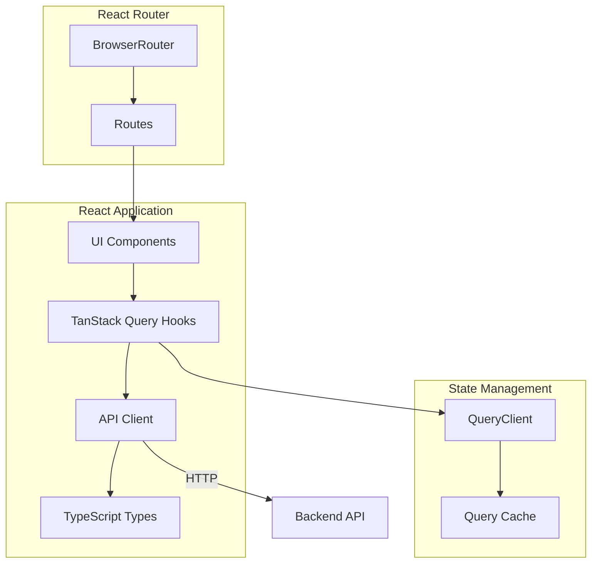

# Detailed Implementation Plan: Stage 4 - Frontend Setup

## Overview

This document provides a detailed implementation plan for **Stage 4: Frontend Setup** of the OptiView project. This stage focuses on configuring the frontend application with API integration, TypeScript types, TanStack Query setup, and React Router configuration.

**Prerequisites:**

- Stage 0: Infrastructure Setup - ✅ Completed
- Frontend template exists at `/frontend` with React 19 + Vite 7 + TypeScript 5 + Tailwind CSS 4 + Flowbite React

---

## 1. Current State Analysis

### 1.1 Frontend Template Structure

```
frontend/
├── src/
│   ├── App.tsx          # Main app component (placeholder)
│   ├── main.tsx         # Entry point
│   └── index.css        # Tailwind CSS imports
├── package.json         # Dependencies (React, Flowbite, Tailwind)
├── vite.config.ts       # Vite config with @ alias
└── tsconfig.*.json      # TypeScript configs
```

### 1.2 Existing Dependencies

| Package | Version | Purpose |
|---------|---------|---------|
| react | 19.2.0 | UI framework |
| react-dom | 19.2.0 | React DOM rendering |
| flowbite-react | 0.12.10 | UI component library |
| tailwindcss | 4.1.17 | CSS framework |
| vite | 7.2.4 | Build tool |

### 1.3 Required New Dependencies

| Package | Version | Purpose |
|---------|---------|---------|
| @tanstack/react-query | 5.x | Server state management |
| react-router-dom | 6.x | SPA routing |

---

## 2. Backend API Types Reference

The following types must be mirrored in the frontend to ensure type safety:

### 2.1 Genre Enum

```typescript
// From backend/src/entities/genre.enum.ts
enum Genre {
  NATURE = 'Nature',
  ARCHITECTURE = 'Architecture',
  PORTRAIT = 'Portrait',
  UNCATEGORIZED = 'Uncategorized',
}
```

### 2.2 Image Type

```typescript
// From backend/src/modules/images/dto/image-response.dto.ts
interface Image {
  id: string;              // UUID
  filename: string;
  genre: Genre;
  rating: number;          // 1-5
  aspectRatio: number;
  dominantColor: string;   // Hex color e.g. '#FF5733'
  lqipBase64: string;      // Base64 data URI
  width: number;
  height: number;
  createdAt: Date | string;
}
```

### 2.3 Filter Parameters

```typescript
// From backend/src/modules/images/dto/image-filter.dto.ts
interface ImageFilters {
  genre?: Genre;
  rating?: number;         // Min rating filter (1-5)
  sort?: SortField;        // 'createdAt' | 'rating' | 'filename'
  sortOrder?: SortOrder;   // 'ASC' | 'DESC'
  page?: number;           // Default: 1
  pageSize?: number;       // Default: 10, Max: 100
}
```

### 2.4 Paginated Response

```typescript
// From backend/src/modules/images/dto/paginated-response.dto.ts
interface PaginatedResponse<T> {
  data: T[];
  pagination: {
    page: number;
    pageSize: number;
    totalItems: number;
    totalPages: number;
    hasNextPage: boolean;
    hasPrevPage: boolean;
  };
}
```

### 2.5 Rating Update

```typescript
// PATCH /api/images/:id/rating
interface RatingUpdateRequest {
  rating: number;  // 1-5
}

interface RatingUpdateResponse {
  id: string;
  rating: number;
  updatedAt: string;
}
```

---

## 3. Implementation Architecture

### 3.1 Directory Structure (Target)

```
frontend/
├── src/
│   ├── api/
│   │   ├── client.ts           # Axios/fetch API client
│   │   └── images.api.ts       # Images API methods
│   ├── hooks/
│   │   └── useImages.ts        # TanStack Query hooks
│   ├── types/
│   │   ├── image.ts            # Image-related types
│   │   └── api.ts              # Generic API types
│   ├── App.tsx                 # Router setup
│   ├── main.tsx                # QueryClient provider
│   └── index.css
├── .env                        # API base URL
└── .env.example                # Environment template
```

### 3.2 Architecture Diagram



---

## 4. Detailed Task Breakdown

### Task 4.1: Install Additional Dependencies

**Goal:** Add TanStack Query and React Router to the project.

**Commands:**

```bash
cd frontend
npm install @tanstack/react-query react-router-dom
```

**Verification:**

- Check `package.json` contains new dependencies
- Run `npm run dev` to verify no import errors

**Files Modified:**

- `frontend/package.json`
- `frontend/package-lock.json`

---

### Task 4.2: Configure Environment Variables

**Goal:** Set up environment configuration for API base URL.

**Create Files:**

#### `frontend/.env`

```env
VITE_API_BASE_URL=http://localhost:3000
```

#### `frontend/.env.example`

```env
# Backend API base URL
VITE_API_BASE_URL=http://localhost:3000
```

**Usage in Code:**

```typescript
const API_BASE_URL = import.meta.env.VITE_API_BASE_URL;
```

**Notes:**

- Vite requires `VITE_` prefix for exposed environment variables
- Access via `import.meta.env.VITE_*`
- `.env` should be added to `.gitignore` if it contains sensitive data (not needed for this MVP)

---

### Task 4.3: Create TypeScript Types

**Goal:** Define TypeScript types matching backend DTOs.

#### `frontend/src/types/image.ts`

```typescript
/**
 * Genre enum representing image categories.
 * Must match backend Genre enum values exactly.
 */
export enum Genre {
  NATURE = 'Nature',
  ARCHITECTURE = 'Architecture',
  PORTRAIT = 'Portrait',
  UNCATEGORIZED = 'Uncategorized',
}

/**
 * Fields available for sorting images.
 */
export enum SortField {
  CREATED_AT = 'createdAt',
  RATING = 'rating',
  FILENAME = 'filename',
}

/**
 * Sort order direction.
 */
export enum SortOrder {
  ASC = 'ASC',
  DESC = 'DESC',
}

/**
 * Image entity representing a photo in the gallery.
 */
export interface Image {
  id: string;
  filename: string;
  genre: Genre;
  rating: number;
  aspectRatio: number;
  dominantColor: string;
  lqipBase64: string;
  width: number;
  height: number;
  createdAt: string;
}

/**
 * Filter parameters for image queries.
 */
export interface ImageFilters {
  genre?: Genre;
  rating?: number;
  sort?: SortField;
  sortOrder?: SortOrder;
  page?: number;
  pageSize?: number;
}

/**
 * Request body for rating update.
 */
export interface RatingUpdateRequest {
  rating: number;
}

/**
 * Response from rating update endpoint.
 */
export interface RatingUpdateResponse {
  id: string;
  rating: number;
  updatedAt: string;
}
```

#### `frontend/src/types/api.ts`

```typescript
/**
 * Generic paginated response wrapper.
 */
export interface PaginatedResponse<T> {
  data: T[];
  pagination: PaginationMeta;
}

/**
 * Pagination metadata.
 */
export interface PaginationMeta {
  page: number;
  pageSize: number;
  totalItems: number;
  totalPages: number;
  hasNextPage: boolean;
  hasPrevPage: boolean;
}

/**
 * Generic API error response.
 */
export interface ApiError {
  statusCode: number;
  message: string;
  error: string;
}
```

#### `frontend/src/types/index.ts`

```typescript
export * from './image';
export * from './api';
```

---

### Task 4.4: Create API Client

**Goal:** Create a centralized API client with base URL configuration.

#### `frontend/src/api/client.ts`

```typescript
/**
 * API client configuration for backend communication.
 * Uses native fetch API for HTTP requests.
 */

const API_BASE_URL = import.meta.env.VITE_API_BASE_URL || 'http://localhost:3000';

/**
 * Default headers for API requests.
 */
const defaultHeaders: HeadersInit = {
  'Content-Type': 'application/json',
};

/**
 * Makes a GET request to the API.
 */
export async function apiGet<T>(endpoint: string, options?: RequestInit): Promise<T> {
  const response = await fetch(`${API_BASE_URL}${endpoint}`, {
    method: 'GET',
    headers: defaultHeaders,
    ...options,
  });

  if (!response.ok) {
    const error = await response.json().catch(() => ({ message: 'Unknown error' }));
    throw new ApiError(response.status, error.message || response.statusText);
  }

  return response.json();
}

/**
 * Makes a POST request to the API.
 */
export async function apiPost<T>(endpoint: string, body?: unknown, options?: RequestInit): Promise<T> {
  const response = await fetch(`${API_BASE_URL}${endpoint}`, {
    method: 'POST',
    headers: defaultHeaders,
    body: body ? JSON.stringify(body) : undefined,
    ...options,
  });

  if (!response.ok) {
    const error = await response.json().catch(() => ({ message: 'Unknown error' }));
    throw new ApiError(response.status, error.message || response.statusText);
  }

  return response.json();
}

/**
 * Makes a PATCH request to the API.
 */
export async function apiPatch<T>(endpoint: string, body: unknown, options?: RequestInit): Promise<T> {
  const response = await fetch(`${API_BASE_URL}${endpoint}`, {
    method: 'PATCH',
    headers: defaultHeaders,
    body: JSON.stringify(body),
    ...options,
  });

  if (!response.ok) {
    const error = await response.json().catch(() => ({ message: 'Unknown error' }));
    throw new ApiError(response.status, error.message || response.statusText);
  }

  return response.json();
}

/**
 * Makes a multipart form POST request for file uploads.
 */
export async function apiUpload<T>(endpoint: string, formData: FormData, options?: RequestInit): Promise<T> {
  // Don't set Content-Type for FormData - browser sets it with boundary
  const response = await fetch(`${API_BASE_URL}${endpoint}`, {
    method: 'POST',
    body: formData,
    ...options,
  });

  if (!response.ok) {
    const error = await response.json().catch(() => ({ message: 'Unknown error' }));
    throw new ApiError(response.status, error.message || response.statusText);
  }

  return response.json();
}

/**
 * Custom error class for API errors.
 */
export class ApiError extends Error {
  constructor(
    public statusCode: number,
    message: string,
  ) {
    super(message);
    this.name = 'ApiError';
  }
}

export { API_BASE_URL };
```

---

### Task 4.5: Create Images API Methods

**Goal:** Implement typed API methods for all image endpoints.

#### `frontend/src/api/images.api.ts`

```typescript
import { apiGet, apiPatch, apiUpload } from './client';
import type {
  Image,
  ImageFilters,
  PaginatedResponse,
  RatingUpdateRequest,
  RatingUpdateResponse,
} from '@/types';
import { API_BASE_URL } from './client';

/**
 * Images API endpoints.
 */
const ENDPOINTS = {
  IMAGES: '/api/images',
  IMAGE_BY_ID: (id: string) => `/api/images/${id}`,
  IMAGE_METADATA: (id: string) => `/api/images/${id}/metadata`,
  IMAGE_LQIP: (id: string) => `/api/images/${id}/lqip`,
  IMAGE_RATING: (id: string) => `/api/images/${id}/rating`,
  UPLOAD: '/api/images/upload',
} as const;

/**
 * Builds query string from filter parameters.
 */
function buildQueryString(filters: ImageFilters): string {
  const params = new URLSearchParams();

  if (filters.genre) params.append('genre', filters.genre);
  if (filters.rating !== undefined) params.append('rating', filters.rating.toString());
  if (filters.sort) params.append('sort', filters.sort);
  if (filters.sortOrder) params.append('sortOrder', filters.sortOrder);
  if (filters.page !== undefined) params.append('page', filters.page.toString());
  if (filters.pageSize !== undefined) params.append('pageSize', filters.pageSize.toString());

  const queryString = params.toString();
  return queryString ? `?${queryString}` : '';
}

/**
 * Fetches paginated list of images with optional filters.
 */
export async function getImages(filters: ImageFilters = {}): Promise<PaginatedResponse<Image>> {
  const queryString = buildQueryString(filters);
  return apiGet<PaginatedResponse<Image>>(`${ENDPOINTS.IMAGES}${queryString}`);
}

/**
 * Fetches single image metadata by ID.
 */
export async function getImageMetadata(id: string): Promise<Image> {
  return apiGet<Image>(ENDPOINTS.IMAGE_METADATA(id));
}

/**
 * Gets the URL for a processed image with specified width.
 * The browser's Accept header determines the format (AVIF/WebP/JPEG).
 */
export function getImageUrl(id: string, width: number): string {
  return `${API_BASE_URL}${ENDPOINTS.IMAGE_BY_ID(id)}?width=${width}`;
}

/**
 * Gets the URL for the LQIP placeholder.
 */
export function getLqipUrl(id: string): string {
  return `${API_BASE_URL}${ENDPOINTS.IMAGE_LQIP(id)}`;
}

/**
 * Updates the rating for an image.
 */
export async function updateImageRating(id: string, rating: number): Promise<RatingUpdateResponse> {
  const body: RatingUpdateRequest = { rating };
  return apiPatch<RatingUpdateResponse>(ENDPOINTS.IMAGE_RATING(id), body);
}

/**
 * Uploads a new image with genre selection.
 */
export async function uploadImage(
  file: File,
  genre: string,
  onProgress?: (progress: number) => void,
): Promise<Image> {
  const formData = new FormData();
  formData.append('file', file);
  formData.append('genre', genre);

  // For progress tracking, we need XMLHttpRequest
  if (onProgress) {
    return new Promise((resolve, reject) => {
      const xhr = new XMLHttpRequest();

      xhr.upload.addEventListener('progress', (event) => {
        if (event.lengthComputable) {
          const progress = Math.round((event.loaded / event.total) * 100);
          onProgress(progress);
        }
      });

      xhr.addEventListener('load', () => {
        if (xhr.status >= 200 && xhr.status < 300) {
          try {
            resolve(JSON.parse(xhr.responseText));
          } catch {
            reject(new Error('Invalid response format'));
          }
        } else {
          try {
            const error = JSON.parse(xhr.responseText);
            reject(new Error(error.message || 'Upload failed'));
          } catch {
            reject(new Error('Upload failed'));
          }
        }
      });

      xhr.addEventListener('error', () => reject(new Error('Network error')));
      xhr.addEventListener('abort', () => reject(new Error('Upload cancelled')));

      xhr.open('POST', `${API_BASE_URL}${ENDPOINTS.UPLOAD}`);
      xhr.send(formData);
    });
  }

  return apiUpload<Image>(ENDPOINTS.UPLOAD, formData);
}
```

#### `frontend/src/api/index.ts`

```typescript
export * from './client';
export * from './images.api';
```

---

### Task 4.6: Create TanStack Query Hooks

**Goal:** Implement React Query hooks for data fetching with caching.

#### `frontend/src/hooks/useImages.ts`

```typescript
import { useQuery, useMutation, useQueryClient } from '@tanstack/react-query';
import * as imagesApi from '@/api/images.api';
import type { ImageFilters, Image } from '@/types';

/**
 * Query keys for TanStack Query cache management.
 */
export const queryKeys = {
  images: (filters: ImageFilters) => ['images', filters] as const,
  image: (id: string) => ['image', id] as const,
  imageMetadata: (id: string) => ['imageMetadata', id] as const,
} as const;

/**
 * Hook for fetching paginated images with filters.
 * Automatically refetches when filters change.
 */
export function useImages(filters: ImageFilters = {}) {
  return useQuery({
    queryKey: queryKeys.images(filters),
    queryFn: () => imagesApi.getImages(filters),
    staleTime: 1000 * 60 * 5, // 5 minutes
  });
}

/**
 * Hook for fetching single image metadata.
 */
export function useImageMetadata(id: string) {
  return useQuery({
    queryKey: queryKeys.imageMetadata(id),
    queryFn: () => imagesApi.getImageMetadata(id),
    enabled: !!id,
    staleTime: 1000 * 60 * 5, // 5 minutes
  });
}

/**
 * Hook for updating image rating with optimistic updates.
 */
export function useUpdateRating() {
  const queryClient = useQueryClient();

  return useMutation({
    mutationFn: ({ id, rating }: { id: string; rating: number }) =>
      imagesApi.updateImageRating(id, rating),

    // Optimistic update
    onMutate: async ({ id, rating }) => {
      // Cancel any outgoing refetches
      await queryClient.cancelQueries({ queryKey: queryKeys.imageMetadata(id) });

      // Snapshot previous value
      const previousImage = queryClient.getQueryData<Image>(queryKeys.imageMetadata(id));

      // Optimistically update
      if (previousImage) {
        queryClient.setQueryData<Image>(queryKeys.imageMetadata(id), {
          ...previousImage,
          rating,
        });
      }

      return { previousImage };
    },

    // Revert on error
    onError: (err, { id }, context) => {
      if (context?.previousImage) {
        queryClient.setQueryData(queryKeys.imageMetadata(id), context.previousImage);
      }
      console.error('Failed to update rating:', err);
    },

    // Refetch after settling
    onSettled: (data, error, { id }) => {
      queryClient.invalidateQueries({ queryKey: queryKeys.imageMetadata(id) });
      queryClient.invalidateQueries({ queryKey: ['images'] });
    },
  });
}

/**
 * Hook for uploading images.
 * Does not use React Query's built-in progress tracking;
 * progress is handled via callback in the API function.
 */
export function useUploadImage() {
  const queryClient = useQueryClient();

  return useMutation({
    mutationFn: ({
      file,
      genre,
      onProgress,
    }: {
      file: File;
      genre: string;
      onProgress?: (progress: number) => void;
    }) => imagesApi.uploadImage(file, genre, onProgress),

    onSuccess: () => {
      // Invalidate images list to show new upload
      queryClient.invalidateQueries({ queryKey: ['images'] });
    },
  });
}

/**
 * Helper hook to get image URL with proper format negotiation.
 * Returns URL that can be used in img src attribute.
 */
export function useImageUrl(id: string, width: number) {
  return imagesApi.getImageUrl(id, width);
}

/**
 * Helper hook to get LQIP URL.
 */
export function useLqipUrl(id: string) {
  return imagesApi.getLqipUrl(id);
}
```

#### `frontend/src/hooks/index.ts`

```typescript
export * from './useImages';
```

---

### Task 4.7: Set Up React Router

**Goal:** Configure React Router with application routes.

#### Updated `frontend/src/App.tsx`

```typescript
import { BrowserRouter, Routes, Route } from 'react-router-dom';

// Placeholder components - will be implemented in Stage 5 and 6
function GalleryPage() {
  return (
    <div className="container mx-auto p-4">
      <h1 className="text-2xl font-bold">Gallery Page</h1>
      <p className="text-gray-600">Gallery feature will be implemented in Stage 5</p>
    </div>
  );
}

function UploadPage() {
  return (
    <div className="container mx-auto p-4">
      <h1 className="text-2xl font-bold">Upload Page</h1>
      <p className="text-gray-600">Upload feature will be implemented in Stage 6</p>
    </div>
  );
}

export function App() {
  return (
    <BrowserRouter>
      <Routes>
        <Route path="/" element={<GalleryPage />} />
        <Route path="/upload" element={<UploadPage />} />
      </Routes>
    </BrowserRouter>
  );
}

export default App;
```

---

### Task 4.8: Configure TanStack Query Provider

**Goal:** Set up QueryClient with development tools.

#### Updated `frontend/src/main.tsx`

```typescript
import { StrictMode } from 'react';
import { createRoot } from 'react-dom/client';
import { QueryClient, QueryClientProvider } from '@tanstack/react-query';
import { ReactQueryDevtools } from '@tanstack/react-query-devtools';
import './index.css';
import App from './App';

// Create QueryClient with default options
const queryClient = new QueryClient({
  defaultOptions: {
    queries: {
      staleTime: 1000 * 60 * 5, // 5 minutes
      retry: 1,
      refetchOnWindowFocus: false,
    },
  },
});

createRoot(document.getElementById('root')!).render(
  <StrictMode>
    <QueryClientProvider client={queryClient}>
      <App />
      <ReactQueryDevtools initialIsOpen={false} />
    </QueryClientProvider>
  </StrictMode>,
);
```

**Note:** Requires installing devtools:

```bash
npm install @tanstack/react-query-devtools
```

---

## 5. File Creation Summary

| File | Action | Description |
|------|--------|-------------|
| `frontend/.env` | Create | Environment variables |
| `frontend/.env.example` | Create | Environment template |
| `frontend/src/types/image.ts` | Create | Image-related types |
| `frontend/src/types/api.ts` | Create | Generic API types |
| `frontend/src/types/index.ts` | Create | Types barrel export |
| `frontend/src/api/client.ts` | Create | API client with fetch |
| `frontend/src/api/images.api.ts` | Create | Images API methods |
| `frontend/src/api/index.ts` | Create | API barrel export |
| `frontend/src/hooks/useImages.ts` | Create | TanStack Query hooks |
| `frontend/src/hooks/index.ts` | Create | Hooks barrel export |
| `frontend/src/App.tsx` | Modify | Add React Router |
| `frontend/src/main.tsx` | Modify | Add QueryClient provider |
| `frontend/package.json` | Modify | Add new dependencies |

---

## 6. Dependencies to Install

```bash
cd frontend
npm install @tanstack/react-query @tanstack/react-query-devtools react-router-dom
```

---

## 7. Verification Checklist

### 7.1 Installation Verification

- [ ] `npm run dev` starts without errors
- [ ] No TypeScript compilation errors
- [ ] No ESLint warnings

### 7.2 API Client Verification

- [ ] API client connects to backend (check Network tab)
- [ ] Environment variable is properly read

### 7.3 Router Verification

- [ ] `/` route shows Gallery placeholder
- [ ] `/upload` route shows Upload placeholder
- [ ] Browser back/forward navigation works

### 7.4 TanStack Query Verification

- [ ] React Query DevTools appear in development
- [ ] Query hooks return typed data
- [ ] Cache is properly populated

---

## 8. Risks and Mitigations

| Risk | Probability | Impact | Mitigation |
|------|-------------|--------|------------|
| Type mismatch between frontend/backend | Medium | Medium | Keep types in sync; consider code generation later |
| Environment variable not loaded | Low | Medium | Verify VITE_ prefix; check .env file location |
| React 19 compatibility with TanStack Query | Low | High | Use TanStack Query 5.x which supports React 19 |

---

## 9. Next Steps After Stage 4

Once Stage 4 is complete, the following stages can begin:

1. **Stage 5: Frontend Gallery Feature**
   - Uses `useImages` hook for data
   - Uses `useUpdateRating` for rating interaction
   - Uses router for navigation

2. **Stage 6: Frontend Upload Feature**
   - Uses `useUploadImage` hook
   - Uses `/upload` route

Both Stage 5 and Stage 6 depend on Stage 4 being complete, but they can run in parallel.

---

## 10. Implementation Order

The recommended order for implementing tasks:

```mermaid
flowchart LR
    T1[4.1 Install Dependencies] --> T2[4.2 Environment Variables]
    T2 --> T3[4.3 TypeScript Types]
    T3 --> T4[4.4 API Client]
    T4 --> T5[4.5 Images API Methods]
    T5 --> T6[4.6 TanStack Query Hooks]
    T6 --> T7[4.7 React Router]
    T7 --> T8[4.8 QueryClient Provider]
    T8 --> T9[Verification]
```



---

## 11. Acceptance Criteria

- [ ] Frontend starts with `npm run dev`
- [ ] API client successfully connects to backend
- [ ] TanStack Query hooks return typed data
- [ ] Router navigates between `/` and `/upload`
- [ ] Environment configuration allows easy API URL changes
- [ ] No TypeScript errors
- [ ] No console errors in browser
- [ ] React Query DevTools available in development mode
