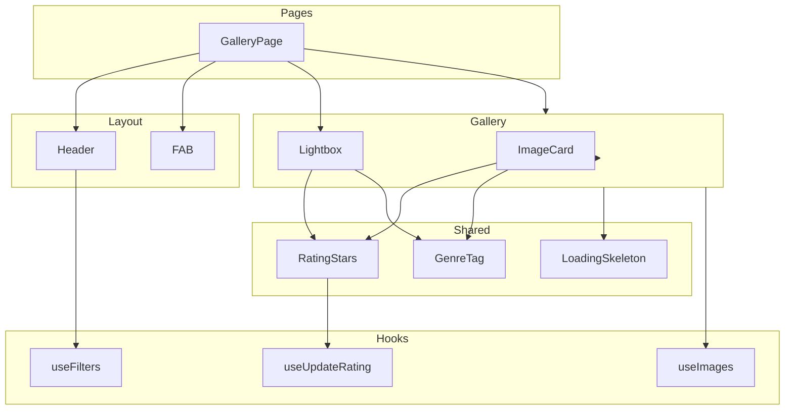
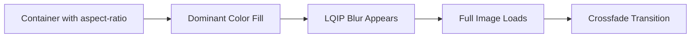

# Stage 5: Frontend Gallery Feature - Detailed Implementation Plan

## Overview

This document provides a detailed implementation plan for Stage 5 of the OptiView project - the Frontend Gallery Feature. This stage builds upon the completed Stage 4 (Frontend Setup) and implements the main gallery page with masonry grid, filters, sorting, and image lightbox.

**Prerequisites:**

- Stage 3: REST API Endpoints - ✅ Completed
- Stage 4: Frontend Setup - ✅ Completed

---

## Architecture Summary

### Technology Stack (Already Configured)

| Technology               | Version | Purpose                 |
|:-------------------------|:--------|:------------------------|
| React                    | 19.x    | UI framework            |
| Vite                     | 7.x     | Build tool              |
| TanStack Query           | 5.x     | Server state management |
| React Router             | 7.x     | SPA routing             |
| Tailwind CSS             | 4.x     | Styling                 |
| Flowbite React           | 0.12.x  | UI component library    |
| react-responsive-masonry | ^2.4.0  | Masonry grid layout     |

### Existing Artifacts from Stage 4

| Artifact                                                             | Status | Description                              |
|:---------------------------------------------------------------------|:-------|:-----------------------------------------|
| [`frontend/src/api/client.ts`](frontend/src/api/client.ts)           | ✅     | OpenAPI-fetch client with error handling |
| [`frontend/src/api/images.api.ts`](frontend/src/api/images.api.ts)   | ✅     | Upload function with progress tracking   |
| [`frontend/src/api/types.ts`](frontend/src/api/types.ts)             | ✅     | TypeScript types from OpenAPI schema     |
| [`frontend/src/hooks/useImages.ts`](frontend/src/hooks/useImages.ts) | ✅     | TanStack Query hooks for images          |
| [`frontend/src/App.tsx`](frontend/src/App.tsx)                       | ✅     | Router setup with placeholder pages      |

---

## Component Architecture



---

## Implementation Tasks

### Task 1: Install Dependencies

**Objective:** Add react-responsive-masonry for masonry grid layout.

**Commands:**

```powershell
cd frontend
npm install react-responsive-masonry
```

**Files to modify:** `frontend/package.json`

**Verification:**

- [ ] Package installed successfully
- [ ] No peer dependency warnings
- [ ] TypeScript types available or `@types/react-responsive-masonry` installed if needed

---

### Task 2: Create useFilters Hook

**Objective:** Create a custom hook for managing filter state in URL query parameters.

**File:** `frontend/src/hooks/useFilters.ts`

**Implementation Details:**

```typescript
// Hook manages URL state for filters
// Returns: { filters, setGenre, setRating, setSort, setSortOrder, resetFilters }
// Syncs with URL: ?genre=Nature&rating=4&sort=createdAt&sortOrder=DESC&page=1

interface UseFiltersReturn {
  filters: ImageFilterDto;
  setGenre: (genre: Genre | undefined) => void;
  setRating: (rating: number | undefined) => void;
  setSort: (sort: SortField) => void;
  setSortOrder: (order: SortOrder) => void;
  setPage: (page: number) => void;
  resetFilters: () => void;
}
```

**Key Features:**

- Use `useSearchParams` from react-router-dom
- Parse URL parameters into typed filter object
- Provide setter functions that update URL
- Default values: sort=createdAt, sortOrder=DESC, page=1, pageSize=20
- Reset function clears all filters to defaults

**Dependencies:**

- react-router-dom (already installed)
- Types from [`frontend/src/api/types.ts`](frontend/src/api/types.ts)

**Tests:** `frontend/src/hooks/useFilters.test.ts`

- Test URL sync for each filter
- Test reset functionality
- Test default values

---

### Task 3: Create Header Component

**Objective:** Implement the filter header with genre, rating, and sort dropdowns.

**File:** `frontend/src/components/Header/Header.tsx`

**UI Specification Reference:** UI.md Section 4.1

**Component Structure:**

```tsx
export function Header() {
  // Uses useFilters hook for state management
  // Renders: Logo, GenreFilter, RatingFilter, SortDropdown
}
```

**Sub-components:**

| Component | File | Description |
|:----------|:-----|:------------|
| GenreFilter | `Header/GenreFilter.tsx` | Dropdown for genre selection |
| RatingFilter | `Header/RatingFilter.tsx` | Dropdown for minimum rating |
| SortDropdown | `Header/SortDropdown.tsx` | Combined sort field and order |

**Props Interface:**

```typescript
interface HeaderProps {
  // No props - uses useFilters hook directly
}
```

**Behavior:**

- Fixed position at top of viewport
- Sticky on scroll
- Filters update URL query parameters on change
- Gallery reloads via TanStack Query when filters change

**Styling:**

- Use Flowbite React Select components
- Tailwind CSS for layout
- Responsive: inline filters on tablet/desktop, stacked on mobile

**Tests:** `frontend/src/components/Header/Header.test.tsx`

- Test filter changes update URL
- Test responsive layout
- Test accessibility (keyboard navigation)

---

### Task 4: Create RatingStars Component

**Objective:** Create a reusable star rating component for display and interaction.

**File:** `frontend/src/components/RatingStars/RatingStars.tsx`

**UI Specification Reference:** UI.md Section 4.6

**Props Interface:**

```typescript
interface RatingStarsProps {
  rating: number;           // Current rating 1-5
  readonly?: boolean;       // If true, display only
  size?: 'sm' | 'md' | 'lg'; // Star size variant
  onChange?: (rating: number) => void; // Callback on click
}
```

**Size Variants:**

| Variant | Star Size | Use Case |
|:--------|:----------|:---------|
| sm | 16px | Image card in gallery |
| md | 20px | Lightbox default |
| lg | 24px | Lightbox enhanced |

**Visual States:**

- Default: Filled stars (★) and empty stars (☆)
- Hover: Highlight stars from 1 to N with gold color
- Active: Slight scale animation (1.1x)

**Accessibility:**

- Each star is a button with `aria-label`
- `aria-valuenow` / `aria-valuemax` for screen readers
- Keyboard: Tab to focus, Enter or Space to select

**Implementation Notes:**

- Use Lucide React icons (Star component) or inline SVG
- CSS transitions for hover effects
- Consider using Flowbite React Rating as base if suitable

**Tests:** `frontend/src/components/RatingStars/RatingStars.test.tsx`

- Test click interaction
- Test hover preview
- Test readonly mode
- Test keyboard navigation
- Test accessibility attributes

---

### Task 5: Create GenreTag Component

**Objective:** Create a simple tag component for displaying image genre.

**File:** `frontend/src/components/GenreTag/GenreTag.tsx`

**Props Interface:**

```typescript
interface GenreTagProps {
  genre: Genre;
  size?: 'sm' | 'md';
}
```

**Visual Design:**

- Pill-shaped badge
- Color-coded by genre (optional enhancement)
- Small text label

**Tests:** `frontend/src/components/GenreTag/GenreTag.test.tsx`

---

### Task 6: Create ImageCard Component

**Objective:** Create the individual image card with LQIP loading, rating, and genre display.

**File:** `frontend/src/components/Gallery/ImageCard.tsx`

**UI Specification Reference:** UI.md Section 4.2

**Props Interface:**

```typescript
interface ImageCardProps {
  image: Image;
  onClick: () => void;  // Opens lightbox
}
```

**Loading Sequence:**



**Implementation Details:**

1. **Container:**
   - `aspect-ratio` CSS property from `image.aspectRatio`
   - `background-color` from `image.dominantColor`

2. **LQIP Layer:**
   - Base64 image from `image.lqipBase64`
   - CSS `filter: blur(20px)`
   - CSS `transform: scale(1.1)` to prevent blur edge artifacts

3. **Full Image:**
   - Use `` with `srcset` for responsive images
   - Request appropriate size based on container width
   - Fade in when loaded (`onLoad` event)
   - Hide LQIP layer after load

4. **Footer:**
   - RatingStars component (interactive, size='sm')
   - GenreTag component

**CSS Implementation Reference:**

```css
.image-container {
  position: relative;
  background-color: var(--dominant-color);
  aspect-ratio: var(--aspect-ratio);
  overflow: hidden;
  border-radius: 8px;
  cursor: pointer;
}

.image-placeholder {
  position: absolute;
  inset: 0;
  background-image: url(var(--lqip-base64));
  background-size: cover;
  filter: blur(20px);
  transform: scale(1.1);
  transition: opacity 300ms ease;
}

.image-full {
  position: absolute;
  inset: 0;
  width: 100%;
  height: 100%;
  object-fit: cover;
  opacity: 0;
  transition: opacity 300ms ease;
}

.image-full.loaded {
  opacity: 1;
}

.image-full.loaded + .image-placeholder {
  opacity: 0;
}
```

**Image URL Construction:**

```typescript
// Use API endpoint with width parameter
const imageUrl = `/api/images/${image.id}?width=${containerWidth}`;
```

**Tests:** `frontend/src/components/Gallery/ImageCard.test.tsx`

- Test loading sequence
- Test click handler
- Test rating interaction
- Test aspect ratio preservation

---

### Task 7: Create Gallery Component

**Objective:** Create the main gallery grid with masonry layout.

**File:** `frontend/src/components/Gallery/Gallery.tsx`

**UI Specification Reference:** UI.md Section 4.2

**Props Interface:**

```typescript
interface GalleryProps {
  // No props - uses useFilters and useImages hooks
}
```

**Responsive Columns:**

| Viewport Width | Columns |
|:---------------|:--------|
| < 640px (Mobile) | 2 |
| 640px - 1024px (Tablet) | 3 |
| > 1024px (Desktop) | 4 |

**Implementation with react-responsive-masonry:**

```tsx
import Masonry from 'react-responsive-masonry';

export function Gallery() {
  const { filters } = useFilters();
  const { data, isLoading, error } = useImages(filters);

  if (isLoading) return <LoadingSkeleton />;
  if (error) return <ErrorMessage error={error} />;
  if (!data?.items?.length) return <EmptyState />;

  return (
    <Masonry columnsCount={columnsCount} gutter="16px">
      {data.items.map((image) => (
        <ImageCard
          key={image.id}
          image={image}
          onClick={() => openLightbox(image)}
        />
      ))}
    </Masonry>
  );
}
```

**Responsive Column Detection:**

- Use `react-responsive-masonry` built-in responsive support
- Or use custom hook with `window.matchMedia`

**Pagination:**

- Display pagination controls below grid
- Use `data.meta` for pagination info
- Update `page` filter on page change

**Tests:** `frontend/src/components/Gallery/Gallery.test.tsx`

- Test masonry layout
- Test responsive columns
- Test pagination
- Test loading and error states

---

### Task 8: Create LoadingSkeleton Component

**Objective:** Create skeleton placeholders for initial gallery load.

**File:** `frontend/src/components/Gallery/LoadingSkeleton.tsx`

**Implementation:**

- Display grid of placeholder cards
- Use varying aspect ratios for realistic appearance
- Pulse animation for loading indication
- Match masonry column layout

**Tests:** `frontend/src/components/Gallery/LoadingSkeleton.test.tsx`

---

### Task 9: Create Lightbox Component

**Objective:** Create the full-screen image modal with navigation and rating.

**File:** `frontend/src/components/Gallery/Lightbox.tsx`

**UI Specification Reference:** UI.md Section 4.4

**Props Interface:**

```typescript
interface LightboxProps {
  image: Image | null;
  images: Image[];  // For navigation
  isOpen: boolean;
  onClose: () => void;
  onNavigate: (direction: 'prev' | 'next') => void;
}
```

**Layout Elements:**

```
┌─────────────────────────────────────────────────────────────────┐
│                                                         [X]    │
│                                                                 │
│         [<]                                           [>]       │
│                                                                 │
│                     ┌─────────────────┐                        │
│                     │                 │                        │
│                     │    Full Image   │                        │
│                     │                 │                        │
│                     │   (centered)    │                        │
│                     │                 │                        │
│                     └─────────────────┘                        │
│                                                                 │
│                    ★★★★☆  Nature                               │
│                                                                 │
│           [Download 1920px] [Download 1280px] [Download 640px] │
│                                                                 │
└─────────────────────────────────────────────────────────────────┘
```

**Features:**

1. **Overlay:**
   - Dark semi-transparent background: `rgba(0, 0, 0, 0.9)`
   - Click outside image closes modal

2. **Close Button:**
   - Top right corner
   - ESC key closes modal

3. **Navigation:**
   - Arrow buttons on sides
   - Keyboard: Left/Right arrows navigate
   - Wrap around at ends (optional)

4. **Image Display:**
   - Centered horizontally and vertically
   - Max height: 90vh
   - Responsive width

5. **Rating:**
   - RatingStars component below image
   - Interactive, size='md' or 'lg'

6. **Genre Tag:**
   - Displayed next to rating

7. **Download Buttons:**
   - 2-3 size options: 1920px, 1280px, 640px
   - Use same format negotiation as gallery

**Accessibility:**

- Focus trap when open
- Return focus to trigger element on close
- ARIA role="dialog"
- Keyboard navigation support

**State Management:**

```typescript
// In GalleryPage or Gallery component
const [lightboxImage, setLightboxImage] = useState<Image | null>(null);
const [isLightboxOpen, setIsLightboxOpen] = useState(false);
```

**Tests:** `frontend/src/components/Gallery/Lightbox.test.tsx`

- Test open/close behavior
- Test keyboard navigation
- Test click outside to close
- Test focus trap
- Test rating interaction
- Test download buttons

---

### Task 10: Create FAB Component

**Objective:** Create the floating action button for navigation to upload page.

**File:** `frontend/src/components/FAB/FAB.tsx`

**UI Specification Reference:** UI.md Section 4.3

**Props Interface:**

```typescript
interface FABProps {
  // No props - navigates to /upload
}
```

**Visual Design:**

- Circular button, 56px diameter
- Plus icon (+)
- Fixed position, bottom-right corner
- Elevated shadow
- Secondary color from theme

**Behavior:**

- Click navigates to `/upload` route
- Subtle hover/focus animation (scale 1.05)

**Tests:** `frontend/src/components/FAB/FAB.test.tsx`

---

### Task 11: Create GalleryPage Component

**Objective:** Create the main gallery page that composes all components.

**File:** `frontend/src/pages/GalleryPage.tsx`

**Component Composition:**

```tsx
export function GalleryPage() {
  const [lightboxImage, setLightboxImage] = useState<Image | null>(null);
  const { data } = useImages(useFilters().filters);

  return (
    <div className="min-h-screen bg-gray-50">
      <Header />
      <main className="container mx-auto px-4 py-6">
        <Gallery onImageClick={setLightboxImage} />
      </main>
      <FAB />
      <Lightbox
        image={lightboxImage}
        images={data?.items ?? []}
        isOpen={!!lightboxImage}
        onClose={() => setLightboxImage(null)}
      />
    </div>
  );
}
```

**Tests:** `frontend/src/pages/GalleryPage.test.tsx`

- Integration test for page rendering
- Test lightbox opening from card click

---

### Task 12: Update App.tsx

**Objective:** Replace placeholder GalleryPage with actual implementation.

**File:** `frontend/src/App.tsx`

**Changes:**

- Import GalleryPage from `./pages/GalleryPage`
- Replace placeholder component

---

### Task 13: Create Styles

**Objective:** Create CSS module or Tailwind styles for gallery components.

**File:** `frontend/src/styles/gallery.css` (if needed)

**Styling Approach:**

- Prefer Tailwind utility classes
- Use CSS modules for complex animations
- Follow existing Tailwind 4 + Flowbite patterns

---

## File Structure Summary

```
frontend/src/
├── components/
│   ├── Header/
│   │   ├── Header.tsx
│   │   ├── Header.test.tsx
│   │   ├── GenreFilter.tsx
│   │   ├── RatingFilter.tsx
│   │   └── SortDropdown.tsx
│   ├── Gallery/
│   │   ├── Gallery.tsx
│   │   ├── Gallery.test.tsx
│   │   ├── ImageCard.tsx
│   │   ├── ImageCard.test.tsx
│   │   ├── Lightbox.tsx
│   │   ├── Lightbox.test.tsx
│   │   ├── LoadingSkeleton.tsx
│   │   └── LoadingSkeleton.test.tsx
│   ├── RatingStars/
│   │   ├── RatingStars.tsx
│   │   └── RatingStars.test.tsx
│   ├── GenreTag/
│   │   ├── GenreTag.tsx
│   │   └── GenreTag.test.tsx
│   └── FAB/
│       ├── FAB.tsx
│       └── FAB.test.tsx
├── pages/
│   ├── GalleryPage.tsx
│   └── GalleryPage.test.tsx
├── hooks/
│   ├── useFilters.ts
│   └── useFilters.test.ts
└── App.tsx (modified)
```

---

## Testing Strategy

### Unit Tests

| Component | Test File | Coverage Focus |
|:----------|:----------|:---------------|
| useFilters | `useFilters.test.ts` | URL sync, defaults, reset |
| Header | `Header.test.tsx` | Filter changes, accessibility |
| RatingStars | `RatingStars.test.tsx` | Click, hover, keyboard |
| GenreTag | `GenreTag.test.tsx` | Rendering |
| ImageCard | `ImageCard.test.tsx` | Loading sequence, rating |
| Gallery | `Gallery.test.tsx` | Layout, pagination |
| Lightbox | `Lightbox.test.tsx` | Navigation, focus trap |
| FAB | `FAB.test.tsx` | Navigation |

### Integration Tests

| Test | Focus |
|:-----|:------|
| GalleryPage | Full page rendering, lightbox flow |
| Rating flow | Click star → API call → UI update |

### Accessibility Tests

- Use jest-axe for automated accessibility testing
- Test keyboard navigation for all interactive elements
- Test focus management in lightbox

---

## Performance Considerations

### Image Loading Optimization

1. **LQIP Strategy:**
   - Base64 embedded in API response
   - Instant display, no additional request
   - Smooth transition to full image

2. **Responsive Images:**
   - Request appropriate size from API
   - Use `srcset` if browser supports
   - Consider `loading="lazy"` for below-fold images

3. **Caching:**
   - TanStack Query caches API responses
   - Browser caches processed images

### Layout Stability

1. **Aspect Ratio:**
   - Set `aspect-ratio` CSS property from metadata
   - Prevents CLS during image load

2. **Dominant Color:**
   - Background color fills space immediately
   - Smooth visual transition

### Animation Performance

1. **CSS Transforms:**
   - Use `transform` and `opacity` for animations
   - GPU-accelerated, no layout thrashing

2. **will-change:**
   - Consider `will-change: opacity` for animated elements

---

## Risks and Mitigations

| Risk | Probability | Impact | Mitigation |
|:-----|:------------|:-------|:-----------|
| Masonry layout performance with many images | Medium | Medium | Implement pagination, consider virtualization for large datasets |
| LQIP blur transition jank | Low | Medium | Use CSS transforms, will-change property |
| Lightbox focus trap issues | Medium | Medium | Use established focus-trap library or test thoroughly |
| Image loading race conditions | Low | Low | Use React key prop correctly, cancel pending requests on unmount |

---

## Definition of Done Checklist

- [ ] Gallery displays images in responsive masonry grid
- [ ] Filters update URL and refetch data
- [ ] LQIP blur effect shows before full image loads
- [ ] No CLS during image loading
- [ ] Lightbox opens, closes, and navigates correctly
- [ ] Rating update works with optimistic UI
- [ ] Keyboard navigation works for all interactive elements
- [ ] Component tests cover main user flows
- [ ] All tests pass
- [ ] No TypeScript errors
- [ ] No ESLint warnings
- [ ] Accessibility audit passes

---

## Implementation Order

1. **Install dependencies** (react-responsive-masonry)
2. **Create useFilters hook** - Foundation for filter state
3. **Create RatingStars component** - Shared by ImageCard and Lightbox
4. **Create GenreTag component** - Simple shared component
5. **Create Header component** - Filter controls
6. **Create ImageCard component** - Individual card with LQIP
7. **Create LoadingSkeleton component** - Loading state
8. **Create Gallery component** - Main grid layout
9. **Create Lightbox component** - Full-screen modal
10. **Create FAB component** - Navigation to upload
11. **Create GalleryPage** - Page composition
12. **Update App.tsx** - Wire up new page
13. **Write tests** - Throughout development
14. **Final verification** - Definition of Done checklist

---

## Dependencies on Backend API

The frontend gallery depends on the following backend endpoints (all implemented in Stage 3):

| Endpoint | Method | Usage |
|:---------|:-------|:------|
| `/api/images` | GET | Fetch paginated image list with filters |
| `/api/images/:id?width=N` | GET | Fetch processed image for display |
| `/api/images/:id/metadata` | GET | Fetch image metadata (optional) |
| `/api/images/:id/rating` | PATCH | Update image rating |

---

## Notes

- **Flowbite React:** Already installed and configured. Use Flowbite components (Select, Button, Modal, etc.) where appropriate.
- **Tailwind CSS 4:** Using new syntax with `@import "tailwindcss"` and `@plugin` directives.
- **OpenAPI Types:** Types are auto-generated from backend OpenAPI spec. Run `npm run gen` to regenerate after API changes.
- **Testing:** Use Vitest + React Testing Library (need to verify if configured, or set up in this stage).
