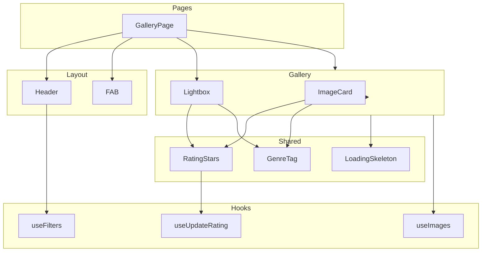
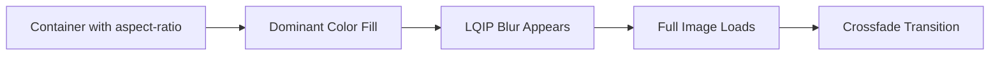

# Stage 5: Frontend Gallery Feature - Detailed Implementation Plan

## Overview

This document provides a detailed implementation plan for Stage 5 of the OptiView project - the Frontend Gallery Feature. This stage builds upon the completed Stage 4 (Frontend Setup) and implements the main gallery page with masonry grid, filters, sorting, and image lightbox.

**Prerequisites:**

- Stage 3: REST API Endpoints - ✅ Completed
- Stage 4: Frontend Setup - ✅ Completed

---

## Architecture Summary

### Technology Stack (Already Configured)

| Technology               | Version | Purpose                 |
|:-------------------------|:--------|:------------------------|
| React                    | 19.x    | UI framework            |
| Vite                     | 7.x     | Build tool              |
| TanStack Query           | 5.x     | Server state management |
| React Router             | 7.x     | SPA routing             |
| Tailwind CSS             | 4.x     | Styling                 |
| Flowbite React           | 0.12.x  | UI component library    |
| react-responsive-masonry | ^2.4.0  | Masonry grid layout     |

### Existing Artifacts from Stage 4

| Artifact                                                             | Status | Description                              |
|:---------------------------------------------------------------------|:-------|:-----------------------------------------|
| [`frontend/src/api/client.ts`](frontend/src/api/client.ts)           | ✅     | OpenAPI-fetch client with error handling |
| [`frontend/src/api/images.api.ts`](frontend/src/api/images.api.ts)   | ✅     | Upload function with progress tracking   |
| [`frontend/src/api/types.ts`](frontend/src/api/types.ts)             | ✅     | TypeScript types from OpenAPI schema     |
| [`frontend/src/hooks/useImages.ts`](frontend/src/hooks/useImages.ts) | ✅     | TanStack Query hooks for images          |
| [`frontend/src/App.tsx`](frontend/src/App.tsx)                       | ✅     | Router setup with placeholder pages      |

---

## Flowbite Component Integration

This section identifies opportunities to use Flowbite React components instead of custom implementations. Using Flowbite components reduces development time, ensures consistent styling, and provides built-in accessibility support.

### Component Mapping Table

| Plan Component | Flowbite Component | Recommendation | Notes |
|:---------------|:-------------------|:---------------|:------|
| **Header** | [`Navbar`](https://flowbite-react.com/components/navbar) | ✅ **Use Flowbite** | Full navbar with brand, collapse, links - perfect fit |
| **GenreTag** | [`Badge`](https://flowbite-react.com/components/badge) | ✅ **Use Flowbite** | Pill-shaped, color-coded badges - perfect fit |
| **Lightbox** | [`Modal`](https://flowbite-react.com/components/modal) | ✅ **Use Flowbite** | Overlay dialog with close, keyboard support - wrap custom content in Modal |
| **Pagination** | [`Pagination`](https://flowbite-react.com/components/pagination) | ✅ **Use Flowbite** | Built-in pagination with page change handler |
| **GenreFilter** | [`Select`](https://flowbite-react.com/components/forms) | ✅ **Use Flowbite** | Form select component |
| **RatingFilter** | [`Select`](https://flowbite-react.com/components/forms) | ✅ **Use Flowbite** | Form select component |
| **SortDropdown** | [`Dropdown`](https://flowbite-react.com/components/dropdown) | ✅ **Use Flowbite** | Dropdown menu with items |
| **RatingStars** | [`Rating`](https://flowbite-react.com/components/rating) | ⚠️ **Evaluate** | Flowbite Rating is display-only; may need custom for interactive mode |
| **FAB** | [`Button`](https://flowbite-react.com/components/button) | ⚠️ **Style Flowbite** | Use Button with custom Tailwind classes for circular FAB |
| **LoadingSkeleton** | No direct component | ❌ **Custom** | Use Flowbite `Spinner` or create custom skeleton |
| **ImageCard** | No suitable component | ❌ **Custom** | Complex LQIP blur-up loading not supported by Flowbite Card |
| **Gallery** | No suitable component | ❌ **Custom** | Masonry layout requires `react-responsive-masonry` |

### Flowbite Imports Summary

```typescript
// Components to import from flowbite-react
import {
  Navbar,
  Badge,
  Modal,
  Pagination,
  Select,
  Dropdown,
  Button,
  Spinner,
} from 'flowbite-react';
```

---

## Component Architecture



---

## Implementation Tasks

### Task 1: Install Dependencies

**Objective:** Add required packages for masonry grid layout and URL state management.

**Commands:**

```powershell
cd frontend
npm install react-responsive-masonry state-in-url
```

**Packages:**

| Package | Purpose |
|:--------|:--------|
| react-responsive-masonry | Masonry grid layout |
| state-in-url | Type-safe URL query parameter state management |

**Files to modify:** `frontend/package.json`

**Verification:**

- [ ] Packages installed successfully
- [ ] No peer dependency warnings
- [ ] TypeScript types available or `@types/*` packages installed if needed

---

### Task 2: Create useFilters Hook

**Objective:** Create a custom hook for managing filter state in URL query parameters using the `state-in-url` library.

**File:** `frontend/src/hooks/useFilters.ts`

**Package Installation:**

```powershell
cd frontend
npm install state-in-url
```

**Implementation Details:**

```typescript
import { useUrlState } from 'state-in-url/react-router';
import { Genre, SortField, SortOrder } from '../api/types';

// Define filter state type - only non-default values appear in URL
type FilterState = {
  genre: Genre | undefined;
  rating: number | undefined;
  sort: SortField;
  sortOrder: SortOrder;
  page: number;
  pageSize: number;
};

// Default values - these won't appear in URL when set
const defaultFilters: FilterState = {
  genre: undefined,
  rating: undefined,
  sort: SortField.CREATED_AT,
  sortOrder: SortOrder.DESC,
  page: 1,
  pageSize: 20,
};

// Hook returns individual filter values and setters
interface UseFiltersReturn {
  // Individual filter values
  genre: Genre | undefined;
  rating: number | undefined;
  sort: SortField;
  sortOrder: SortOrder;
  page: number;
  pageSize: number;
  // Individual setters for explicit API
  setGenre: (genre: Genre | undefined) => void;
  setRating: (rating: number | undefined) => void;
  setSort: (sort: SortField) => void;
  setSortOrder: (order: SortOrder) => void;
  setPage: (page: number) => void;
  setPageSize: (pageSize: number) => void;
  // Reset function
  resetFilters: () => void;
}

export function useFilters(): UseFiltersReturn {
  const { urlState, setUrl, reset } = useUrlState(defaultFilters, {
    replace: true, // Don't create history entries for filter changes
  });

  // Individual setters
  const setGenre = (genre: Genre | undefined) => setUrl({ genre, page: 1 });
  const setRating = (rating: number | undefined) => setUrl({ rating, page: 1 });
  const setSort = (sort: SortField) => setUrl({ sort, page: 1 });
  const setSortOrder = (sortOrder: SortOrder) => setUrl({ sortOrder, page: 1 });
  const setPage = (page: number) => setUrl({ page });
  const setPageSize = (pageSize: number) => setUrl({ pageSize, page: 1 });

  return {
    // Values
    genre: urlState.genre,
    rating: urlState.rating,
    sort: urlState.sort,
    sortOrder: urlState.sortOrder,
    page: urlState.page,
    pageSize: urlState.pageSize,
    // Setters
    setGenre,
    setRating,
    setSort,
    setSortOrder,
    setPage,
    setPageSize,
    // Reset
    resetFilters: () => reset({ replace: true }),
  };
}
```

**Key Features:**

- Uses `state-in-url` library for type-safe URL state management
- Integrates with React Router v7 via `state-in-url/react-router`
- Only non-default values appear in URL (cleaner URLs)
- Individual setters reset page to 1 when filter changes (standard UX pattern)
- `replace: true` prevents polluting browser history with filter changes
- Reset function clears all filters to defaults

**URL Example:**

```
?genre=Nature&rating=4&sort=createdAt&sortOrder=DESC&page=1
```

**Dependencies:**

- state-in-url (new package)
- react-router-dom (already installed)
- Types from [`frontend/src/api/types.ts`](frontend/src/api/types.ts)

**Tests:** `frontend/src/hooks/useFilters.test.ts`

- Test URL sync for each filter
- Test reset functionality
- Test default values
- Test page reset on filter change

---

### Task 3: Create Header Component

**Objective:** Implement the filter header with genre, rating, and sort dropdowns using Flowbite components.

**File:** `frontend/src/components/Header/Header.tsx`

**UI Specification Reference:** UI.md Section 4.1

**Flowbite Components to Use:**

| Component | Flowbite Import | Usage |
|:----------|:----------------|:------|
| Navbar | `import { Navbar } from 'flowbite-react'` | Main header container with responsive collapse |
| Select | `import { Select } from 'flowbite-react'` | Genre and rating filter dropdowns |
| Dropdown | `import { Dropdown } from 'flowbite-react'` | Sort field and order selection |

**Component Structure:**

```tsx
import { Navbar, Select, Dropdown } from 'flowbite-react';
import { useFilters } from '../../hooks/useFilters';

export function Header() {
  const { genre, rating, sort, sortOrder, setGenre, setRating, setSort, setSortOrder, resetFilters } = useFilters();

  return (
    <Navbar fluid className="fixed top-0 w-full z-50 bg-white shadow-sm">
      <Navbar.Brand href="/">
        <span className="text-xl font-semibold">OptiView</span>
      </Navbar.Brand>
      <Navbar.Toggle />
      <Navbar.Collapse>
        <div className="flex flex-wrap items-center gap-4">
          {/* Genre Filter */}
          <Select value={genre ?? ''} onChange={(e) => setGenre(e.target.value || undefined)}>
            <option value="">All Genres</option>
            {GENRE_OPTIONS.map((g) => <option key={g} value={g}>{g}</option>)}
          </Select>

          {/* Rating Filter */}
          <Select value={rating ?? ''} onChange={(e) => setRating(e.target.value ? Number(e.target.value) : undefined)}>
            <option value="">Any Rating</option>
            <option value="5">5 Stars</option>
            <option value="4">4+ Stars</option>
            <option value="3">3+ Stars</option>
          </Select>

          {/* Sort Dropdown */}
          <Dropdown label={`Sort: ${sort} ${sortOrder}`} size="sm">
            <Dropdown.Item onClick={() => { setSort(SortField.CREATED_AT); setSortOrder(SortOrder.DESC); }}>
              Newest First
            </Dropdown.Item>
            <Dropdown.Item onClick={() => { setSort(SortField.CREATED_AT); setSortOrder(SortOrder.ASC); }}>
              Oldest First
            </Dropdown.Item>
            <Dropdown.Item onClick={() => { setSort(SortField.RATING); setSortOrder(SortOrder.DESC); }}>
              Highest Rated
            </Dropdown.Item>
          </Dropdown>

          {/* Reset Button */}
          <Button size="sm" color="gray" onClick={resetFilters}>Reset</Button>
        </div>
      </Navbar.Collapse>
    </Navbar>
  );
}
```

**Sub-components:**

| Component | File | Description |
|:----------|:-----|:------------|
| GenreFilter | `Header/GenreFilter.tsx` | Uses Flowbite Select for genre selection |
| RatingFilter | `Header/RatingFilter.tsx` | Uses Flowbite Select for minimum rating |
| SortDropdown | `Header/SortDropdown.tsx` | Uses Flowbite Dropdown for sort field and order |

**Props Interface:**

```typescript
interface HeaderProps {
  // No props - uses useFilters hook directly
}
```

**Behavior:**

- Fixed position at top of viewport using Navbar
- Responsive collapse on mobile via Navbar.Collapse
- Filters update URL query parameters on change
- Gallery reloads via TanStack Query when filters change

**Styling:**

- Flowbite Navbar provides responsive layout automatically
- Tailwind CSS for additional spacing and alignment
- Mobile: filters stacked in collapsed menu
- Desktop: filters inline in navbar

**Tests:** `frontend/src/components/Header/Header.test.tsx`

- Test filter changes update URL
- Test responsive layout (mobile collapse)
- Test accessibility (keyboard navigation via Flowbite)

---

### Task 4: Create RatingStars Component

**Objective:** Create a reusable star rating component for display and interaction.

**File:** `frontend/src/components/RatingStars/RatingStars.tsx`

**UI Specification Reference:** UI.md Section 4.6

**Flowbite Component:**

Flowbite provides a [`Rating`](https://flowbite-react.com/components/rating) component, but it is primarily designed for display purposes. For interactive rating (click to change), a custom wrapper or component is needed.

**Decision:** Use Flowbite `Rating` for readonly display, create custom interactive wrapper for click-to-rate functionality.

**Props Interface:**

```typescript
import { Rating } from 'flowbite-react';

interface RatingStarsProps {
  rating: number;           // Current rating 1-5
  readonly?: boolean;       // If true, display only
  size?: 'sm' | 'md' | 'lg'; // Star size variant
  onChange?: (rating: number) => void; // Callback on click
}
```

**Implementation Approach:**

```tsx
import { Rating } from 'flowbite-react';
import { Star } from 'lucide-react';

export function RatingStars({ rating, readonly = false, size = 'md', onChange }: RatingStarsProps) {
  const [hoverRating, setHoverRating] = useState<number | null>(null);

  const sizeClasses = {
    sm: 'w-4 h-4',
    md: 'w-5 h-5',
    lg: 'w-6 h-6',
  };

  if (readonly) {
    // Use Flowbite Rating for display-only mode
    return <Rating>{rating} out of 5</Rating>;
  }

  // Interactive mode - custom implementation with Flowbite styling
  return (
    <div className="flex items-center gap-1" role="group" aria-label="Rating">
      {[1, 2, 3, 4, 5].map((star) => (
        <button
          key={star}
          type="button"
          className={`p-0.5 transition-transform hover:scale-110 focus:outline-none focus:ring-2 focus:ring-primary-500 rounded`}
          onClick={() => onChange?.(star)}
          onMouseEnter={() => setHoverRating(star)}
          onMouseLeave={() => setHoverRating(null)}
          aria-label={`Rate ${star} star${star > 1 ? 's' : ''}`}
        >
          <Star
            className={`${sizeClasses[size]} ${
              (hoverRating ?? rating) >= star ? 'fill-yellow-400 text-yellow-400' : 'text-gray-300'
            }`}
          />
        </button>
      ))}
    </div>
  );
}
```

**Size Variants:**

| Variant | Star Size | Use Case |
|:--------|:----------|:---------|
| sm | 16px | Image card in gallery |
| md | 20px | Lightbox default |
| lg | 24px | Lightbox enhanced |

**Visual States:**

- Default: Filled stars (★) and empty stars (☆)
- Hover: Highlight stars from 1 to N with gold color
- Active: Slight scale animation (1.1x)

**Accessibility:**

- Each star is a button with `aria-label`
- `aria-valuenow` / `aria-valuemax` for screen readers
- Keyboard: Tab to focus, Enter or Space to select

**Tests:** `frontend/src/components/RatingStars/RatingStars.test.tsx`

- Test click interaction
- Test hover preview
- Test readonly mode with Flowbite Rating
- Test keyboard navigation
- Test accessibility attributes

---

### Task 5: Create GenreTag Component

**Objective:** Create a simple tag component for displaying image genre using Flowbite Badge.

**File:** `frontend/src/components/GenreTag/GenreTag.tsx`

**Flowbite Component:**

Use [`Badge`](https://flowbite-react.com/components/badge) from Flowbite React - perfect fit for pill-shaped, color-coded tags.

**Props Interface:**

```typescript
import { Badge } from 'flowbite-react';
import { Genre } from '../../api/types';

interface GenreTagProps {
  genre: Genre;
  size?: 'sm' | 'md';
}
```

**Implementation:**

```tsx
import { Badge } from 'flowbite-react';
import { Genre } from '../../api/types';

const GENRE_COLORS: Record<Genre, 'info' | 'success' | 'warning' | 'failure' | 'purple' | 'pink'> = {
  [Genre.Nature]: 'success',
  [Genre.Architecture]: 'info',
  [Genre.People]: 'pink',
  [Genre.Animals]: 'warning',
  [Genre.Food]: 'failure',
  [Genre.Travel]: 'purple',
  [Genre.Abstract]: 'info',
  [Genre.Other]: 'gray',
};

export function GenreTag({ genre, size = 'sm' }: GenreTagProps) {
  return (
    <Badge color={GENRE_COLORS[genre]} size={size}>
      {genre}
    </Badge>
  );
}
```

**Visual Design:**

- Pill-shaped badge via Flowbite Badge component
- Color-coded by genre using Flowbite color variants
- Small text label
- Built-in dark mode support

**Tests:** `frontend/src/components/GenreTag/GenreTag.test.tsx`

- Test genre color mapping
- Test size variants

---

### Task 6: Create ImageCard Component

**Objective:** Create the individual image card with LQIP loading, rating, and genre display.

**File:** `frontend/src/components/Gallery/ImageCard.tsx`

**UI Specification Reference:** UI.md Section 4.2

**Props Interface:**

```typescript
interface ImageCardProps {
  image: Image;
  onClick: () => void;  // Opens lightbox
}
```

**Loading Sequence:**



**Implementation Details:**

1. **Container:**
   - `aspect-ratio` CSS property from `image.aspectRatio`
   - `background-color` from `image.dominantColor`

2. **LQIP Layer:**
   - Base64 image from `image.lqipBase64`
   - CSS `filter: blur(20px)`
   - CSS `transform: scale(1.1)` to prevent blur edge artifacts

3. **Full Image:**
   - Use `` with `srcset` for responsive images
   - Request appropriate size based on container width
   - Fade in when loaded (`onLoad` event)
   - Hide LQIP layer after load

4. **Footer:**
   - RatingStars component (interactive, size='sm')
   - GenreTag component

**CSS Implementation Reference:**

```css
.image-container {
  position: relative;
  background-color: var(--dominant-color);
  aspect-ratio: var(--aspect-ratio);
  overflow: hidden;
  border-radius: 8px;
  cursor: pointer;
}

.image-placeholder {
  position: absolute;
  inset: 0;
  background-image: url(var(--lqip-base64));
  background-size: cover;
  filter: blur(20px);
  transform: scale(1.1);
  transition: opacity 300ms ease;
}

.image-full {
  position: absolute;
  inset: 0;
  width: 100%;
  height: 100%;
  object-fit: cover;
  opacity: 0;
  transition: opacity 300ms ease;
}

.image-full.loaded {
  opacity: 1;
}

.image-full.loaded + .image-placeholder {
  opacity: 0;
}
```

**Image URL Construction:**

```typescript
// Use API endpoint with width parameter
const imageUrl = `/api/images/${image.id}?width=${containerWidth}`;
```

**Tests:** `frontend/src/components/Gallery/ImageCard.test.tsx`

- Test loading sequence
- Test click handler
- Test rating interaction
- Test aspect ratio preservation

---

### Task 7: Create Gallery Component

**Objective:** Create the main gallery grid with masonry layout and Flowbite Pagination.

**File:** `frontend/src/components/Gallery/Gallery.tsx`

**UI Specification Reference:** UI.md Section 4.2

**Flowbite Components to Use:**

| Component | Flowbite Import | Usage |
|:----------|:----------------|:------|
| Pagination | `import { Pagination } from 'flowbite-react'` | Page navigation controls |

**Props Interface:**

```typescript
interface GalleryProps {
  // No props - uses useFilters and useImages hooks
}
```

**Responsive Columns:**

| Viewport Width | Columns |
|:---------------|:--------|
| < 640px (Mobile) | 2 |
| 640px - 1024px (Tablet) | 3 |
| > 1024px (Desktop) | 4 |

**Implementation with react-responsive-masonry and Flowbite Pagination:**

```tsx
import Masonry from 'react-responsive-masonry';
import { Pagination } from 'flowbite-react';
import { useFilters } from '../../hooks/useFilters';

export function Gallery() {
  const { genre, rating, sort, sortOrder, page, pageSize, setPage } = useFilters();
  const { data, isLoading, error } = useImages({
    genre,
    rating,
    sort,
    sortOrder,
    page,
    pageSize,
  });

  if (isLoading) return <LoadingSkeleton />;
  if (error) return <ErrorMessage error={error} />;
  if (!data?.items?.length) return <EmptyState />;

  const totalPages = Math.ceil((data?.meta?.total ?? 0) / pageSize);

  return (
    <div>
      <Masonry columnsCount={columnsCount} gutter="16px">
        {data.items.map((image) => (
          <ImageCard
            key={image.id}
            image={image}
            onClick={() => openLightbox(image)}
          />
        ))}
      </Masonry>

      {totalPages > 1 && (
        <div className="mt-8 flex justify-center">
          <Pagination
            currentPage={page}
            totalPages={totalPages}
            onPageChange={(newPage) => setPage(newPage)}
          />
        </div>
      )}
    </div>
  );
}
```

**Responsive Column Detection:**

- Use `react-responsive-masonry` built-in responsive support
- Or use custom hook with `window.matchMedia`

**Pagination with Flowbite:**

- Flowbite `Pagination` component provides built-in page navigation
- Displays current page, total pages, and navigation arrows
- Automatically handles edge cases (first/last page)
- Built-in accessibility and keyboard navigation

**Tests:** `frontend/src/components/Gallery/Gallery.test.tsx`

- Test masonry layout
- Test responsive columns
- Test pagination with Flowbite component
- Test loading and error states

---

### Task 8: Create LoadingSkeleton Component

**Objective:** Create skeleton placeholders for initial gallery load using Flowbite Spinner.

**File:** `frontend/src/components/Gallery/LoadingSkeleton.tsx`

**Flowbite Components to Use:**

| Component | Flowbite Import | Usage |
|:----------|:----------------|:------|
| Spinner | `import { Spinner } from 'flowbite-react'` | Loading indicator |

**Implementation:**

```tsx
import { Spinner } from 'flowbite-react';

export function LoadingSkeleton() {
  return (
    <div className="flex items-center justify-center min-h-[400px]">
      <Spinner size="xl" />
    </div>
  );
}
```

**Alternative - Skeleton Cards:**

For a more sophisticated loading state, create custom skeleton cards:

```tsx
export function LoadingSkeleton() {
  return (
    <div className="grid grid-cols-2 md:grid-cols-3 lg:grid-cols-4 gap-4">
      {Array.from({ length: 8 }).map((_, i) => (
        <div
          key={i}
          className="animate-pulse bg-gray-200 dark:bg-gray-700 rounded-lg"
          style={{ aspectRatio: getRandomAspectRatio() }}
        />
      ))}
    </div>
  );
}
```

**Features:**

- Display grid of placeholder cards
- Use varying aspect ratios for realistic appearance
- Pulse animation for loading indication
- Match masonry column layout

**Tests:** `frontend/src/components/Gallery/LoadingSkeleton.test.tsx`

- Test spinner renders correctly
- Test skeleton card layout (if implemented)

---

### Task 9: Create Lightbox Component

**Objective:** Create the full-screen image modal with navigation and rating using Flowbite Modal.

**File:** `frontend/src/components/Gallery/Lightbox.tsx`

**UI Specification Reference:** UI.md Section 4.4

**Flowbite Components to Use:**

| Component | Flowbite Import | Usage |
|:----------|:----------------|:------|
| Modal | `import { Modal } from 'flowbite-react'` | Full-screen overlay dialog |
| Button | `import { Button } from 'flowbite-react'` | Download and navigation buttons |

**Props Interface:**

```typescript
import { Modal, Button } from 'flowbite-react';

interface LightboxProps {
  image: Image | null;
  images: Image[];  // For navigation
  isOpen: boolean;
  onClose: () => void;
  onNavigate: (direction: 'prev' | 'next') => void;
}
```

**Implementation with Flowbite Modal:**

```tsx
import { Modal, Button } from 'flowbite-react';
import { RatingStars } from '../RatingStars/RatingStars';
import { GenreTag } from '../GenreTag/GenreTag';

export function Lightbox({ image, images, isOpen, onClose, onNavigate }: LightboxProps) {
  if (!image) return null;

  return (
    <Modal
      show={isOpen}
      onClose={onClose}
      size="full"
      position="center"
      dismissible
      className="bg-black/90"
    >
      <Modal.Header className="sr-only">
        Image Viewer
      </Modal.Header>
      <Modal.Body className="flex flex-col items-center justify-center min-h-screen p-4">
        {/* Navigation - Previous */}
        <Button
          className="absolute left-4 top-1/2 -translate-y-1/2"
          color="light"
          onClick={() => onNavigate('prev')}
        >
          ←
        </Button>

        {/* Main Image */}
        

        {/* Navigation - Next */}
        <Button
          className="absolute right-4 top-1/2 -translate-y-1/2"
          color="light"
          onClick={() => onNavigate('next')}
        >
          →
        </Button>

        {/* Footer: Rating, Genre, Downloads */}
        <div className="mt-4 flex flex-col items-center gap-4">
          <div className="flex items-center gap-4">
            <RatingStars rating={image.rating} onChange={(r) => updateRating(r)} />
            <GenreTag genre={image.genre} />
          </div>

          <div className="flex gap-2">
            <Button size="sm" color="light" href={`/api/images/${image.id}?width=1920`} download>
              Download 1920px
            </Button>
            <Button size="sm" color="light" href={`/api/images/${image.id}?width=1280`} download>
              Download 1280px
            </Button>
            <Button size="sm" color="light" href={`/api/images/${image.id}?width=640`} download>
              Download 640px
            </Button>
          </div>
        </div>
      </Modal.Body>
    </Modal>
  );
}
```

**Layout Elements:**

```
┌─────────────────────────────────────────────────────────────────┐
│                                                         [X]    │
│                                                                 │
│         [<]                                           [>]       │
│                                                                 │
│                     ┌─────────────────┐                        │
│                     │                 │                        │
│                     │    Full Image   │                        │
│                     │                 │                        │
│                     │   (centered)    │                        │
│                     │                 │                        │
│                     └─────────────────┘                        │
│                                                                 │
│                    ★★★★☆  Nature                               │
│                                                                 │
│           [Download 1920px] [Download 1280px] [Download 640px] │
│                                                                 │
└─────────────────────────────────────────────────────────────────┘
```

**Features:**

1. **Overlay:**
   - Flowbite Modal with `size="full"` for full-screen
   - Dark semi-transparent background via Tailwind `bg-black/90`
   - Click outside image closes modal (dismissible prop)

2. **Close Button:**
   - Flowbite Modal provides built-in close button
   - ESC key closes modal (built-in)

3. **Navigation:**
   - Flowbite Button components for arrow buttons
   - Keyboard: Left/Right arrows navigate (custom handler)
   - Wrap around at ends (optional)

4. **Image Display:**
   - Centered horizontally and vertically
   - Max height: 80vh
   - Responsive width

5. **Rating:**
   - RatingStars component below image
   - Interactive, size='md' or 'lg'

6. **Genre Tag:**
   - Flowbite Badge displayed next to rating

7. **Download Buttons:**
   - Flowbite Button components
   - 2-3 size options: 1920px, 1280px, 640px

**Accessibility:**

- Flowbite Modal provides focus trap automatically
- Return focus to trigger element on close (built-in)
- ARIA role="dialog" (built-in)
- Keyboard navigation support (built-in ESC to close)

**State Management:**

```typescript
// In GalleryPage or Gallery component
const [lightboxImage, setLightboxImage] = useState<Image | null>(null);
const [isLightboxOpen, setIsLightboxOpen] = useState(false);
```

**Tests:** `frontend/src/components/Gallery/Lightbox.test.tsx`

- Test open/close behavior
- Test keyboard navigation
- Test click outside to close (Flowbite dismissible)
- Test focus trap (Flowbite built-in)
- Test rating interaction
- Test download buttons

---

### Task 10: Create FAB Component

**Objective:** Create the floating action button for navigation to upload page using Flowbite Button.

**File:** `frontend/src/components/FAB/FAB.tsx`

**UI Specification Reference:** UI.md Section 4.3

**Flowbite Components to Use:**

| Component | Flowbite Import | Usage |
|:----------|:----------------|:------|
| Button | `import { Button } from 'flowbite-react'` | Base button with custom styling |

**Props Interface:**

```typescript
import { Button } from 'flowbite-react';
import { useNavigate } from 'react-router-dom';
import { Plus } from 'lucide-react';

export function FAB() {
  const navigate = useNavigate();

  return (
    <Button
      className="fixed bottom-6 right-6 w-14 h-14 rounded-full shadow-lg hover:scale-105 transition-transform"
      color="blue"
      onClick={() => navigate('/upload')}
    >
      <Plus className="w-6 h-6" />
    </Button>
  );
}
```

**Visual Design:**

- Flowbite Button with custom Tailwind classes for circular shape
- Circular button, 56px diameter (w-14 h-14)
- Plus icon (+) from Lucide React
- Fixed position, bottom-right corner
- Elevated shadow (shadow-lg)
- Primary color from Flowbite theme

**Behavior:**

- Click navigates to `/upload` route using React Router's `useNavigate`
- Subtle hover/focus animation (scale 1.05) via Tailwind transition

**Tests:** `frontend/src/components/FAB/FAB.test.tsx`

- Test navigation to /upload on click
- Test accessibility (keyboard navigation)

---

### Task 11: Create GalleryPage Component

**Objective:** Create the main gallery page that composes all components.

**File:** `frontend/src/pages/GalleryPage.tsx`

**Component Composition:**

```tsx
import { useFilters } from '../hooks/useFilters';

export function GalleryPage() {
  const [lightboxImage, setLightboxImage] = useState<Image | null>(null);
  const { genre, rating, sort, sortOrder, page, pageSize } = useFilters();
  const { data } = useImages({ genre, rating, sort, sortOrder, page, pageSize });

  return (
    <div className="min-h-screen bg-gray-50">
      <Header />
      <main className="container mx-auto px-4 py-6">
        <Gallery onImageClick={setLightboxImage} />
      </main>
      <FAB />
      <Lightbox
        image={lightboxImage}
        images={data?.items ?? []}
        isOpen={!!lightboxImage}
        onClose={() => setLightboxImage(null)}
      />
    </div>
  );
}
```

**Tests:** `frontend/src/pages/GalleryPage.test.tsx`

- Integration test for page rendering
- Test lightbox opening from card click

---

### Task 12: Update App.tsx

**Objective:** Replace placeholder GalleryPage with actual implementation.

**File:** `frontend/src/App.tsx`

**Changes:**

- Import GalleryPage from `./pages/GalleryPage`
- Replace placeholder component

---

### Task 13: Create Styles

**Objective:** Create CSS module or Tailwind styles for gallery components.

**File:** `frontend/src/styles/gallery.css` (if needed)

**Styling Approach:**

- Prefer Tailwind utility classes
- Use CSS modules for complex animations
- Follow existing Tailwind 4 + Flowbite patterns

---

## File Structure Summary

```
frontend/src/
├── components/
│   ├── Header/
│   │   ├── Header.tsx
│   │   ├── Header.test.tsx
│   │   ├── GenreFilter.tsx
│   │   ├── RatingFilter.tsx
│   │   └── SortDropdown.tsx
│   ├── Gallery/
│   │   ├── Gallery.tsx
│   │   ├── Gallery.test.tsx
│   │   ├── ImageCard.tsx
│   │   ├── ImageCard.test.tsx
│   │   ├── Lightbox.tsx
│   │   ├── Lightbox.test.tsx
│   │   ├── LoadingSkeleton.tsx
│   │   └── LoadingSkeleton.test.tsx
│   ├── RatingStars/
│   │   ├── RatingStars.tsx
│   │   └── RatingStars.test.tsx
│   ├── GenreTag/
│   │   ├── GenreTag.tsx
│   │   └── GenreTag.test.tsx
│   └── FAB/
│       ├── FAB.tsx
│       └── FAB.test.tsx
├── pages/
│   ├── GalleryPage.tsx
│   └── GalleryPage.test.tsx
├── hooks/
│   ├── useFilters.ts
│   └── useFilters.test.ts
└── App.tsx (modified)
```

---

## Testing Strategy

### Unit Tests

| Component | Test File | Coverage Focus |
|:----------|:----------|:---------------|
| useFilters | `useFilters.test.ts` | URL sync, defaults, reset |
| Header | `Header.test.tsx` | Filter changes, accessibility |
| RatingStars | `RatingStars.test.tsx` | Click, hover, keyboard |
| GenreTag | `GenreTag.test.tsx` | Rendering |
| ImageCard | `ImageCard.test.tsx` | Loading sequence, rating |
| Gallery | `Gallery.test.tsx` | Layout, pagination |
| Lightbox | `Lightbox.test.tsx` | Navigation, focus trap |
| FAB | `FAB.test.tsx` | Navigation |

### Integration Tests

| Test | Focus |
|:-----|:------|
| GalleryPage | Full page rendering, lightbox flow |
| Rating flow | Click star → API call → UI update |

### Accessibility Tests

- Use jest-axe for automated accessibility testing
- Test keyboard navigation for all interactive elements
- Test focus management in lightbox

---

## Performance Considerations

### Image Loading Optimization

1. **LQIP Strategy:**
   - Base64 embedded in API response
   - Instant display, no additional request
   - Smooth transition to full image

2. **Responsive Images:**
   - Request appropriate size from API
   - Use `srcset` if browser supports
   - Consider `loading="lazy"` for below-fold images

3. **Caching:**
   - TanStack Query caches API responses
   - Browser caches processed images

### Layout Stability

1. **Aspect Ratio:**
   - Set `aspect-ratio` CSS property from metadata
   - Prevents CLS during image load

2. **Dominant Color:**
   - Background color fills space immediately
   - Smooth visual transition

### Animation Performance

1. **CSS Transforms:**
   - Use `transform` and `opacity` for animations
   - GPU-accelerated, no layout thrashing

2. **will-change:**
   - Consider `will-change: opacity` for animated elements

---

## Risks and Mitigations

| Risk | Probability | Impact | Mitigation |
|:-----|:------------|:-------|:-----------|
| Masonry layout performance with many images | Medium | Medium | Implement pagination, consider virtualization for large datasets |
| LQIP blur transition jank | Low | Medium | Use CSS transforms, will-change property |
| Lightbox focus trap issues | Medium | Medium | Use established focus-trap library or test thoroughly |
| Image loading race conditions | Low | Low | Use React key prop correctly, cancel pending requests on unmount |

---

## Definition of Done Checklist

- [ ] Gallery displays images in responsive masonry grid
- [ ] Filters update URL and refetch data
- [ ] LQIP blur effect shows before full image loads
- [ ] No CLS during image loading
- [ ] Lightbox opens, closes, and navigates correctly
- [ ] Rating update works with optimistic UI
- [ ] Keyboard navigation works for all interactive elements
- [ ] Component tests cover main user flows
- [ ] All tests pass
- [ ] No TypeScript errors
- [ ] No ESLint warnings
- [ ] Accessibility audit passes

---

## Implementation Order

1. **Install dependencies** (react-responsive-masonry, state-in-url)
2. **Create useFilters hook** - Foundation for filter state using state-in-url
3. **Create RatingStars component** - Shared by ImageCard and Lightbox
4. **Create GenreTag component** - Simple shared component
5. **Create Header component** - Filter controls
6. **Create ImageCard component** - Individual card with LQIP
7. **Create LoadingSkeleton component** - Loading state
8. **Create Gallery component** - Main grid layout
9. **Create Lightbox component** - Full-screen modal
10. **Create FAB component** - Navigation to upload
11. **Create GalleryPage** - Page composition
12. **Update App.tsx** - Wire up new page
13. **Write tests** - Throughout development
14. **Final verification** - Definition of Done checklist

---

## Dependencies on Backend API

The frontend gallery depends on the following backend endpoints (all implemented in Stage 3):

| Endpoint | Method | Usage |
|:---------|:-------|:------|
| `/api/images` | GET | Fetch paginated image list with filters |
| `/api/images/:id?width=N` | GET | Fetch processed image for display |
| `/api/images/:id/metadata` | GET | Fetch image metadata (optional) |
| `/api/images/:id/rating` | PATCH | Update image rating |

---

## Notes

- **Flowbite React:** Already installed and configured. Use Flowbite components (Select, Button, Modal, etc.) where appropriate.
- **Tailwind CSS 4:** Using new syntax with `@import "tailwindcss"` and `@plugin` directives.
- **OpenAPI Types:** Types are auto-generated from backend OpenAPI spec. Run `npm run gen` to regenerate after API changes.
- **Testing:** Use Vitest + React Testing Library (need to verify if configured, or set up in this stage).
