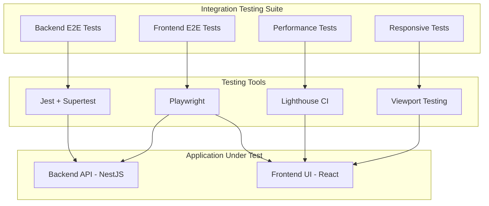
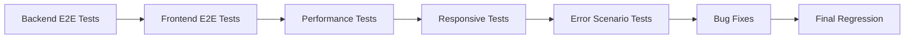

# Stage 7: Integration Testing - Detailed Implementation Plan

## Overview

This document provides a detailed implementation plan for Stage 7: Integration Testing of the OptiView project. This stage validates end-to-end functionality and performance requirements after completing the Frontend Gallery (Stage 5) and Frontend Upload (Stage 6) features.

### Key Decisions

| Decision Point | Choice |
|:---------------|:-------|
| E2E Framework | Playwright |
| CI/CD | Manual local execution only |
| Accessibility Testing | Out of scope for this stage |

---

## Goals

1. Validate end-to-end functionality across backend and frontend
2. Achieve Lighthouse performance score of 90+
3. Verify Core Web Vitals meet target thresholds
4. Test responsive design across all breakpoints
5. Document and fix discovered bugs

---

## Architecture Overview



---

## Prerequisites

Before starting Stage 7, ensure:

- [ ] Stage 5: Frontend Gallery Feature is complete
- [ ] Stage 6: Frontend Upload Feature is complete
- [ ] Backend API is running and accessible
- [ ] Frontend dev server can start successfully
- [ ] Database has test data or seed script available
- [ ] All existing unit tests pass

---

## Phase 1: Playwright Setup

### Goal

Configure Playwright for frontend E2E testing with proper project structure.

### Tasks

#### 1.1 Install Playwright Dependencies

```bash
cd frontend
npm install -D @playwright/test
npx playwright install
```

#### 1.2 Create Playwright Configuration

Create [`frontend/playwright.config.ts`](frontend/playwright.config.ts):

```typescript
import { defineConfig, devices } from '@playwright/test';

export default defineConfig({
  testDir: './e2e',
  fullyParallel: true,
  forbidOnly: !!process.env.CI,
  retries: process.env.CI ? 2 : 0,
  workers: process.env.CI ? 1 : undefined,
  reporter: 'html',
  use: {
    baseURL: 'http://localhost:5173',
    trace: 'on-first-retry',
    screenshot: 'only-on-failure',
  },
  projects: [
    {
      name: 'chromium',
      use: { ...devices['Desktop Chrome'] },
    },
    {
      name: 'firefox',
      use: { ...devices['Desktop Firefox'] },
    },
    {
      name: 'webkit',
      use: { ...devices['Desktop Safari'] },
    },
    {
      name: 'Mobile Chrome',
      use: { ...devices['Pixel 5'] },
    },
    {
      name: 'Mobile Safari',
      use: { ...devices['iPhone 12'] },
    },
  ],
  webServer: {
    command: 'npm run dev',
    url: 'http://localhost:5173',
    reuseExistingServer: !process.env.CI,
    timeout: 120 * 1000,
  },
});
```

#### 1.3 Create E2E Directory Structure

```
frontend/
├── e2e/
│   ├── fixtures/
│   │   └── test-helpers.ts
│   ├── pages/
│   │   ├── gallery-page.ts
│   │   ├── upload-page.ts
│   │   └── lightbox-modal.ts
│   ├── tests/
│   │   ├── gallery.spec.ts
│   │   ├── upload.spec.ts
│   │   ├── rating.spec.ts
│   │   ├── lightbox.spec.ts
│   │   └── filters.spec.ts
│   └── utils/
│       └── api-helpers.ts
└── playwright.config.ts
```

#### 1.4 Create Page Object Models

Create base page objects for maintainable test code:

**[`frontend/e2e/pages/gallery-page.ts`](frontend/e2e/pages/gallery-page.ts)**

```typescript
import { Page, Locator } from '@playwright/test';

export class GalleryPage {
  readonly page: Page;
  readonly header: Locator;
  readonly galleryGrid: Locator;
  readonly imageCards: Locator;
  readonly genreFilter: Locator;
  readonly ratingFilter: Locator;
  readonly sortDropdown: Locator;
  readonly fab: Locator;

  constructor(page: Page) {
    this.page = page;
    this.header = page.locator('header');
    this.galleryGrid = page.locator('[data-testid="gallery-grid"]');
    this.imageCards = page.locator('[data-testid="image-card"]');
    this.genreFilter = page.locator('[data-testid="genre-filter"]');
    this.ratingFilter = page.locator('[data-testid="rating-filter"]');
    this.sortDropdown = page.locator('[data-testid="sort-dropdown"]');
    this.fab = page.locator('[data-testid="fab"]');
  }

  async goto() {
    await this.page.goto('/');
  }

  async selectGenre(genre: string) {
    await this.genreFilter.click();
    await this.page.getByRole('option', { name: genre }).click();
  }

  async selectMinRating(rating: number) {
    await this.ratingFilter.click();
    await this.page.getByRole('option', { name: `${rating}+ stars` }).click();
  }

  async openLightbox(imageIndex: number) {
    await this.imageCards.nth(imageIndex).click();
  }

  async navigateToUpload() {
    await this.fab.click();
  }
}
```

**[`frontend/e2e/pages/upload-page.ts`](frontend/e2e/pages/upload-page.ts)**

```typescript
import { Page, Locator, FileChooser } from '@playwright/test';

export class UploadPage {
  readonly page: Page;
  readonly dropZone: Locator;
  readonly fileInput: Locator;
  readonly uploadQueue: Locator;
  readonly backToGallery: Locator;

  constructor(page: Page) {
    this.page = page;
    this.dropZone = page.locator('[data-testid="dropzone"]');
    this.fileInput = page.locator('input[type="file"]');
    this.uploadQueue = page.locator('[data-testid="upload-queue"]');
    this.backToGallery = page.locator('[data-testid="back-to-gallery"]');
  }

  async goto() {
    await this.page.goto('/upload');
  }

  async uploadFile(filePath: string, genre?: string) {
    await this.fileInput.setInputFiles(filePath);
    if (genre) {
      // Select genre for the uploaded file
    }
  }

  async waitForUploadComplete(timeout = 30000) {
    await this.page.locator('[data-testid="upload-status-done"]').waitFor({
      state: 'visible',
      timeout,
    });
  }
}
```

**[`frontend/e2e/pages/lightbox-modal.ts`](frontend/e2e/pages/lightbox-modal.ts)**

```typescript
import { Page, Locator } from '@playwright/test';

export class LightboxModal {
  readonly page: Page;
  readonly overlay: Locator;
  readonly closeButton: Locator;
  readonly prevButton: Locator;
  readonly nextButton: Locator;
  readonly image: Locator;
  readonly ratingStars: Locator;
  readonly downloadButtons: Locator;

  constructor(page: Page) {
    this.page = page;
    this.overlay = page.locator('[data-testid="lightbox-overlay"]');
    this.closeButton = page.locator('[data-testid="lightbox-close"]');
    this.prevButton = page.locator('[data-testid="lightbox-prev"]');
    this.nextButton = page.locator('[data-testid="lightbox-next"]');
    this.image = page.locator('[data-testid="lightbox-image"]');
    this.ratingStars = page.locator('[data-testid="lightbox-rating"]');
    this.downloadButtons = page.locator('[data-testid="download-button"]');
  }

  async close() {
    await this.closeButton.click();
  }

  async navigateNext() {
    await this.nextButton.click();
  }

  async navigatePrev() {
    await this.prevButton.click();
  }

  async setRating(rating: number) {
    await this.ratingStars.locator(`button:nth-child(${rating})`).click();
  }

  async download(size: string) {
    await this.page.getByRole('button', { name: `Download ${size}` }).click();
  }
}
```

#### 1.5 Create Test Fixtures

**[`frontend/e2e/fixtures/test-helpers.ts`](frontend/e2e/fixtures/test-helpers.ts)**

```typescript
import { test as base, Page } from '@playwright/test';
import { GalleryPage } from '../pages/gallery-page';
import { UploadPage } from '../pages/upload-page';
import { LightboxModal } from '../pages/lightbox-modal';

// Declare the types of fixtures
type MyFixtures = {
  galleryPage: GalleryPage;
  uploadPage: UploadPage;
  lightbox: LightboxModal;
};

// Extend base test with custom fixtures
export const test = base.extend<MyFixtures>({
  galleryPage: async ({ page }, use) => {
    await use(new GalleryPage(page));
  },
  uploadPage: async ({ page }, use) => {
    await use(new UploadPage(page));
  },
  lightbox: async ({ page }, use) => {
    await use(new LightboxModal(page));
  },
});

export { expect } from '@playwright/test';
```

#### 1.6 Add NPM Scripts

Update [`frontend/package.json`](frontend/package.json):

```json
{
  "scripts": {
    "test:e2e": "playwright test",
    "test:e2e:ui": "playwright test --ui",
    "test:e2e:debug": "playwright test --debug",
    "test:e2e:report": "playwright show-report"
  }
}
```

### Definition of Done - Phase 1

- [ ] Playwright installed and configured
- [ ] Page Object Models created for main pages
- [ ] Test fixtures set up
- [ ] `npm run test:e2e` command executes without errors
- [ ] Sample test passes in at least one browser

---

## Phase 2: Backend Integration Tests Enhancement

### Goal

Enhance existing backend E2E tests with additional integration scenarios.

### Current State

The backend already has E2E tests in [`backend/test/api.e2e-spec.ts`](backend/test/api.e2e-spec.ts) covering:
- POST /api/images/upload
- GET /api/images with filters and pagination
- GET /api/images/:id/metadata
- GET /api/images/:id with format negotiation
- GET /api/images/:id/lqip
- PATCH /api/images/:id/rating

### Additional Tests to Add

#### 2.1 Create Integration Test File

Create [`backend/test/integration/full-flow.e2e-spec.ts`](backend/test/integration/full-flow.e2e-spec.ts):

```typescript
import { Test, TestingModule } from '@nestjs/testing';
import { INestApplication, ValidationPipe } from '@nestjs/common';
import request from 'supertest';
import { AppModule } from '../../src/app.module';
import { getRepositoryToken } from '@nestjs/typeorm';
import { Image } from '../../src/entities/image.entity';
import sharp from 'sharp';

describe('Full Integration Flow (e2e)', () => {
  let app: INestApplication;
  let imageRepository: any;
  let testImageIds: string[] = [];

  beforeAll(async () => {
    const moduleFixture: TestingModule = await Test.createTestingModule({
      imports: [AppModule],
    }).compile();

    app = moduleFixture.createNestApplication();
    app.useGlobalPipes(
      new ValidationPipe({
        whitelist: true,
        forbidNonWhitelisted: true,
        transform: true,
      }),
    );

    imageRepository = moduleFixture.get(getRepositoryToken(Image));
    await app.init();
  });

  afterAll(async () => {
    // Clean up all test images
    for (const id of testImageIds) {
      try {
        await imageRepository.delete(id);
      } catch (err) {
        // Ignore cleanup errors
      }
    }
    await app.close();
  });

  describe('Complete Upload to Gallery Flow', () => {
    it('should upload, retrieve, rate, and delete image in sequence', async () => {
      // Create test image
      const testBuffer = await sharp({
        create: {
          width: 1920,
          height: 1080,
          channels: 3,
          background: { r: 100, g: 150, b: 200 },
        },
      })
        .jpeg({ quality: 90 })
        .toBuffer();

      // Step 1: Upload
      const uploadResponse = await request(app.getHttpServer())
        .post('/api/images/upload')
        .attach('file', testBuffer, 'integration-test.jpg')
        .field('genre', 'Nature')
        .expect(201);

      const imageId = uploadResponse.body.id;
      testImageIds.push(imageId);

      expect(uploadResponse.body).toHaveProperty('id');
      expect(uploadResponse.body.genre).toBe('Nature');

      // Step 2: Verify in list
      const listResponse = await request(app.getHttpServer())
        .get('/api/images')
        .query({ genre: 'Nature' })
        .expect(200);

      const foundInList = listResponse.body.data.find(
        (img: any) => img.id === imageId,
      );
      expect(foundInList).toBeDefined();

      // Step 3: Get metadata
      const metadataResponse = await request(app.getHttpServer())
        .get(`/api/images/${imageId}/metadata`)
        .expect(200);

      expect(metadataResponse.body.id).toBe(imageId);
      expect(metadataResponse.body.width).toBe(1920);
      expect(metadataResponse.body.height).toBe(1080);

      // Step 4: Update rating
      const ratingResponse = await request(app.getHttpServer())
        .patch(`/api/images/${imageId}/rating`)
        .send({ rating: 5 })
        .expect(200);

      expect(ratingResponse.body.rating).toBe(5);

      // Step 5: Verify rating in list
      const updatedListResponse = await request(app.getHttpServer())
        .get('/api/images')
        .query({ rating: 5 })
        .expect(200);

      const foundWithRating = updatedListResponse.body.data.find(
        (img: any) => img.id === imageId,
      );
      expect(foundWithRating).toBeDefined();
      expect(foundWithRating.rating).toBe(5);

      // Step 6: Get processed image
      const imageResponse = await request(app.getHttpServer())
        .get(`/api/images/${imageId}`)
        .query({ width: 640 })
        .set('Accept', 'image/webp')
        .expect(200);

      expect(imageResponse.headers['content-type']).toMatch(/image\/webp/);
    });
  });

  describe('Error Recovery Scenarios', () => {
    it('should handle concurrent rating updates gracefully', async () => {
      // Create test image
      const testBuffer = await sharp({
        create: {
          width: 800,
          height: 600,
          channels: 3,
          background: { r: 50, g: 100, b: 150 },
        },
      })
        .jpeg()
        .toBuffer();

      const uploadResponse = await request(app.getHttpServer())
        .post('/api/images/upload')
        .attach('file', testBuffer, 'concurrent-test.jpg')
        .expect(201);

      const imageId = uploadResponse.body.id;
      testImageIds.push(imageId);

      // Simulate concurrent updates
      const updates = await Promise.all([
        request(app.getHttpServer())
          .patch(`/api/images/${imageId}/rating`)
          .send({ rating: 3 }),
        request(app.getHttpServer())
          .patch(`/api/images/${imageId}/rating`)
          .send({ rating: 4 }),
        request(app.getHttpServer())
          .patch(`/api/images/${imageId}/rating`)
          .send({ rating: 5 }),
      ]);

      // All should succeed
      updates.forEach((response) => {
        expect(response.status).toBe(200);
      });

      // Final value should be one of the updates
      const finalResponse = await request(app.getHttpServer())
        .get(`/api/images/${imageId}/metadata`)
        .expect(200);

      expect([3, 4, 5]).toContain(finalResponse.body.rating);
    });
  });
});
```

#### 2.2 Add Performance-Related Tests

Create [`backend/test/integration/performance.e2e-spec.ts`](backend/test/integration/performance.e2e-spec.ts):

```typescript
import { Test, TestingModule } from '@nestjs/testing';
import { INestApplication, ValidationPipe } from '@nestjs/common';
import request from 'supertest';
import { AppModule } from '../../src/app.module';
import { getRepositoryToken } from '@nestjs/typeorm';
import { Image } from '../../src/entities/image.entity';
import sharp from 'sharp';

describe('Performance Tests (e2e)', () => {
  let app: INestApplication;
  let imageRepository: any;
  let testImageId: string;

  beforeAll(async () => {
    const moduleFixture: TestingModule = await Test.createTestingModule({
      imports: [AppModule],
    }).compile();

    app = moduleFixture.createNestApplication();
    app.useGlobalPipes(
      new ValidationPipe({
        whitelist: true,
        forbidNonWhitelisted: true,
        transform: true,
      }),
    );

    imageRepository = moduleFixture.get(getRepositoryToken(Image));
    await app.init();

    // Create a test image for performance tests
    const testBuffer = await sharp({
      create: {
        width: 1920,
        height: 1080,
        channels: 3,
        background: { r: 100, g: 150, b: 200 },
      },
    })
      .jpeg({ quality: 90 })
      .toBuffer();

    const response = await request(app.getHttpServer())
      .post('/api/images/upload')
      .attach('file', testBuffer, 'perf-test.jpg')
      .field('genre', 'Nature');

    testImageId = response.body.id;
  });

  afterAll(async () => {
    if (testImageId) {
      await imageRepository.delete(testImageId);
    }
    await app.close();
  });

  describe('Response Time Tests', () => {
    it('should respond to GET /api/images within 500ms', async () => {
      const start = Date.now();
      await request(app.getHttpServer()).get('/api/images').expect(200);
      const duration = Date.now() - start;

      expect(duration).toBeLessThan(500);
    });

    it('should respond to GET /api/images/:id/metadata within 200ms', async () => {
      const start = Date.now();
      await request(app.getHttpServer())
        .get(`/api/images/${testImageId}/metadata`)
        .expect(200);
      const duration = Date.now() - start;

      expect(duration).toBeLessThan(200);
    });

    it('should serve cached processed image within 100ms', async () => {
      // First request to generate cache
      await request(app.getHttpServer())
        .get(`/api/images/${testImageId}`)
        .query({ width: 640 })
        .set('Accept', 'image/webp');

      // Second request should be cached
      const start = Date.now();
      await request(app.getHttpServer())
        .get(`/api/images/${testImageId}`)
        .query({ width: 640 })
        .set('Accept', 'image/webp')
        .expect(200);
      const duration = Date.now() - start;

      expect(duration).toBeLessThan(100);
    });
  });

  describe('Cache Headers Tests', () => {
    it('should return correct cache headers for processed images', async () => {
      const response = await request(app.getHttpServer())
        .get(`/api/images/${testImageId}`)
        .query({ width: 640 })
        .expect(200);

      expect(response.headers['cache-control']).toBe(
        'public, max-age=31536000',
      );
    });
  });
});
```

### Definition of Done - Phase 2

- [ ] Full integration flow test created
- [ ] Error recovery tests added
- [ ] Performance tests added
- [ ] All backend E2E tests pass
- [ ] Test coverage documented

---

## Phase 3: Frontend E2E Tests

### Goal

Create comprehensive E2E tests for all critical user flows.

### Test Files to Create

#### 3.1 Gallery Tests

Create [`frontend/e2e/tests/gallery.spec.ts`](frontend/e2e/tests/gallery.spec.ts):

```typescript
import { test, expect } from '../fixtures/test-helpers';

test.describe('Gallery Page', () => {
  test.beforeEach(async ({ galleryPage }) => {
    await galleryPage.goto();
  });

  test('should display gallery grid with images', async ({ galleryPage }) => {
    await expect(galleryPage.galleryGrid).toBeVisible();
    const cardCount = await galleryPage.imageCards.count();
    expect(cardCount).toBeGreaterThan(0);
  });

  test('should display loading skeleton initially', async ({ page }) => {
    // Reload to catch loading state
    await page.reload();
    // Skeleton should appear briefly
    const skeleton = page.locator('[data-testid="loading-skeleton"]');
    // Either skeleton is visible or images loaded very fast
    const skeletonVisible = await skeleton.isVisible().catch(() => false);
    // This test is informational - skeleton may load too fast to catch
  });

  test('should show LQIP blur effect on image cards', async ({ page }) => {
    const firstCard = page.locator('[data-testid="image-card"]').first();
    await expect(firstCard).toBeVisible();

    // Check for dominant color background
    const style = await firstCard.evaluate((el) => {
      return window.getComputedStyle(el).backgroundColor;
    });
    // Should have some background color set
    expect(style).toBeTruthy();
  });

  test('should navigate to upload page via FAB', async ({ galleryPage, page }) => {
    await galleryPage.navigateToUpload();
    await expect(page).toHaveURL('/upload');
  });
});
```

#### 3.2 Filter Tests

Create [`frontend/e2e/tests/filters.spec.ts`](frontend/e2e/tests/filters.spec.ts):

```typescript
import { test, expect } from '../fixtures/test-helpers';

test.describe('Gallery Filters', () => {
  test.beforeEach(async ({ galleryPage }) => {
    await galleryPage.goto();
  });

  test('should filter by genre', async ({ galleryPage, page }) => {
    await galleryPage.selectGenre('Nature');

    // URL should update
    expect(page.url()).toContain('genre=Nature');

    // All visible cards should have Nature genre
    const cards = page.locator('[data-testid="image-card"]');
    const count = await cards.count();

    for (let i = 0; i < Math.min(count, 5); i++) {
      const genreTag = cards.nth(i).locator('[data-testid="genre-tag"]');
      await expect(genreTag).toHaveText('Nature');
    }
  });

  test('should filter by minimum rating', async ({ galleryPage, page }) => {
    await galleryPage.selectMinRating(4);

    // URL should update
    expect(page.url()).toContain('rating=4');

    // All visible cards should have rating >= 4
    const cards = page.locator('[data-testid="image-card"]');
    const count = await cards.count();

    for (let i = 0; i < Math.min(count, 5); i++) {
      const ratingStars = cards.nth(i).locator('[data-testid="rating-stars"]');
      const filledStars = await ratingStars.locator('svg.filled').count();
      expect(filledStars).toBeGreaterThanOrEqual(4);
    }
  });

  test('should sort by rating ascending', async ({ galleryPage, page }) => {
    await page.locator('[data-testid="sort-dropdown"]').click();
    await page.getByRole('option', { name: 'Rating' }).click();
    await page.locator('[data-testid="sort-order-dropdown"]').click();
    await page.getByRole('option', { name: 'Ascending' }).click();

    // Verify sort order
    const cards = page.locator('[data-testid="image-card"]');
    const count = await cards.count();

    if (count > 1) {
      const ratings: number[] = [];
      for (let i = 0; i < Math.min(count, 10); i++) {
        const ratingStars = cards.nth(i).locator('[data-testid="rating-stars"]');
        const filledStars = await ratingStars.locator('svg.filled').count();
        ratings.push(filledStars);
      }

      // Check ascending order
      for (let i = 1; i < ratings.length; i++) {
        expect(ratings[i]).toBeGreaterThanOrEqual(ratings[i - 1]);
      }
    }
  });

  test('should persist filters in URL', async ({ page, galleryPage }) => {
    await galleryPage.selectGenre('Nature');
    await galleryPage.selectMinRating(4);

    // Reload page
    await page.reload();

    // Filters should persist
    expect(page.url()).toContain('genre=Nature');
    expect(page.url()).toContain('rating=4');
  });

  test('should combine multiple filters', async ({ galleryPage, page }) => {
    await galleryPage.selectGenre('Nature');
    await galleryPage.selectMinRating(3);

    // Both filters should be in URL
    expect(page.url()).toContain('genre=Nature');
    expect(page.url()).toContain('rating=3');
  });
});
```

#### 3.3 Rating Tests

Create [`frontend/e2e/tests/rating.spec.ts`](frontend/e2e/tests/rating.spec.ts):

```typescript
import { test, expect } from '../fixtures/test-helpers';

test.describe('Rating Functionality', () => {
  test.beforeEach(async ({ galleryPage }) => {
    await galleryPage.goto();
  });

  test('should update rating from image card', async ({ page }) => {
    const firstCard = page.locator('[data-testid="image-card"]').first();
    await expect(firstCard).toBeVisible();

    // Click on 5th star
    const ratingStars = firstCard.locator('[data-testid="rating-stars"]');
    const fifthStar = ratingStars.locator('button').nth(4);
    await fifthStar.click();

    // Wait for update
    await page.waitForTimeout(500);

    // Verify optimistic update
    const filledStars = await ratingStars.locator('svg.filled').count();
    expect(filledStars).toBe(5);
  });

  test('should show hover preview on stars', async ({ page }) => {
    const firstCard = page.locator('[data-testid="image-card"]').first();
    const ratingStars = firstCard.locator('[data-testid="rating-stars"]');
    const thirdStar = ratingStars.locator('button').nth(2);

    // Hover over 3rd star
    await thirdStar.hover();

    // First 3 stars should show preview state
    // This depends on implementation - check for hover class or attribute
  });

  test('should update rating from lightbox', async ({ galleryPage, page, lightbox }) => {
    await galleryPage.openLightbox(0);
    await expect(lightbox.overlay).toBeVisible();

    // Set rating to 4
    await lightbox.setRating(4);

    // Wait for update
    await page.waitForTimeout(500);

    // Close lightbox and verify rating persisted
    await lightbox.close();
    await page.waitForTimeout(300);

    // Reopen and check
    await galleryPage.openLightbox(0);
    const filledStars = await lightbox.ratingStars
      .locator('svg.filled')
      .count();
    expect(filledStars).toBe(4);
  });

  test('should revert rating on API error', async ({ page }) => {
    // This test requires mocking API error
    // Route interception to simulate error
    await page.route('**/api/images/*/rating', (route) => {
      route.fulfill({
        status: 500,
        body: JSON.stringify({ message: 'Server error' }),
      });
    });

    const firstCard = page.locator('[data-testid="image-card"]').first();
    const ratingStars = firstCard.locator('[data-testid="rating-stars"]');
    const originalFilled = await ratingStars.locator('svg.filled').count();

    // Try to update rating
    await ratingStars.locator('button').nth(4).click();

    // Wait for error handling
    await page.waitForTimeout(1000);

    // Rating should revert to original
    const currentFilled = await ratingStars.locator('svg.filled').count();
    expect(currentFilled).toBe(originalFilled);
  });
});
```

#### 3.4 Lightbox Tests

Create [`frontend/e2e/tests/lightbox.spec.ts`](frontend/e2e/tests/lightbox.spec.ts):

```typescript
import { test, expect } from '../fixtures/test-helpers';

test.describe('Lightbox Modal', () => {
  test.beforeEach(async ({ galleryPage }) => {
    await galleryPage.goto();
  });

  test('should open lightbox on image click', async ({ galleryPage, lightbox }) => {
    await galleryPage.openLightbox(0);
    await expect(lightbox.overlay).toBeVisible();
    await expect(lightbox.image).toBeVisible();
  });

  test('should close lightbox with close button', async ({ galleryPage, lightbox, page }) => {
    await galleryPage.openLightbox(0);
    await expect(lightbox.overlay).toBeVisible();

    await lightbox.close();
    await expect(lightbox.overlay).not.toBeVisible();
  });

  test('should close lightbox with ESC key', async ({ galleryPage, lightbox, page }) => {
    await galleryPage.openLightbox(0);
    await expect(lightbox.overlay).toBeVisible();

    await page.keyboard.press('Escape');
    await expect(lightbox.overlay).not.toBeVisible();
  });

  test('should close lightbox when clicking outside image', async ({ galleryPage, lightbox, page }) => {
    await galleryPage.openLightbox(0);
    await expect(lightbox.overlay).toBeVisible();

    // Click on overlay background
    await page.mouse.click(10, 10);
    await expect(lightbox.overlay).not.toBeVisible();
  });

  test('should navigate to next image', async ({ galleryPage, lightbox, page }) => {
    await galleryPage.openLightbox(0);

    const firstImageSrc = await lightbox.image.getAttribute('src');

    await lightbox.navigateNext();
    await page.waitForTimeout(300);

    const secondImageSrc = await lightbox.image.getAttribute('src');
    expect(secondImageSrc).not.toBe(firstImageSrc);
  });

  test('should navigate to previous image', async ({ galleryPage, lightbox, page }) => {
    await galleryPage.openLightbox(1);

    const currentImageSrc = await lightbox.image.getAttribute('src');

    await lightbox.navigatePrev();
    await page.waitForTimeout(300);

    const prevImageSrc = await lightbox.image.getAttribute('src');
    expect(prevImageSrc).not.toBe(currentImageSrc);
  });

  test('should navigate with arrow keys', async ({ galleryPage, lightbox, page }) => {
    await galleryPage.openLightbox(0);

    const firstImageSrc = await lightbox.image.getAttribute('src');

    // Press right arrow
    await page.keyboard.press('ArrowRight');
    await page.waitForTimeout(300);

    const nextImageSrc = await lightbox.image.getAttribute('src');
    expect(nextImageSrc).not.toBe(firstImageSrc);

    // Press left arrow
    await page.keyboard.press('ArrowLeft');
    await page.waitForTimeout(300);

    const backImageSrc = await lightbox.image.getAttribute('src');
    expect(backImageSrc).toBe(firstImageSrc);
  });

  test('should display download buttons', async ({ galleryPage, lightbox }) => {
    await galleryPage.openLightbox(0);

    const downloadButtons = lightbox.downloadButtons;
    const count = await downloadButtons.count();

    expect(count).toBeGreaterThan(0);
  });

  test('should display genre tag', async ({ galleryPage, lightbox, page }) => {
    await galleryPage.openLightbox(0);

    const genreTag = page.locator('[data-testid="lightbox-genre"]');
    await expect(genreTag).toBeVisible();
  });
});
```

#### 3.5 Upload Tests

Create [`frontend/e2e/tests/upload.spec.ts`](frontend/e2e/tests/upload.spec.ts):

```typescript
import { test, expect } from '../fixtures/test-helpers';
import path from 'path';

test.describe('Upload Page', () => {
  test.beforeEach(async ({ uploadPage }) => {
    await uploadPage.goto();
  });

  test('should display dropzone', async ({ uploadPage }) => {
    await expect(uploadPage.dropZone).toBeVisible();
  });

  test('should accept valid image file', async ({ uploadPage, page }) => {
    // Create a test image file
    const testImagePath = path.join(__dirname, '../fixtures/test-image.jpg');

    await uploadPage.uploadFile(testImagePath, 'Nature');

    // File should appear in queue
    await expect(uploadPage.uploadQueue).toBeVisible();
  });

  test('should reject invalid file type', async ({ page }) => {
    // Create invalid file
    const invalidFile = path.join(__dirname, '../fixtures/test.txt');

    // Try to upload - should show error
    const fileInput = page.locator('input[type="file"]');
    await fileInput.setInputFiles(invalidFile);

    // Should show error message
    const errorMessage = page.locator('[data-testid="upload-error"]');
    await expect(errorMessage).toBeVisible();
  });

  test('should show upload progress', async ({ uploadPage, page }) => {
    const testImagePath = path.join(__dirname, '../fixtures/test-image.jpg');

    await uploadPage.uploadFile(testImagePath);

    // Progress bar should be visible
    const progressBar = page.locator('[data-testid="upload-progress"]');
    await expect(progressBar).toBeVisible();
  });

  test('should show success state after upload', async ({ uploadPage, page }) => {
    const testImagePath = path.join(__dirname, '../fixtures/test-image.jpg');

    await uploadPage.uploadFile(testImagePath, 'Nature');
    await uploadPage.waitForUploadComplete();

    // Success indicator should be visible
    const successIndicator = page.locator('[data-testid="upload-status-done"]');
    await expect(successIndicator).toBeVisible();
  });

  test('should allow genre selection per file', async ({ uploadPage, page }) => {
    const testImagePath = path.join(__dirname, '../fixtures/test-image.jpg');

    await uploadPage.uploadFile(testImagePath);

    // Genre dropdown should be visible
    const genreDropdown = page.locator('[data-testid="genre-select"]').first();
    await expect(genreDropdown).toBeVisible();

    // Select genre
    await genreDropdown.click();
    await page.getByRole('option', { name: 'Architecture' }).click();
  });

  test('should navigate back to gallery', async ({ uploadPage, page }) => {
    await uploadPage.backToGallery.click();
    await expect(page).toHaveURL('/');
  });

  test('should handle multiple file upload', async ({ uploadPage, page }) => {
    const testImagePath = path.join(__dirname, '../fixtures/test-image.jpg');

    // Upload multiple files
    const fileInput = page.locator('input[type="file"]');
    await fileInput.setInputFiles([testImagePath, testImagePath, testImagePath]);

    // Should show 3 items in queue
    const queueItems = page.locator('[data-testid="upload-item"]');
    const count = await queueItems.count();
    expect(count).toBe(3);
  });
});
```

#### 3.6 Create Test Fixtures Directory

Create test image fixtures:

```
frontend/e2e/fixtures/
├── test-image.jpg    # Valid test image
├── test-image.png    # Valid PNG test image
├── test-image.webp   # Valid WebP test image
└── test.txt          # Invalid file for error testing
```

### Definition of Done - Phase 3

- [ ] Gallery tests created and passing
- [ ] Filter tests created and passing
- [ ] Rating tests created and passing
- [ ] Lightbox tests created and passing
- [ ] Upload tests created and passing
- [ ] All tests pass in Chromium
- [ ] All tests pass in Firefox
- [ ] All tests pass in WebKit

---

## Phase 4: Performance Testing

### Goal

Verify Lighthouse scores and Core Web Vitals meet target thresholds.

### Target Metrics

| Metric | Target | Description |
|:-------|:-------|:------------|
| Lighthouse Performance | 90+ | Overall performance score |
| Lighthouse Accessibility | 90+ | Accessibility compliance |
| Lighthouse Best Practices | 90+ | Web best practices |
| CLS | < 0.1 | Cumulative Layout Shift |
| LCP | < 2.5s | Largest Contentful Paint |
| FID | < 100ms | First Input Delay |

### Tasks

#### 4.1 Install Lighthouse

```bash
npm install -D lighthouse
```

#### 4.2 Create Lighthouse Test Script

Create [`frontend/e2e/tests/lighthouse.spec.ts`](frontend/e2e/tests/lighthouse.spec.ts):

```typescript
import { test, expect } from '@playwright/test';
import { playAudit } from 'playwright-lighthouse';
import { chromium } from 'playwright';

test.describe('Performance Tests', () => {
  test('Lighthouse audit for Gallery page', async () => {
    const browser = await chromium.launch();
    const page = await browser.newPage();

    await page.goto('http://localhost:5173');

    await playAudit({
      page,
      thresholds: {
        performance: 90,
        accessibility: 90,
        'best-practices': 90,
        seo: 80,
      },
      port: 9222,
    });

    await browser.close();
  });
});
```

#### 4.3 Create Core Web Vitals Test

Create [`frontend/e2e/tests/web-vitals.spec.ts`](frontend/e2e/tests/web-vitals.spec.ts):

```typescript
import { test, expect } from '@playwright/test';

test.describe('Core Web Vitals', () => {
  test('should have CLS under 0.1', async ({ page }) => {
    // Navigate and wait for page to stabilize
    await page.goto('/');
    await page.waitForLoadState('networkidle');

    // Get CLS value
    const cls = await page.evaluate(() => {
      return new Promise((resolve) => {
        let clsValue = 0;

        const observer = new PerformanceObserver((list) => {
          for (const entry of list.getEntries()) {
            if (entry.entryType === 'layout-shift' && !(entry as any).hadRecentInput) {
              clsValue += (entry as any).value;
            }
          }
        });

        observer.observe({ type: 'layout-shift', buffered: true });

        // Wait a bit for any layout shifts
        setTimeout(() => {
          observer.disconnect();
          resolve(clsValue);
        }, 3000);
      });
    });

    expect(cls).toBeLessThan(0.1);
  });

  test('should have LCP under 2.5 seconds', async ({ page }) => {
    await page.goto('/');
    await page.waitForLoadState('networkidle');

    const lcp = await page.evaluate(() => {
      return new Promise((resolve) => {
        const observer = new PerformanceObserver((list) => {
          const entries = list.getEntries();
          const lastEntry = entries[entries.length - 1];
          observer.disconnect();
          resolve(lastEntry.startTime);
        });

        observer.observe({ type: 'largest-contentful-paint', buffered: true });
      });
    });

    expect(lcp as number).toBeLessThan(2500);
  });

  test('should have no layout shift during image loading', async ({ page }) => {
    await page.goto('/');

    // Wait for images to start loading
    await page.waitForSelector('[data-testid="image-card"]');

    // Measure CLS during image loading
    const clsDuringLoad = await page.evaluate(() => {
      return new Promise((resolve) => {
        let clsValue = 0;

        const observer = new PerformanceObserver((list) => {
          for (const entry of list.getEntries()) {
            if (entry.entryType === 'layout-shift' && !(entry as any).hadRecentInput) {
              clsValue += (entry as any).value;
            }
          }
        });

        observer.observe({ type: 'layout-shift', buffered: true });

        // Wait for all images to load
        setTimeout(() => {
          observer.disconnect();
          resolve(clsValue);
        }, 5000);
      });
    });

    expect(clsDuringLoad).toBeLessThan(0.1);
  });
});
```

#### 4.4 Create Performance Documentation Script

Create [`frontend/e2e/scripts/run-performance-tests.ts`](frontend/e2e/scripts/run-performance-tests.ts):

```typescript
import lighthouse from 'lighthouse';
import * as chromeLauncher from 'chrome-launcher';
import * as fs from 'fs';
import * as path from 'path';

async function runLighthouseAudit() {
  const chrome = await chromeLauncher.launch({
    chromeFlags: ['--headless', '--no-sandbox'],
  });

  const options = {
    logLevel: 'info' as const,
    output: 'html' as const,
    onlyCategories: ['performance', 'accessibility', 'best-practices'],
    port: chrome.port,
  };

  const runnerResult = await lighthouse('http://localhost:5173', options);

  // Save report
  const reportPath = path.join(__dirname, '../../test-results/lighthouse-report.html');
  fs.mkdirSync(path.dirname(reportPath), { recursive: true });
  fs.writeFileSync(reportPath, runnerResult.report);

  // Log scores
  const categories = runnerResult.lhr.categories;
  console.log('\n=== Lighthouse Scores ===');
  console.log(`Performance: ${categories.performance.score * 100}`);
  console.log(`Accessibility: ${categories.accessibility.score * 100}`);
  console.log(`Best Practices: ${categories['best-practices'].score * 100}`);

  await chrome.kill();

  return {
    performance: categories.performance.score,
    accessibility: categories.accessibility.score,
    bestPractices: categories['best-practices'].score,
  };
}

runLighthouseAudit().catch(console.error);
```

#### 4.5 Add Performance Test Scripts

Update [`frontend/package.json`](frontend/package.json):

```json
{
  "scripts": {
    "test:perf": "ts-node e2e/scripts/run-performance-tests.ts",
    "test:lighthouse": "playwright test e2e/tests/lighthouse.spec.ts"
  }
}
```

### Definition of Done - Phase 4

- [ ] Lighthouse audit script created
- [ ] Core Web Vitals tests created
- [ ] Lighthouse Performance score 90+
- [ ] Lighthouse Accessibility score 90+
- [ ] Lighthouse Best Practices score 90+
- [ ] CLS measured and documented < 0.1
- [ ] LCP measured and documented < 2.5s
- [ ] Performance report saved to test-results/

---

## Phase 5: Responsive Design Testing

### Goal

Verify application works correctly across all viewport sizes.

### Breakpoints to Test

| Breakpoint | Width | Columns | Device |
|:-----------|:------|:--------|:-------|
| Mobile | 375px | 2 | iPhone 12 |
| Mobile Large | 414px | 2 | iPhone 12 Pro Max |
| Tablet | 768px | 3 | iPad Mini |
| Tablet Large | 1024px | 3 | iPad Pro |
| Desktop | 1280px | 4 | Standard Desktop |
| Desktop Large | 1920px | 4 | Full HD |

### Tasks

#### 5.1 Create Responsive Tests

Create [`frontend/e2e/tests/responsive.spec.ts`](frontend/e2e/tests/responsive.spec.ts):

```typescript
import { test, expect, devices } from '@playwright/test';

test.describe('Responsive Design Tests', () => {
  test.describe('Mobile Viewport - 375px', () => {
    test.use({ viewport: { width: 375, height: 667 } });

    test('should display 2 column grid on mobile', async ({ page }) => {
      await page.goto('/');

      const grid = page.locator('[data-testid="gallery-grid"]');
      await expect(grid).toBeVisible();

      // Check grid has 2 columns
      const gridStyle = await grid.evaluate((el) => {
        return window.getComputedStyle(el).gridTemplateColumns;
      });

      const columnCount = gridStyle.split(' ').length;
      expect(columnCount).toBe(2);
    });

    test('should show stacked filters on mobile', async ({ page }) => {
      await page.goto('/');

      const header = page.locator('header');
      await expect(header).toBeVisible();

      // Filters should be visible but may be stacked
      const genreFilter = page.locator('[data-testid="genre-filter"]');
      await expect(genreFilter).toBeVisible();
    });

    test('should display FAB on mobile', async ({ page }) => {
      await page.goto('/');

      const fab = page.locator('[data-testid="fab"]');
      await expect(fab).toBeVisible();
    });
  });

  test.describe('Tablet Viewport - 768px', () => {
    test.use({ viewport: { width: 768, height: 1024 } });

    test('should display 3 column grid on tablet', async ({ page }) => {
      await page.goto('/');

      const grid = page.locator('[data-testid="gallery-grid"]');
      await expect(grid).toBeVisible();

      const gridStyle = await grid.evaluate((el) => {
        return window.getComputedStyle(el).gridTemplateColumns;
      });

      const columnCount = gridStyle.split(' ').length;
      expect(columnCount).toBe(3);
    });

    test('should show inline filters on tablet', async ({ page }) => {
      await page.goto('/');

      const header = page.locator('header');
      const headerWidth = await header.evaluate((el) => el.offsetWidth);

      // Filters should be inline
      const genreFilter = page.locator('[data-testid="genre-filter"]');
      const ratingFilter = page.locator('[data-testid="rating-filter"]');

      await expect(genreFilter).toBeVisible();
      await expect(ratingFilter).toBeVisible();
    });
  });

  test.describe('Desktop Viewport - 1280px', () => {
    test.use({ viewport: { width: 1280, height: 720 } });

    test('should display 4 column grid on desktop', async ({ page }) => {
      await page.goto('/');

      const grid = page.locator('[data-testid="gallery-grid"]');
      await expect(grid).toBeVisible();

      const gridStyle = await grid.evaluate((el) => {
        return window.getComputedStyle(el).gridTemplateColumns;
      });

      const columnCount = gridStyle.split(' ').length;
      expect(columnCount).toBe(4);
    });
  });

  test.describe('Large Desktop - 1920px', () => {
    test.use({ viewport: { width: 1920, height: 1080 } });

    test('should display 4 column grid on large desktop', async ({ page }) => {
      await page.goto('/');

      const grid = page.locator('[data-testid="gallery-grid"]');
      await expect(grid).toBeVisible();

      const gridStyle = await grid.evaluate((el) => {
        return window.getComputedStyle(el).gridTemplateColumns;
      });

      const columnCount = gridStyle.split(' ').length;
      expect(columnCount).toBe(4);
    });
  });
});
```

#### 5.2 Create Visual Regression Tests

Create [`frontend/e2e/tests/visual-regression.spec.ts`](frontend/e2e/tests/visual-regression.spec.ts):

```typescript
import { test, expect } from '@playwright/test';

test.describe('Visual Regression Tests', () => {
  test('gallery page visual snapshot - desktop', async ({ page }) => {
    await page.setViewportSize({ width: 1280, height: 720 });
    await page.goto('/');
    await page.waitForLoadState('networkidle');

    await expect(page).toHaveScreenshot('gallery-desktop.png', {
      fullPage: true,
      animations: 'disabled',
    });
  });

  test('gallery page visual snapshot - mobile', async ({ page }) => {
    await page.setViewportSize({ width: 375, height: 667 });
    await page.goto('/');
    await page.waitForLoadState('networkidle');

    await expect(page).toHaveScreenshot('gallery-mobile.png', {
      fullPage: true,
      animations: 'disabled',
    });
  });

  test('upload page visual snapshot', async ({ page }) => {
    await page.setViewportSize({ width: 1280, height: 720 });
    await page.goto('/upload');
    await page.waitForLoadState('networkidle');

    await expect(page).toHaveScreenshot('upload-page.png', {
      fullPage: true,
      animations: 'disabled',
    });
  });

  test('lightbox visual snapshot', async ({ page }) => {
    await page.setViewportSize({ width: 1280, height: 720 });
    await page.goto('/');
    await page.waitForLoadState('networkidle');

    // Open lightbox
    await page.locator('[data-testid="image-card"]').first().click();
    await page.waitForTimeout(300);

    await expect(page).toHaveScreenshot('lightbox.png', {
      animations: 'disabled',
    });
  });
});
```

### Definition of Done - Phase 5

- [ ] Responsive tests for all breakpoints created
- [ ] Visual regression tests created
- [ ] All responsive tests pass
- [ ] Visual snapshots saved for comparison

---

## Phase 6: Error Scenario Testing

### Goal

Test error handling and recovery scenarios.

### Tasks

#### 6.1 Create Error Scenario Tests

Create [`frontend/e2e/tests/error-scenarios.spec.ts`](frontend/e2e/tests/error-scenarios.spec.ts):

```typescript
import { test, expect } from '@playwright/test';

test.describe('Error Scenarios', () => {
  test('should handle API server error gracefully', async ({ page }) => {
    // Mock server error
    await page.route('**/api/images*', (route) => {
      route.fulfill({
        status: 500,
        body: JSON.stringify({ message: 'Internal Server Error' }),
      });
    });

    await page.goto('/');

    // Should show error state
    const errorMessage = page.locator('[data-testid="error-message"]');
    await expect(errorMessage).toBeVisible();
  });

  test('should handle network timeout', async ({ page }) => {
    // Mock timeout
    await page.route('**/api/images*', (route) => {
      route.abort('timedout');
    });

    await page.goto('/');

    // Should show error state
    const errorMessage = page.locator('[data-testid="error-message"]');
    await expect(errorMessage).toBeVisible();
  });

  test('should handle image not found 404', async ({ page }) => {
    await page.goto('/');

    // Mock 404 for specific image
    await page.route('**/api/images/non-existent-id', (route) => {
      route.fulfill({
        status: 404,
        body: JSON.stringify({ message: 'Image not found' }),
      });
    });

    // Try to access non-existent image
    const response = await page.request.get(
      'http://localhost:5173/api/images/non-existent-id',
    );
    expect(response.status()).toBe(404);
  });

  test('should handle upload failure', async ({ page }) => {
    await page.goto('/upload');

    // Mock upload failure
    await page.route('**/api/images/upload', (route) => {
      route.fulfill({
        status: 500,
        body: JSON.stringify({ message: 'Upload failed' }),
      });
    });

    // Try to upload
    const fileInput = page.locator('input[type="file"]');
    await fileInput.setInputFiles({
      name: 'test.jpg',
      mimeType: 'image/jpeg',
      buffer: Buffer.from('fake image'),
    });

    // Should show error state
    const errorIndicator = page.locator('[data-testid="upload-status-error"]');
    await expect(errorIndicator).toBeVisible();
  });

  test('should handle invalid file type upload', async ({ page }) => {
    await page.goto('/upload');

    // Try to upload invalid file
    const fileInput = page.locator('input[type="file"]');
    await fileInput.setInputFiles({
      name: 'test.txt',
      mimeType: 'text/plain',
      buffer: Buffer.from('not an image'),
    });

    // Should show validation error
    const errorMessage = page.locator('[data-testid="upload-error"]');
    await expect(errorMessage).toBeVisible();
  });

  test('should handle file size limit exceeded', async ({ page }) => {
    await page.goto('/upload');

    // Create a file larger than 10MB
    const largeBuffer = Buffer.alloc(11 * 1024 * 1024, 'a');

    const fileInput = page.locator('input[type="file"]');
    await fileInput.setInputFiles({
      name: 'large.jpg',
      mimeType: 'image/jpeg',
      buffer: largeBuffer,
    });

    // Should show size limit error
    const errorMessage = page.locator('[data-testid="upload-error"]');
    await expect(errorMessage).toBeVisible();
    await expect(errorMessage).toContainText('size');
  });

  test('should allow retry after upload failure', async ({ page }) => {
    await page.goto('/upload');

    let callCount = 0;

    // Mock upload that fails first, succeeds second
    await page.route('**/api/images/upload', (route) => {
      callCount++;
      if (callCount === 1) {
        route.fulfill({
          status: 500,
          body: JSON.stringify({ message: 'Upload failed' }),
        });
      } else {
        route.fulfill({
          status: 201,
          body: JSON.stringify({
            id: 'test-id',
            filename: 'test.jpg',
            genre: 'Uncategorized',
            rating: 3,
          }),
        });
      }
    });

    // Upload file
    const fileInput = page.locator('input[type="file"]');
    await fileInput.setInputFiles({
      name: 'test.jpg',
      mimeType: 'image/jpeg',
      buffer: Buffer.from('fake image'),
    });

    // Wait for error
    const errorIndicator = page.locator('[data-testid="upload-status-error"]');
    await expect(errorIndicator).toBeVisible();

    // Click retry
    const retryButton = page.locator('[data-testid="retry-button"]');
    await retryButton.click();

    // Should succeed
    const successIndicator = page.locator('[data-testid="upload-status-done"]');
    await expect(successIndicator).toBeVisible();
  });
});
```

### Definition of Done - Phase 6

- [ ] API error handling tests created
- [ ] Network failure tests created
- [ ] Upload error tests created
- [ ] Retry mechanism tests created
- [ ] All error scenario tests pass

---

## Phase 7: Bug Documentation and Fixing

### Goal

Document discovered bugs and create fix plan.

### Tasks

#### 7.1 Create Bug Report Template

Create [`frontend/e2e/BUG_REPORT_TEMPLATE.md`](frontend/e2e/BUG_REPORT_TEMPLATE.md):

```markdown
# Bug Report

## Summary
Brief description of the bug

## Severity
- [ ] Critical: Blocks core functionality
- [ ] High: Major feature broken
- [ ] Medium: Feature partially broken
- [ ] Low: Minor issue, workaround available

## Steps to Reproduce
1. Step 1
2. Step 2
3. Step 3

## Expected Behavior
What should happen

## Actual Behavior
What actually happens

## Environment
- Browser: [e.g., Chrome 120]
- Viewport: [e.g., 375x667]
- OS: [e.g., Windows 10]

## Screenshots
If applicable, add screenshots

## Test Case
Link to failing test if applicable

## Additional Context
Any other relevant information
```

#### 7.2 Create Bug Tracking Document

Create [`frontend/test-results/bugs.md`](frontend/test-results/bugs.md):

```markdown
# Integration Testing Bug Log

## Overview
This document tracks bugs discovered during Stage 7 integration testing.

## Bug List

| ID | Summary | Severity | Status | Discovered | Fixed |
|:---|:--------|:---------|:-------|:-----------|:------|
| BUG-001 | Example bug | Medium | Open | 2026-03-16 | - |

## Detailed Bug Reports

### BUG-001: Example Bug

**Severity:** Medium

**Steps to Reproduce:**
1. Navigate to gallery
2. Click on filter
3. Observe incorrect behavior

**Expected:** Filter should apply correctly
**Actual:** Filter does not apply

**Status:** Open

---
```

#### 7.3 Bug Fixing Process

For each discovered bug:

1. Document in bug tracking document
2. Create failing test case
3. Implement fix
4. Verify test passes
5. Update bug status
6. Regression test affected areas

### Definition of Done - Phase 7

- [ ] Bug report template created
- [ ] Bug tracking document created
- [ ] All discovered bugs documented
- [ ] Critical and high severity bugs fixed
- [ ] Bug fixes verified with tests

---

## Test Execution Plan

### Pre-requisites Checklist

Before running tests:

- [ ] Backend server running on port 3000
- [ ] Frontend dev server running on port 5173
- [ ] Database has test data
- [ ] Upload directories exist and are writable

### Test Execution Order



### Commands to Run Tests

```bash
# Backend tests
cd backend
npm run test:e2e

# Frontend E2E tests
cd frontend
npm run test:e2e

# Frontend E2E tests with UI
npm run test:e2e:ui

# Performance tests
npm run test:perf

# All tests
npm run test:e2e ; npm run test:perf
```

---

## Test Results Documentation

### Create Test Results Directory

```
test-results/
├── backend/
│   ├── coverage/
│   └── junit.xml
├── frontend/
│   ├── playwright-report/
│   ├── lighthouse-report.html
│   └── screenshots/
└── bugs.md
```

### Test Report Template

Create [`test-results/TEST_SUMMARY.md`](test-results/TEST_SUMMARY.md):

```markdown
# Integration Test Summary

## Execution Date
YYYY-MM-DD

## Backend Tests

| Test Suite | Total | Passed | Failed | Skipped |
|:-----------|:------|:-------|:-------|:--------|
| API E2E    | -     | -      | -      | -       |
| Integration| -     | -      | -      | -       |
| Performance| -     | -      | -      | -       |

## Frontend Tests

| Test Suite | Total | Passed | Failed | Skipped |
|:-----------|:------|:-------|:-------|:--------|
| Gallery    | -     | -      | -      | -       |
| Filters    | -     | -      | -      | -       |
| Rating     | -     | -      | -      | -       |
| Lightbox   | -     | -      | -      | -       |
| Upload     | -     | -      | -      | -       |
| Responsive | -     | -      | -      | -       |
| Errors     | -     | -      | -      | -       |

## Performance Results

| Metric | Target | Actual | Status |
|:-------|:-------|:-------|:-------|
| Lighthouse Performance | 90+ | - | - |
| Lighthouse Accessibility | 90+ | - | - |
| Lighthouse Best Practices | 90+ | - | - |
| CLS | < 0.1 | - | - |
| LCP | < 2.5s | - | - |

## Bugs Found

| ID | Summary | Severity | Status |
|:---|:--------|:---------|:-------|
| - | - | - | - |

## Recommendations

- [ ] Recommendation 1
- [ ] Recommendation 2
```

---

## Definition of Done - Stage 7

### All Phases Complete

- [ ] Phase 1: Playwright Setup
- [ ] Phase 2: Backend Integration Tests Enhancement
- [ ] Phase 3: Frontend E2E Tests
- [ ] Phase 4: Performance Testing
- [ ] Phase 5: Responsive Design Testing
- [ ] Phase 6: Error Scenario Testing
- [ ] Phase 7: Bug Documentation and Fixing

### Quality Gates

- [ ] All E2E tests pass consistently
- [ ] Lighthouse Performance score 90+
- [ ] Lighthouse Accessibility score 90+
- [ ] Lighthouse Best Practices score 90+
- [ ] CLS measures below 0.1
- [ ] LCP measures below 2.5 seconds
- [ ] No critical bugs remain
- [ ] No high severity bugs remain
- [ ] Test coverage documented

### Deliverables

| Deliverable | Location |
|:------------|:---------|
| Playwright config | [`frontend/playwright.config.ts`](frontend/playwright.config.ts) |
| Page Object Models | [`frontend/e2e/pages/`](frontend/e2e/pages/) |
| E2E Test Files | [`frontend/e2e/tests/`](frontend/e2e/tests/) |
| Backend Integration Tests | [`backend/test/integration/`](backend/test/integration/) |
| Performance Report | [`test-results/lighthouse-report.html`](test-results/lighthouse-report.html) |
| Test Summary | [`test-results/TEST_SUMMARY.md`](test-results/TEST_SUMMARY.md) |
| Bug Log | [`test-results/bugs.md`](test-results/bugs.md) |

---

## Risk Mitigation

| Risk | Probability | Impact | Mitigation |
|:-----|:------------|:-------|:-----------|
| Lighthouse score below target | Medium | High | Profile and optimize critical rendering path |
| E2E test flakiness | Medium | Medium | Use proper wait strategies, retry configuration |
| Cross-browser inconsistencies | Low | Medium | Test on Chrome, Firefox, Safari |
| Performance varies by machine | Medium | Low | Document baseline, use relative thresholds |
| Test data pollution | Low | Medium | Clean up test data after each run |

---

## Dependencies

### NPM Packages to Install

**Frontend:**
```bash
npm install -D @playwright/test lighthouse playwright-lighthouse
```

**Backend:**
No additional packages needed - uses existing Jest + Supertest setup.

---

## Notes

- Tests should be run in isolation before committing
- Visual regression tests may need baseline updates as UI evolves
- Performance tests should be run on consistent hardware for comparable results
- Bug severity classification follows standard industry practice
