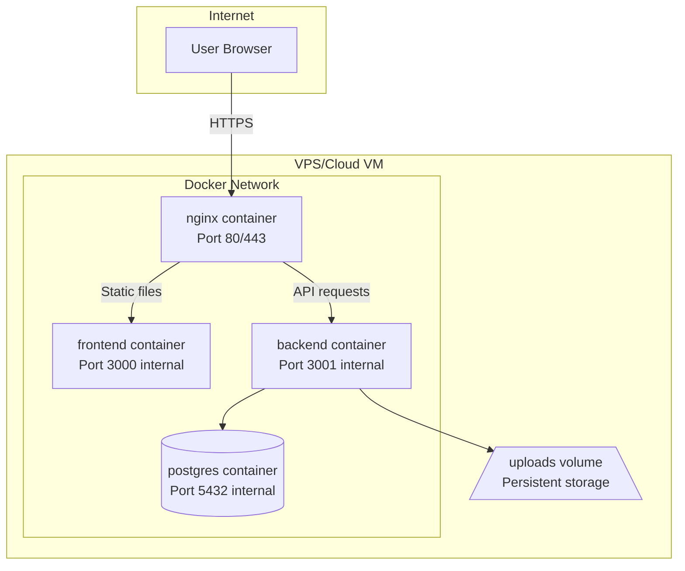

# Stage 8: Deployment Preparation - Detailed Plan

## Overview

This document provides a detailed implementation plan for Stage 8: Deployment Preparation of the OptiView project. The plan covers production Docker configuration, nginx reverse proxy setup with proper static file caching, and comprehensive deployment documentation.

---

## 1. Deployment Strategy: VPS with Docker Compose

**Description:** Deploy all services (frontend, backend, database, nginx) as Docker containers on a single VPS.

**Why this approach:**

- Simple setup and maintenance
- Cost-effective for small to medium traffic
- Full control over the environment
- Easy to migrate between providers
- All services in one place

**Trade-offs:**

- Single point of failure (acceptable for MVP)
- Limited horizontal scaling (can migrate to orchestration later)
- Requires basic server management skills

**Recommended VPS Providers:** DigitalOcean Droplet, AWS EC2, Hetzner Cloud, Linode, Vultr

**Minimum VPS Requirements:**

- 2 GB RAM
- 1 vCPU
- 20 GB SSD storage
- Ubuntu 22.04 LTS

---

## 2. Architecture Diagram



---

## 3. Artifacts to Create

### 3.1 Backend Dockerfile

**File:** `backend/Dockerfile`

**Purpose:** Multi-stage production Docker image for NestJS backend

**Key Features:**

- Multi-stage build for smaller image size
- Node.js 22 Alpine base image
- Non-root user for security
- Production-only dependencies
- Health check support
- Proper handling of Sharp native modules

**Dockerfile Structure:**

```dockerfile
# Stage 1: Dependencies
FROM node:22-alpine AS deps
WORKDIR /app
COPY package.json package-lock.json ./
RUN npm ci

# Stage 2: Build
FROM node:22-alpine AS build
WORKDIR /app
COPY --from=deps /app/node_modules ./node_modules
COPY . .
RUN npm run build
RUN npm prune --production

# Stage 3: Production
FROM node:22-alpine AS production
WORKDIR /app
RUN addgroup -g 1001 -S appgroup && adduser -S appuser -u 1001

# Copy built application and production dependencies
COPY --from=build --chown=appuser:appgroup /app/dist ./dist
COPY --from=build --chown=appuser:appgroup /app/node_modules ./node_modules
COPY --from=build --chown=appuser:appgroup /app/package.json ./

# Create uploads directory structure
RUN mkdir -p /app/uploads/originals /app/uploads/processed /app/uploads/lqip && \
    chown -R appuser:appgroup /app/uploads

ENV NODE_ENV=production
EXPOSE 3000

HEALTHCHECK --interval=30s --timeout=3s \
    CMD wget -qO- http://localhost:3000/health || exit 1

USER appuser
CMD ["node", "dist/main.js"]
```

---

### 3.2 Frontend Dockerfile

**File:** `frontend/Dockerfile`

**Purpose:** Multi-stage production Docker image for React frontend

**Key Features:**

- Build stage with Node.js
- Production stage with nginx for static file serving
- Build-time environment variable injection
- Optimized production build

**Dockerfile Structure:**

```dockerfile
# Stage 1: Build
FROM node:22-alpine AS build
WORKDIR /app
COPY package.json package-lock.json ./
RUN npm ci
COPY . .
ARG VITE_API_URL
ENV VITE_API_URL=$VITE_API_URL
RUN npm run build

# Stage 2: Production (nginx will serve static files)
# Note: This stage is for building only, nginx container will serve the files
FROM node:22-alpine AS production
WORKDIR /app
COPY --from=build /app/dist ./dist
# This stage outputs the built files for nginx to serve
```

---

### 3.3 Nginx Configuration

**File:** `nginx/nginx.conf`

**Purpose:** Reverse proxy configuration with SSL termination and static file caching

**Key Features:**

- SSL/TLS termination with modern cipher suites
- Gzip compression for text-based assets
- Aggressive caching for static assets (JS, CSS, images)
- API proxy to backend
- Security headers
- Rate limiting for API endpoints

**Configuration Structure:**

```nginx
# nginx/nginx.conf

# Rate limiting for API
limit_req_zone $binary_remote_addr zone=api:10m rate=10r/s;
limit_req_zone $binary_remote_addr zone=upload:10m rate=2r/s;

# Upstream definitions
upstream frontend {
    server frontend:3000;
}

upstream backend {
    server backend:3000;
}

server {
    listen 80;
    server_name _;
    return 301 https://$host$request_uri;
}

server {
    listen 443 ssl http2;
    server_name _;

    # SSL configuration
    ssl_certificate /etc/nginx/ssl/cert.pem;
    ssl_certificate_key /etc/nginx/ssl/key.pem;
    ssl_protocols TLSv1.2 TLSv1.3;
    ssl_prefer_server_ciphers on;
    ssl_ciphers ECDHE-ECDSA-AES128-GCM-SHA256:ECDHE-RSA-AES128-GCM-SHA256;
    ssl_session_timeout 1d;
    ssl_session_cache shared:SSL:50m;

    # Security headers
    add_header X-Frame-Options DENY always;
    add_header X-Content-Type-Options nosniff always;
    add_header X-XSS-Protection "1; mode=block" always;
    add_header Strict-Transport-Security "max-age=31536000; includeSubDomains" always;

    # Gzip compression
    gzip on;
    gzip_vary on;
    gzip_min_length 256;
    gzip_proxied any;
    gzip_types text/plain text/css application/json application/javascript text/xml application/xml;

    # Client upload limit
    client_max_body_size 10M;

    # Frontend static files with aggressive caching
    location / {
        proxy_pass http://frontend;
        proxy_set_header Host $host;
        proxy_set_header X-Real-IP $remote_addr;
        proxy_set_header X-Forwarded-For $proxy_add_x_forwarded_for;
        proxy_set_header X-Forwarded-Proto $scheme;
    }

    # Static assets - long-term caching
    location ~* \.(js|css|png|jpg|jpeg|gif|ico|svg|woff|woff2|ttf|eot)$ {
        proxy_pass http://frontend;
        proxy_set_header Host $host;
        expires 1y;
        add_header Cache-Control "public, immutable";
        access_log off;
    }

    # API endpoints
    location /api/ {
        limit_req zone=api burst=20 nodelay;

        proxy_pass http://backend;
        proxy_set_header Host $host;
        proxy_set_header X-Real-IP $remote_addr;
        proxy_set_header X-Forwarded-For $proxy_add_x_forwarded_for;
        proxy_set_header X-Forwarded-Proto $scheme;
    }

    # Upload endpoint - stricter rate limiting
    location /api/images/upload {
        limit_req zone=upload burst=5 nodelay;

        proxy_pass http://backend;
        proxy_set_header Host $host;
        proxy_set_header X-Real-IP $remote_addr;
        proxy_set_header X-Forwarded-For $proxy_add_x_forwarded_for;
        proxy_set_header X-Forwarded-Proto $scheme;

        # Increased timeout for large uploads
        proxy_read_timeout 300s;
    }

    # Health check endpoint
    location /health {
        access_log off;
        return 200 "ok";
        add_header Content-Type text/plain;
    }
}
```

---

### 3.4 Frontend Nginx Configuration (Internal)

**File:** `frontend/nginx/default.conf`

**Purpose:** Internal nginx configuration for serving React static files

**Key Features:**

- Serve static files from /usr/share/nginx/html
- SPA fallback to index.html
- Aggressive caching for hashed assets
- No caching for index.html

**Configuration:**

```nginx
# frontend/nginx/default.conf

server {
    listen 3000;
    server_name localhost;
    root /usr/share/nginx/html;
    index index.html;

    # Gzip compression
    gzip on;
    gzip_vary on;
    gzip_min_length 256;
    gzip_types text/plain text/css application/json application/javascript text/xml application/xml;

    # Assets with content hash - immutable, cache forever
    location ~* \.(js|css|png|jpg|jpeg|gif|ico|svg|woff|woff2|ttf|eot)$ {
        expires 1y;
        add_header Cache-Control "public, immutable";
        access_log off;
    }

    # index.html - no cache to ensure users get updates
    location = /index.html {
        expires -1;
        add_header Cache-Control "no-store, no-cache, must-revalidate, proxy-revalidate";
    }

    # SPA fallback
    location / {
        try_files $uri $uri/ /index.html;
    }
}
```

---

### 3.5 Production Docker Compose

**File:** `docker-compose.prod.yml`

**Purpose:** Production orchestration of all services

**Key Features:**

- All services in one network
- Persistent volumes for database and uploads
- Environment variable management
- Health checks
- Resource limits
- Restart policies

**Configuration:**

```yaml
# docker-compose.prod.yml

services:
  nginx:
    image: nginx:1.27-alpine
    container_name: optiview_nginx
    restart: always
    ports:
      - "80:80"
      - "443:443"
    volumes:
      - ./nginx/nginx.conf:/etc/nginx/nginx.conf:ro
      - ./nginx/ssl:/etc/nginx/ssl:ro
    depends_on:
      frontend:
        condition: service_healthy
      backend:
        condition: service_healthy
    networks:
      - optiview-network
    healthcheck:
      test: ["CMD", "nginx", "-t"]
      interval: 30s
      timeout: 10s
      retries: 3

  frontend:
    build:
      context: ../frontend
      dockerfile: Dockerfile
      args:
        VITE_API_URL: ${VITE_API_URL:-/api}
    container_name: optiview_frontend
    restart: always
    expose:
      - "3000"
    networks:
      - optiview-network
    healthcheck:
      test: ["CMD", "wget", "-qO-", "http://localhost:3000/"]
      interval: 30s
      timeout: 10s
      retries: 3

  backend:
    build:
      context: ./backend
      dockerfile: Dockerfile
      target: production
    container_name: optiview_backend
    restart: always
    expose:
      - "3000"
    environment:
      - NODE_ENV=production
      - DB_HOST=postgres
      - DB_PORT=5432
      - DB_USERNAME=${DB_USERNAME:-postgres}
      - DB_PASSWORD=${DB_PASSWORD:?DB_PASSWORD is required}
      - DB_DATABASE=${DB_DATABASE:-optiview}
      - PORT=3000
    volumes:
      - uploads_data:/app/uploads
    depends_on:
      postgres:
        condition: service_healthy
    networks:
      - optiview-network
    healthcheck:
      test: ["CMD", "wget", "-qO-", "http://localhost:3000/health"]
      interval: 30s
      timeout: 10s
      retries: 3
    deploy:
      resources:
        limits:
          cpus: "1.0"
          memory: 512M

  postgres:
    image: postgres:15-alpine
    container_name: optiview_postgres
    restart: always
    environment:
      POSTGRES_USER: ${DB_USERNAME:-postgres}
      POSTGRES_PASSWORD: ${DB_PASSWORD:?DB_PASSWORD is required}
      POSTGRES_DB: ${DB_DATABASE:-optiview}
    volumes:
      - postgres_data:/var/lib/postgresql/data
    networks:
      - optiview-network
    healthcheck:
      test: ["CMD-SHELL", "pg_isready -U ${DB_USERNAME:-postgres} -d ${DB_DATABASE:-optiview}"]
      interval: 10s
      timeout: 5s
      retries: 5
    deploy:
      resources:
        limits:
          cpus: "0.5"
          memory: 256M

networks:
  optiview-network:
    driver: bridge

volumes:
  postgres_data:
  uploads_data:
```

---

### 3.6 Environment Configuration

**File:** `.env.production.example`

**Purpose:** Template for production environment variables

```env
# Database
DB_USERNAME=postgres
DB_PASSWORD=your_secure_password_here
DB_DATABASE=optiview

# Frontend
VITE_API_URL=/api

# Optional: Custom ports
# NGINX_HTTP_PORT=80
# NGINX_HTTPS_PORT=443
```

---

### 3.7 Deployment Documentation

**File:** `docs/deployment.md`

**Purpose:** Complete deployment guide

**Contents:**

1. Prerequisites
2. Server setup
3. SSL certificate configuration
4. Environment configuration
5. Deployment steps
6. Database migrations
7. Backup strategy
8. Monitoring and logging
9. Troubleshooting
10. Update procedures

---

## 4. Static File Caching Strategy

### Frontend Static Assets

| Asset Type             | Cache Duration | Cache-Control Header                  |
|:-----------------------|:---------------|:--------------------------------------|
| JS/CSS with hash       | 1 year         | `public, immutable`                   |
| Images (PNG, JPG, SVG) | 1 year         | `public, immutable`                   |
| Fonts (WOFF, WOFF2)    | 1 year         | `public, immutable`                   |
| index.html             | No cache       | `no-store, no-cache, must-revalidate` |

### Backend Image Delivery

| Image Type      | Cache Duration | Notes                                |
|:----------------|:---------------|:-------------------------------------|
| Original images | 1 year         | Processed images are immutable by ID |
| LQIP images     | 1 year         | Small placeholders, rarely change    |
| API responses   | No cache       | Dynamic data                         |

### Implementation Notes

1. **Content Hashing:** Vite automatically adds content hashes to JS/CSS filenames, making them cacheable forever
2. **index.html:** Must not be cached to ensure users get the latest version
3. **API Responses:** Should not be cached by nginx; let the application handle caching headers
4. **Image Files:** Processed images are stored with UUID-based paths, making them effectively immutable

---

## 5. Security Considerations

### Docker Security

- [ ] Run containers as non-root user
- [ ] Use specific image tags (not :latest)
- [ ] Scan images for vulnerabilities
- [ ] Limit container resources
- [ ] Use read-only filesystems where possible

### Nginx Security

- [ ] TLS 1.2+ only
- [ ] Modern cipher suites
- [ ] Security headers (X-Frame-Options, HSTS, etc.)
- [ ] Rate limiting on API endpoints
- [ ] Hide nginx version (server_tokens off)
- [ ] Limit upload size (client_max_body_size)

### Application Security

- [ ] Environment variables for secrets
- [ ] No secrets in Docker images
- [ ] Database credentials from environment

---

## 6. Tasks Breakdown

### Phase 1: Docker Configuration

- [ ] Create `backend/Dockerfile` with multi-stage build
- [ ] Create `frontend/Dockerfile` with multi-stage build
- [ ] Create `frontend/nginx/default.conf` for static file serving
- [ ] Create `docker-compose.prod.yml` for production
- [ ] Create `.env.production.example` template
- [ ] Create `.dockerignore` files for both services

### Phase 2: Nginx Configuration

- [ ] Create `nginx/nginx.conf` with reverse proxy configuration
- [ ] Configure SSL/TLS termination
- [ ] Configure static file caching headers
- [ ] Configure API proxy with rate limiting
- [ ] Configure security headers
- [ ] Create SSL certificate generation script

### Phase 3: Documentation

- [ ] Create `docs/deployment.md` with complete deployment guide
- [ ] Document environment variables
- [ ] Document backup and restore procedures
- [ ] Document update procedures
- [ ] Document troubleshooting guide

### Phase 4: Validation

- [ ] Test Docker build for backend
- [ ] Test Docker build for frontend
- [ ] Test docker-compose.prod.yml locally
- [ ] Verify static file caching headers
- [ ] Verify API proxy functionality
- [ ] Verify SSL configuration

---

## 7. Definition of Done

- [ ] Docker production build completes successfully for all services
- [ ] Application runs from production Docker images
- [ ] Nginx properly serves frontend static files with correct caching headers
- [ ] API requests are properly proxied to backend
- [ ] SSL/TLS termination works correctly
- [ ] Database migrations run successfully in production
- [ ] Uploads directory persists across container restarts
- [ ] Deployment guide allows fresh deployment in under 30 minutes
- [ ] All security considerations addressed

---

## 8. File Structure After Implementation

```
optiview/
├── backend/
│   ├── Dockerfile                    # NEW
│   ├── .dockerignore                 # NEW
│   ├── docker-compose.yml            # Existing (dev)
│   └── ... (existing files)
├── frontend/
│   ├── Dockerfile                    # NEW
│   ├── .dockerignore                 # NEW
│   ├── nginx/
│   │   └── default.conf              # NEW
│   └── ... (existing files)
├── nginx/
│   ├── nginx.conf                    # NEW
│   └── ssl/                          # NEW (certificates)
│       └── .gitkeep
├── docker-compose.prod.yml           # NEW
├── .env.production.example           # NEW
└── docs/
    └── deployment.md                 # NEW
```

---

## 9. Next Steps

1. Review and approve this plan
2. Switch to Code mode for implementation
3. Create all artifacts as specified
4. Test locally before deployment
5. Deploy to production VPS

---

## 10. Clarifications

1. **SSL Certificates:** Will use Let's Encrypt (certbot)
2. **Domain Name:** I haven't have a domain name ready for the deployment.
3. **VPS Provider:** Unknown yet.
4. **Database Backups:** automated backup scripts is not needed at this stage.

---

## 11. Docker Volume Strategies for Persistent Data

Named Volumes will be used.

**How it works:**

- Docker manages the volume lifecycle
- Stored in `/var/lib/docker/volumes/` on the host
- Can be easily backed up, shared, and migrated
- Named volumes persist even after containers are removed

**Example in docker-compose.prod.yml:**

```yaml
volumes:
  postgres_data:    # Database data - managed by Docker
  uploads_data:     # Uploaded images - managed by Docker

services:
  backend:
    volumes:
      - uploads_data:/app/uploads
```

**Pros:**

- ✅ Portable between hosts
- ✅ Easy to backup with `docker volume inspect`
- ✅ Works well with Docker's backup mechanisms
- ✅ Isolated from host filesystem
- ✅ Can be shared between containers

**Cons:**

- Slightly harder to access from host for debugging

---

## 12. SSL Certificate Setup (Let's Encrypt)

### Prerequisites

- Valid domain name pointing to server IP
- Port 80 and 443 accessible from internet

### Setup Steps

1. **Install certbot on host:**

```bash
sudo apt update
sudo apt install certbot python3-certbot-nginx
```

1. **Generate certificates:**

```bash
sudo certbot certonly --standalone -d yourdomain.com -d www.yourdomain.com
```

1. **Copy certificates to project:**

```bash
mkdir -p nginx/ssl
sudo cp /etc/letsencrypt/live/yourdomain.com/fullchain.pem nginx/ssl/cert.pem
sudo cp /etc/letsencrypt/live/yourdomain.com/privkey.pem nginx/ssl/key.pem
sudo chown -R $USER:$USER nginx/ssl
```

1. **Set up auto-renewal:**

```bash
# Create renewal script
cat > scripts/renew-ssl.sh << 'EOF'
#!/bin/bash
certbot renew --quiet
cp /etc/letsencrypt/live/yourdomain.com/fullchain.pem /path/to/optiview/nginx/ssl/cert.pem
cp /etc/letsencrypt/live/yourdomain.com/privkey.pem /path/to/optiview/nginx/ssl/key.pem
docker compose -f docker-compose.prod.yml restart nginx
EOF

chmod +x scripts/renew-ssl.sh

# Add to crontab (run weekly)
(crontab -l 2>/dev/null; echo "0 3 * * 0 /path/to/optiview/scripts/renew-ssl.sh") | crontab -
```

### Certificate Locations in Container

- Certificate: `/etc/nginx/ssl/cert.pem`
- Private key: `/etc/nginx/ssl/key.pem`

---

## 13. Database Backup Strategy

### Recommended: Automated Backup Script

Create a backup script that runs periodically:

```bash
#!/bin/bash
# backup.sh
BACKUP_DIR=/backups
DATE=$(date +%Y%m%d_%H%M%S)
pg_dump -U postgres optiview | gzip > $BACKUP_DIR/optiview_$DATE.sql.gz
# Keep only last 7 days of backups
find $BACKUP_DIR -name "optiview_*.sql.gz" -mtime +7 -delete
```

**Run via Docker:**

```yaml
backup:
  image: postgres:15-alpine
  volumes:
    - postgres_data:/var/lib/postgresql/data
    - ./backups:/backups
  environment:
    PGPASSWORD: ${DB_PASSWORD}
  command: sh -c "pg_dump -U postgres optiview | gzip > /backups/backup_$(date +%Y%m%d).sql.gz"
```
