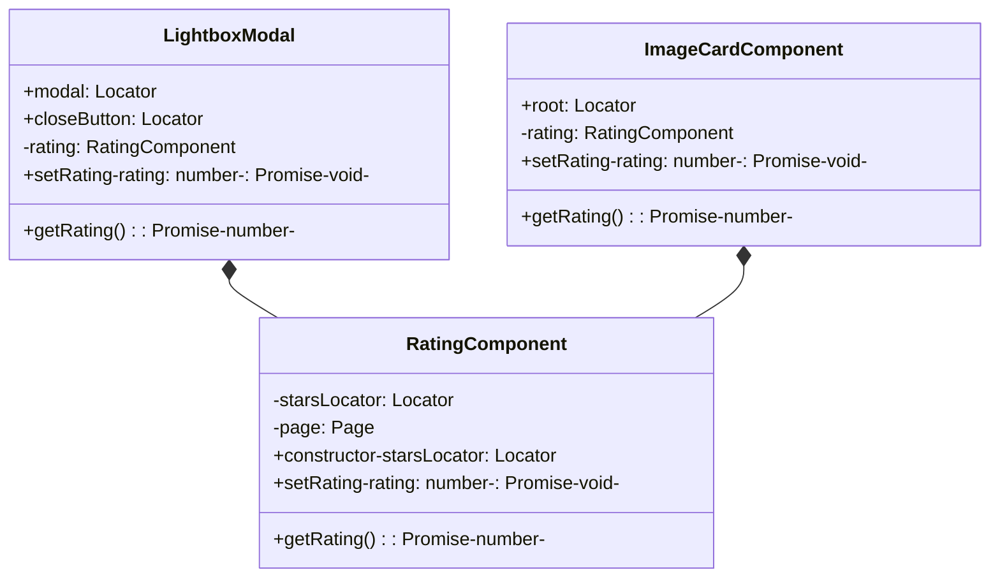

# Refactoring Plan: Shared RatingComponent for E2E Tests

## Problem Statement

Both `getRating()` and `setRating()` methods are duplicated across two files:
- [`e2e/pages/lightbox-modal.ts`](e2e/pages/lightbox-modal.ts)
- [`e2e/components/image-card.component.ts`](e2e/components/image-card.component.ts)

| Method | LightboxModal | ImageCardComponent |
|--------|---------------|-------------------|
| `getRating()` | Counts `aria-pressed="true"` | Same logic |
| `setRating()` | Uses `.nth(rating - 1)` | Uses aria-label lookup |

## Solution: Create Shared RatingComponent

### Architecture



### New File: `e2e/components/rating.component.ts`

```typescript
import type {Locator, Page} from '@playwright/test';

/**
 * Reusable component for interacting with star rating controls.
 * Encapsulates common rating logic used across multiple page objects.
 *
 * The rating component uses semantic aria-labels in the format "Rate N star(s)"
 * which is consistent across all usages in the application.
 */
export class RatingComponent {
  readonly starsLocator: Locator;
  readonly page: Page;

  constructor(starsLocator: Locator) {
    this.starsLocator = starsLocator;
    this.page = starsLocator.page();
  }

  /**
   * Get the current rating by counting filled stars.
   * @returns Current rating [0-5]
   */
  async getRating(): Promise<number> {
    const count = await this.starsLocator.count();

    let filledCount = 0;
    for (let i = 0; i < count; i++) {
      const star = this.starsLocator.nth(i);
      const ariaPressed = await star.getAttribute('aria-pressed');
      if (ariaPressed === 'true') {
        filledCount++;
      }
    }

    return filledCount;
  }

  /**
   * Set rating by clicking a star using its aria-label.
   * Uses semantic aria-label: "Rate N star" or "Rate N stars"
   * @param rating - Rating to set [1-5]
   */
  async setRating(rating: number): Promise<void> {
    const label = `Rate ${rating} star${rating > 1 ? 's' : ''}`;
    const starButton = this.starsLocator.getByRole('button', {name: label});
    await starButton.click();
    await this.page.waitForTimeout(300);
  }
}
```

### Changes to `e2e/components/image-card.component.ts`

1. Import `RatingComponent`
2. Create private `rating` property using `RatingComponent` initialized with `root.locator('button')`
3. Delegate `getRating()` to `RatingComponent` - remove duplicated loop
4. Delegate `setRating()` to `RatingComponent` - remove aria-label construction
5. Update `waitForRatingOverlayVisible()` to call before rating operations

### Changes to `e2e/pages/lightbox-modal.ts`

1. Import `RatingComponent`
2. Create private `rating` property using `RatingComponent` initialized with `this.ratingStars.locator('button')`
3. Delegate `getRating()` to `RatingComponent` - remove duplicated loop
4. Delegate `setRating()` to `RatingComponent` - remove `.nth()` based selection

## Implementation Notes

### Standardized `setRating()` Approach

Both components now use the aria-label approach for setting ratings:
- Uses semantic `getByRole('button', {name: 'Rate N star(s)'})`
- Consistent with the React component's aria-label format
- More resilient to DOM changes than position-based selection

### Benefit Analysis

| Aspect | Before | After |
|--------|--------|-------|
| Lines of duplicated code | ~15 lines × 2 = 30 | ~15 lines in 1 file |
| Maintenance | Update 2 files | Update 1 file |
| Consistency | May drift | Guaranteed same |

## Testing Strategy

1. Run existing tests in `e2e/tests/rating.spec.ts`
2. Run tests that use ratings: `lightbox.spec.ts`, `gallery.spec.ts`
3. No new tests needed - existing tests validate the refactoring

## Execution Order

1. Create `e2e/components/rating.component.ts`
2. Update `e2e/components/image-card.component.ts`
3. Update `e2e/pages/lightbox-modal.ts`
4. Run `npx playwright test rating.spec.ts` to verify
